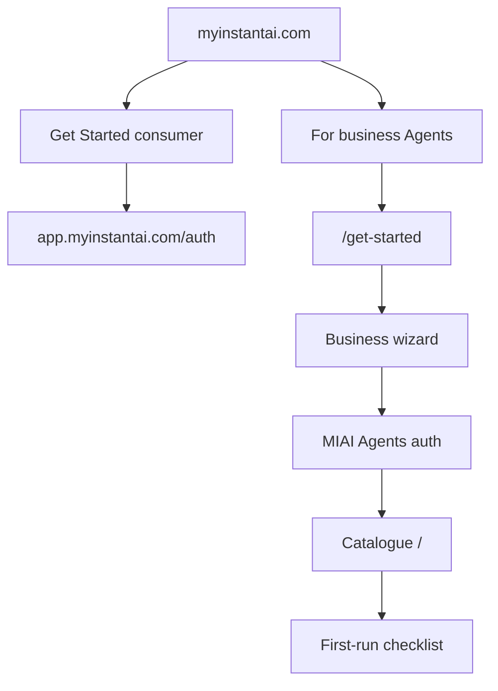

# B2B Agent Marketplace onboarding

Separate **business / Agents** path from MyInstantAI consumer Get Started (token purchase).  
Marketplace owns onboarding UX; MyInstantAI owns identity + workspace minting.

## Decisions

| Choice | Decision |
|---|---|
| Entry | Dedicated **For business / Agents** CTA — consumer Get Started unchanged |
| Land | Catalogue home (`/`) with first-run checklist |

## Journey

1. Marketing CTA → `{APP_BASE_URL}/get-started`  
2. Business wizard (company, market, industry, size, intent)  
3. Account via **MIAI Agents auth** (`product=agents` + `return_to`) — mock mode completes in-app  
4. Workspace provisioned (`workspace_id`, creator `owner`)  
5. Redirect `/?onboarding=1` → catalogue + checklist  
6. Business-mode sidebar (Agents, My Agents, Ops, Insights, Workspace, …)

## Sidebar IA (business mode)

| Group | Items |
|---|---|
| Core | Home, Ask AI, Search, History, Workspace |
| Agents | AI Agents, My Agents, Live Ops, Insights, Support Desk, Trust, Legal |
| Growth | Create |
| Footer | Language, theme, Install |

Hidden in business mode: Learn & Earn. Agent Admin only for platform `operator` (or elevated mock owner).

Consumer mode (toggle): limited nav + link back to consumer app when `NEXT_PUBLIC_MIAI_CONSUMER_APP_URL` is set.

## MyInstantAI asks

1. Marketing CTA **For business** → Agents `/get-started` (not consumer Get Started)  
2. Auth URL supporting `product=agents` + `return_to` (`MIAI_AGENTS_AUTH_URL`)  
3. Workspace provision API (company → `workspace_id`)  
4. JWT claims: `workspace_id`, `user_id`, `roles` including `owner` for creator; optional `product=agents`  
5. Consumer→workspace upgrade later (out of v1)

## In-repo surfaces

| Path | Role |
|---|---|
| `/get-started` | Business wizard (no marketplace chrome) |
| `/login` | Redirect to MIAI Agents auth when configured; else `/get-started` |
| `GET/POST/PATCH /api/onboarding` | Workspace onboarding profile + checklist |
| `GET /api/auth/handoff` | `{ mode, loginUrl, consumerAppUrl }` for clients |

Staging: mock auth completes wizard against current workspace; checklist persists in onboarding store.

## Related

- [PLATFORM_INTEGRATION.md](./PLATFORM_INTEGRATION.md)  
- [PARTNERSHIP_KICKOFF_BRIEF.md](./PARTNERSHIP_KICKOFF_BRIEF.md)  
- [MIGRATION_RUNBOOK.md](./MIGRATION_RUNBOOK.md)  
