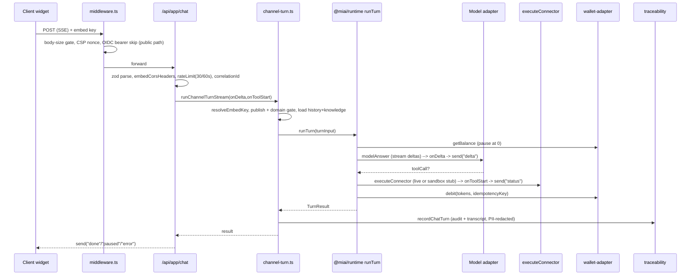

# MyInstantAI Agent Marketplace — Platform Technical Dossier

> **Audience:** MyInstantAI engineering team  
> **Repository:** `github.com/MalcolmGov/miai-agent-marketplace` (private)  
> **Snapshot:** commit `fb97438` · branch `main` · 2026-08-25 · v0.1.0  
> **Scale:** ~75,900 LOC (TS/TSX/JS) · 4 apps · 5 packages · 69 API routes · 39 pages · ~500-agent catalog  
> **Stack:** Next.js 15 (App Router) · React 19 · TypeScript 5 · Node 20 · pnpm workspaces · Postgres (pg, no ORM) · Docker → Railway (Azure Container Apps = migration target)  
> **Confidential** — provided under the MyInstantAI × Moove Digital partnership. Moove Digital owns the IP; this document describes the running platform for the operating/host team.

## How to read this document

This dossier is generated from a direct read of the source at the snapshot above; every path is repo-relative and every claim is grounded in code. Sections 1–3 give the map and architecture; 4–8 go deep on the engine, catalog, data, identity, and integrations; 9–10 are the endpoint reference; 11–13 cover security/compliance, deployment/ops, and testing. Appendices A–E are machine-generated reference tables (endpoint index, environment variables, LOC, dependencies, doc index). "Open items to confirm" at the end lists anything the readers flagged as unverified.

## Contents

- [1. Executive Summary & Repository Topology](#1-executive-summary-repository-topology)
- [2. Technology Stack & Dependencies](#2-technology-stack-dependencies)
- [3. System Architecture & Request Lifecycle](#3-system-architecture-request-lifecycle)
- [4. The Agent Runtime Engine (packages/runtime)](#4-the-agent-runtime-engine-packagesruntime)
- [5. Catalog, Agents & Market Packs](#5-catalog-agents-market-packs)
- [6. Data Model, Persistence & Memory](#6-data-model-persistence-memory)
- [7. Identity, Authentication & Multi-Tenancy](#7-identity-authentication-multitenancy)
- [8. Integrations, Connectors & Channels](#8-integrations-connectors-channels)
- [9. API Reference — Platform, Agents & B2B](#9-api-reference-platform-agents-b2b)
- [10. API Reference — Consumer, Channels, Payments & Privacy](#10-api-reference-consumer-channels-payments-privacy)
- [11. Security, Privacy & Compliance](#11-security-privacy-compliance)
- [12. Deployment, Infrastructure & Operations](#12-deployment-infrastructure-operations)
- [13. Testing, Evals & Quality Gates](#13-testing-evals-quality-gates)
- [Appendix A — Complete Endpoint Index](#appendix-a--complete-endpoint-index)
- [Appendix B — Environment Variable Catalog](#appendix-b--environment-variable-catalog)
- [Appendix C — Code Size & File Counts](#appendix-c--code-size--file-counts)
- [Appendix D — Dependency Manifest](#appendix-d--dependency-manifest)
- [Appendix E — In-Repo Documentation Index](#appendix-e--in-repo-documentation-index)
- [Open items to confirm](#open-items-to-confirm)

## 1. Executive Summary & Repository Topology

### What the product is

`miai-agent-marketplace` is a **multi-tenant marketplace of AI agents plus the runtime that executes them**, delivered by Move Digital and integrating with MyInstantAI's auth / wallet / model rails via swappable adapters. `README.md` describes it as a "greenfield **Agents Marketplace + Agent Runtime**" that consumes `miai.agent-package/v1` bundles from the sibling `miai-agents` project. It ships two agent audiences — **business agents** (rented per workspace: Standard $349 / Pro $699 / Enterprise $1199 per `RENT_USD` in `packages/agent-protocol/src/index.ts`) and **consumer agents** (a personal-assistant surface with durable memory) — behind one Next.js app. Core capabilities: a browsable catalogue (500 agent packages), a chat runtime with tool-calling and multi-step workflows, OAuth connectors to SaaS products, a prepaid token wallet that gates replies, and multi-channel delivery (web chat, embeddable JS widget, Telegram, WhatsApp, MCP, and a native app channel).

### Monorepo layout & role of each unit

pnpm 9.15 workspaces (`pnpm-workspace.yaml` globs `apps/*` + `packages/*`, **excluding** `apps/mobile-shell` which installs self-contained), Node 20, TypeScript 5, `packageManager: pnpm@9.15.0`.

| Workspace | Package name | Role |
|---|---|---|
| `apps/web` | `@miai/web` | The product. Next.js 15 App Router — all UI (`src/app`, `src/components`), 69 API route modules (`src/app/api/**/route.ts`), 39 `page.tsx`, 85 files in `src/lib` (auth, wallet, model, stores, consumer memory, compliance), `middleware.ts`, `instrumentation.ts` |
| `apps/runtime` | `@miai/runtime-app` | Thin turn-worker **scaffold** — `src/worker.ts` (16 LOC) logs readiness + heartbeats; web routes call `@miai/runtime` directly for MVP. Exists to move tool loops onto a queue in Container Apps |
| `apps/connectors` | `@miai/connectors-app` | Thin `node:http` scaffold — `src/server.ts` (21 LOC) exposes `/health` and `/v1/connectors` (`listConnectors()` + `WEBHOOK_TEMPLATES`) on `PORT` 4080 |
| `apps/mobile-shell` | `@miai/mobile-shell` | Expo ~52 / React Native 0.76 WebView shell (`react-native-webview` 13.12) wrapping the hosted web app; workspace-excluded, own install |
| `packages/agent-protocol` | `@miai/agent-protocol` | Shared contracts/types: `AgentPackage`, `AgentManifest`, `AgentTool`, `AgentCategory/Tier/Audience`, `RENT_USD`/`RENT_EUR`, `loadAgentPackage()`, `marketplaceCategory()`. Zero workspace deps (leaf) |
| `packages/runtime` | `@miai/runtime` | The **agent execution engine** — `runTurn()`, `createModelAdapter()`, `ModelAdapter`/`TurnRequest`/`TurnResult` types, guardrails, embeddings/semantic retrieval, and 15+ per-vertical workflow modules under `src/workflows` |
| `packages/connectors` | `@miai/connectors` | Integration adapters — OAuth + live/stub tool execution (`executeConnector`, `ToolBinding`), webhook templates. Depends on `pg` |
| `packages/presets` | `@miai/presets` | **Generated** tool→connector bindings — `src/generated-presets.ts` (~227 KB) + `src/index.ts` expose `GENERATED_PRESETS`, `AgentPreset`, `getPreset`, `defaultBindingsForTools` |
| `packages/wallet-adapter` | `@miai/wallet-adapter` | Billing rail — `createWalletAdapter()`, `estimateTurnTokens()`, `WalletAdapter` (mock/http). Leaf, zero workspace deps |

### Internal dependency graph

Read from each `packages/*/package.json` (`workspace:*`) and `apps/web/package.json` (`workspace:^`):

```
agent-protocol ──┐                    wallet-adapter ──┐   (both leaves)
                 ▼                                     │
connectors ──► presets ──► runtime ◄──────────────────┘
   │              │           ▲ (also ◄ agent-protocol, ◄ connectors, ◄ presets)
   └──────────────┴───────────┴──────────► @miai/web  (depends on ALL 5 packages
                                             + jose ^6.2.5, next ^15.2.8, pg ^8.22,
                                             react/react-dom ^19, zod ^3.24.2)

apps/runtime-app   ──► runtime, wallet-adapter
apps/connectors-app ──► connectors
apps/mobile-shell   ──► (no @miai/* — RN WebView shell over the hosted web app)
```

`@miai/runtime` is the convergence hub, importing all four other packages; `@miai/web` sits above everything. No ORM — `apps/web` and `packages/connectors` use raw `pg`.

### Build graph

Root `package.json` scripts, all `tsc`-per-package then Next:

```
build:packages : pnpm -r --filter './packages/*' build   # tsc each package → dist/
build:web      : pnpm build:packages && pnpm --filter @miai/web build  # then next build
build          : pnpm -r build          # every workspace
ci             : build:packages && typecheck && test && catalog:integrity && eval:suite:static
```

Packages are ESM (`"type":"module"`, `main: ./dist/index.js`, `types: ./dist/index.d.ts`) and must be compiled before `@miai/web` builds. `@miai/web` uses Next 15's own build; note `eslint-config-next` is pinned `15.1.0` while `next` is `^15.2.8`.

### LOC / file counts (measured this pass; excludes node_modules/dist/.next)

| Area | LOC | Files |
|---|---:|---:|
| `apps/web` (TS/TSX/JS/MJS) | 34,550 | 280 |
| `packages/runtime` | 13,818 | 36 |
| `packages/presets` (generated) | 12,245 | 2 |
| `scripts/` | 9,110 | 34 |
| `packages/connectors` | 4,293 | 19 |
| `e2e/` | 1,095 | 34 |
| `packages/wallet-adapter` | 349 | 2 |
| `packages/agent-protocol` | 142 | 1 |
| `apps/mobile-shell` | 129 | 2 |
| `apps/connectors` | 21 | 1 |
| `apps/runtime` | 16 | 1 |
| **Total (code)** | **~75,900** | — |

Plus non-code: catalogue JSON (`data/catalog`), 5 SQL migrations, and markdown docs. `apps/web` alone has **69 API routes** and **39 pages**.

### High-level data flow (what talks to what)

```
Browser / Embed widget / Telegram / WhatsApp / MCP / App WebView
        │  HTTPS
        ▼
apps/web  middleware.ts ─► Next API route (e.g. /api/chat, /api/consumer/chat,
                            /api/embed/chat, /api/app/chat, /api/mcp)
        │  (auth: lib/auth.ts + agents-auth.ts OIDC JWT | consumer-*; wallet gate)
        ▼
lib turn orchestrators  (consumer-turn.ts · ask-turn.ts · channel-turn.ts · api/chat/route.ts)
        │  call
        ▼
@miai/runtime runTurn(req, {wallet, model, onDelta, onToolStart, skipDebit})
        ├─► createModelAdapter()  ── MIAI_MODEL_MODE: mock|openai|azure|anthropic|gateway
        ├─► executeConnector()  (@miai/connectors) with bindings from @miai/presets
        └─► WalletAdapter.debit  (@miai/wallet-adapter) ── MIAI_WALLET_MODE: mock|http
        ▼
Persistence (lib/store.ts, consumer-memory-store.ts, channel-sessions.ts, …)
        └─► Postgres via pg (DATABASE_URL/MIAI_DATABASE_URL) with JSON file-store fallback on /data
```

`runTurn` materializes template vars (`{{business_name}}`), short-circuits when `state === "paused_no_tokens"`, streams deltas via `onDelta`, and estimates/debits tokens (skippable for free sandbox tries via `skipDebit`). Runtime behaviour is env-selected: `MIAI_AUTH_MODE`, `MIAI_WALLET_MODE`, `MIAI_MODEL_MODE`, `SANDBOX_MODE`, `RUNTIME_SEMANTIC_RETRIEVAL`, and `DATABASE_URL` vs file-store fallback. Deploy target is a Docker image on Railway (prod + a SANDBOX_MODE sandbox project), with Azure Container Apps as the stated migration target. Detailed contracts for each layer follow in later sections.

---

## 2. Technology Stack & Dependencies

The platform is a deliberately lean, dependency-minimal TypeScript monorepo. The `@miai/web` application (`apps/web/package.json`) ships **exactly five runtime dependencies** outside the internal workspace packages — `jose`, `next`, `pg`, `react`/`react-dom`, and `zod`. There is no ORM, no client-side state library, no HTTP client (`axios`), no utility library (`lodash`/`dayjs`), and no external UI kit. A repo-wide scan of every `package.json` for `prisma|drizzle|typeorm|sequelize|knex|redux|zustand|jotai|recoil|mobx|react-query|@tanstack|swr|@mui|@chakra|antd|mantine|shadcn|@radix|styled-components|framer-motion|axios|lodash` returned **zero matches**. The stack is Next.js + React + Tailwind on the front, raw `node-postgres` + `jose` on the back, and `zod` at the request boundary.

### Language & Runtime

- **TypeScript 5** (`typescript: ^5`, resolved `5.9.3` in `pnpm-lock.yaml`; workspace packages pin `^5.7.3`). `apps/web/tsconfig.json` runs `strict: true`, `noEmit: true`, `moduleResolution: "bundler"`, `module: "esnext"`, `target: "ES2017"`, `isolatedModules: true`, JSX `preserve`, the `next` TS plugin, and the `@/*` → `./src/*` path alias.
- **Node 20** — the Docker base is `node:20-bookworm-slim` (`Dockerfile`), and `@types/node: ^20` is pinned throughout. Server payment routes explicitly opt into the Node runtime (`export const runtime = "nodejs"` in `apps/web/src/app/api/payments/paystack/{init,return,webhook}/route.ts`).
- **React 19** (`react`/`react-dom: ^19.0.0`, resolved `19.2.8`), driving the App Router's Server Components. (The Expo `apps/mobile-shell` is a separate island: React `18.3.1` / React Native `0.76.3`, deliberately excluded from the pnpm workspace via `pnpm-workspace.yaml`'s `"!apps/mobile-shell"`, so its versions never enter the web lockfile.)
- **Package manager:** `pnpm@9.15.0` (root `packageManager` field), lockfile `lockfileVersion: '9.0'`, `autoInstallPeers: true`.

### Framework — Next.js 15 App Router

`next: ^15.2.8` (resolved `15.5.22`). Configuration lives in `apps/web/next.config.ts`:

- **`transpilePackages`** compiles the five internal `@miai/*` workspace packages from source; **`serverExternalPackages: ["pg", "jose"]`** keeps the native/Node-only Postgres driver and the JOSE crypto lib out of the bundler and loaded as real Node modules server-side.
- **`outputFileTracingRoot`** is set to the monorepo root (`../..`) and **`experimental.externalDir: true`** allows importing across workspace boundaries.
- **Static security headers** (`X-Content-Type-Options`, `Referrer-Policy`, `X-Frame-Options: SAMEORIGIN`, `Permissions-Policy`, HSTS) are applied via `async headers()`; the **CSP is set per-request in middleware** with a nonce.
- **Middleware** (`apps/web/src/middleware.ts`) runs a body-size gate on `/api/*` (default 1 MiB, `MIAI_MAX_BODY_BYTES`), an OIDC Bearer pre-check, and injects a per-request CSP nonce (`buildContentSecurityPolicy`) enabling `script-src` without `unsafe-inline`.
- **Route handlers** back the 69 API routes under `apps/web/src/app/api`; **`export const dynamic = "force-dynamic"`** appears in **58 files** under `apps/web/src/app`, forcing dynamic rendering for auth/wallet/DB-backed pages and routes.

### Styling — Tailwind 3.4 + PostCSS

- **`tailwindcss: ^3.4.1`** (resolved `3.4.19`), configured in `apps/web/tailwind.config.ts` with `content` globs over `src/{pages,components,app}` and a minimal theme extension mapping `background`/`foreground` to CSS variables. No Tailwind plugins.
- **`postcss: ^8`** (`apps/web/postcss.config.mjs`) with `tailwindcss` as its only plugin. No CSS-in-JS runtime — styling is utility classes + CSS variables only.

### Core Runtime Dependencies

- **`jose: ^6.2.5`** (resolved `6.2.5`, `serverExternalPackages`) — all JWT/OIDC crypto. Used in exactly three files: `lib/auth.ts` (B2B Bearer verification: `createRemoteJWKSet` + `jwtVerify` against `MIAI_OIDC_ISSUER`/`AUDIENCE`/`JWKS_URL`), `lib/consumer-oidc.ts` (consumer "Sign in with Google" ID-token verification via `createRemoteJWKSet`/`jwtVerify`), and `lib/consumer-session.ts` (signs and verifies the consumer session cookie with `SignJWT` + `jwtVerify`, `HS256`). Observed calls: `SignJWT` ×3, `createRemoteJWKSet` ×6, `jwtVerify` ×7.
- **`pg: ^8.22.0`** (resolved `8.22.0`) — the raw Postgres driver, wrapped in `apps/web/src/lib/pg.ts`. A **single `pg.Pool` is memoized on `globalThis`** (`__miaiPgPool`, HMR-safe) with `max: 10`, built from `DATABASE_URL || MIAI_DATABASE_URL`. SSL is enabled for non-localhost hosts (`sslFor`/`pgSslVerifyEnabled`), verifying certs unless `PG_SSL_REJECT_UNAUTHORIZED=0`. Exposes `query()`, `getPool()` (returns `null` when no URL → file-store fallback), and a `pingPool()` readiness probe (`SELECT 1`). `@miai/connectors` also depends on `pg: ^8.22.0`.
- **`zod: ^3.24.2`** (resolved `3.25.76`) — request-body validation. Schemas are centralized in **`apps/web/src/lib/api-schemas.ts`** (215 lines; e.g. `studioChatBodySchema`, `channelChatBodySchema`, `consumerChatBodySchema`, `askChatBodySchema`, `rentBodySchema`, `consentBodySchema`, `configureBodySchema`, `knowledgePasteBodySchema`, `briefConfigSchema`), imported by ~23 route files. `zod` is imported in only this one file under `apps/web/src`, keeping validation contracts in one place.

### The No-ORM / Minimal-Dependency Posture

Confirmed from code: persistence is **raw SQL over `node-postgres`, no ORM**. Migrations are five ordered `.sql` files (`apps/web/migrations/001_init.sql` … `005_consumer_reminders.sql`) applied by a hand-rolled runner, `apps/web/src/lib/migrate.ts`, which splits statements on `;`, strips `--` comments, records applied IDs in `miai_schema_migrations`, and is idempotent (`ensureMigrations()` no-ops when `getPool()` returns `null`). This — plus the empty ORM/state/UI-kit scan — substantiates the intentional minimalism: five prod deps, hand-written SQL, and CSS variables in place of a component library.

### Dev / Test Tooling

Unit tests run on the **native Node test runner with experimental type-stripping** — `node --import ../../scripts/web-test-register.mjs --experimental-strip-types --test` (see `apps/web/package.json` scripts). The register hook chain is `scripts/web-test-register.mjs` → `scripts/web-test-hooks.mjs`, a custom module-resolution loader that maps Next's `@/*` alias to `apps/web/src/*` (trying `.ts/.tsx/.js/.mjs`) so web unit tests import source directly without the bundler. E2E uses **`@playwright/test: ^1.54.2`** (resolved `1.62.1`, root devDependency) with `@smoke/@functional/@uat/@handover` grep tags. **`tsx: ^4.19.3`** (resolved `4.23.4`, root devDependency) runs TS scripts. Linting is **ESLint 9** flat config (`apps/web/eslint.config.mjs`) using `@eslint/eslintrc` `FlatCompat` to extend `next/core-web-vitals` + `next/typescript` (`eslint-config-next` pinned to `15.1.0`).

Full `apps/web` devDependencies: `@eslint/eslintrc ^3`, `@types/node ^20`, `@types/pg ^8.20.0`, `@types/react ^19`, `@types/react-dom ^19`, `eslint ^9`, `eslint-config-next 15.1.0`, `postcss ^8`, `tailwindcss ^3.4.1`, `typescript ^5`.

### Internal Workspace Dependencies (`workspace:^`)

`apps/web` consumes five first-party packages via the pnpm `workspace:` protocol: **`@miai/agent-protocol`, `@miai/connectors`, `@miai/presets`, `@miai/runtime`, `@miai/wallet-adapter`** (all `workspace:^`). Each is a `type: "module"` package built by `tsc` to `dist/` with `.d.ts` exports; inter-package edges use `workspace:*` (e.g. `@miai/runtime` depends on all four others; `@miai/presets` → `@miai/connectors`). The `apps/connectors` (`@miai/connectors-app`) and `apps/runtime` (`@miai/runtime-app`) are thin `tsc`-built Node entry scaffolds (OAuth callback surface; agent-turn worker for Container Apps) that re-wrap these packages.

### Dependency Manifest (`apps/web`)

| Package | Specifier → Resolved | Type | Purpose / Where |
|---|---|---|---|
| `next` | `^15.2.8` → `15.5.22` | prod | App Router framework; config in `next.config.ts`, middleware, 69 API routes, 58 `force-dynamic` files |
| `react` / `react-dom` | `^19.0.0` → `19.2.8` | prod | Server + client components (39 `page.tsx`) |
| `jose` | `^6.2.5` → `6.2.5` | prod | JWT/OIDC sign + verify; `lib/auth.ts`, `consumer-oidc.ts`, `consumer-session.ts` |
| `pg` | `^8.22.0` → `8.22.0` | prod | Postgres driver; pooled singleton in `lib/pg.ts`; raw SQL, no ORM |
| `zod` | `^3.24.2` → `3.25.76` | prod | Request validation; all schemas in `lib/api-schemas.ts` |
| `@miai/{agent-protocol,connectors,presets,runtime,wallet-adapter}` | `workspace:^` | prod | Internal protocol, connectors, presets, agent runtime, wallet gating |
| `typescript` | `^5` → `5.9.3` | dev | Type system; `strict`, `tsc --noEmit` typecheck |
| `tailwindcss` | `^3.4.1` → `3.4.19` | dev | Utility CSS; `tailwind.config.ts` |
| `postcss` | `^8` → `8.4.31`/`8.5.25` | dev | CSS pipeline (Tailwind plugin only) |
| `eslint` | `^9` → `9.39.5` | dev | Linting (flat config) |
| `eslint-config-next` | `15.1.0` (pinned) | dev | `next/core-web-vitals` + `next/typescript` rules |
| `@eslint/eslintrc` | `^3` | dev | `FlatCompat` bridge for flat config |
| `@types/node` | `^20` | dev | Node 20 types |
| `@types/pg` | `^8.20.0` | dev | `pg` types |
| `@types/react` / `@types/react-dom` | `^19` | dev | React 19 types |
| `@playwright/test` (root) | `^1.54.2` → `1.62.1` | dev | E2E, tagged `@smoke/@functional/@uat/@handover` |
| `tsx` (root) | `^4.19.3` → `4.23.4` | dev | Runs `.ts` scripts |

**Confirmed negatives (from code, not assumed):** no ORM (raw SQL + `pg` + `lib/migrate.ts`); no client-side state library (Redux/Zustand/Jotai/MobX/React-Query/SWR all absent); no external UI/component kit (MUI/Chakra/AntD/Mantine/shadcn/Radix absent) and no CSS-in-JS runtime — styling is Tailwind utilities plus CSS variables only.

---

## 3. System Architecture & Request Lifecycle

The web tier (`apps/web`) is a single Next.js 15 App Router deployment layered into five tiers. A chat turn flows top-to-bottom through all of them and streams back up:

| Layer | Location | Responsibility |
|---|---|---|
| 1. UI (RSC + client) | `apps/web/src/app/**/page.tsx` (39 pages) + components | Server-rendered pages; client chat widgets POST to the API and consume SSE |
| 2. API route handlers | `apps/web/src/app/api/**/route.ts` (69 routes) | Parse/validate (`zod`), resolve auth, choose JSON vs SSE, delegate to a turn runner |
| 3. Shared server libs | `apps/web/src/lib/*` | Auth, turn orchestration (`*-turn.ts`), session/memory stores, SSE, traceability, guardrail plumbing |
| 4. Runtime engine | `packages/runtime` (`@miai/runtime`, `runTurn`) | Prompt assembly, knowledge retrieval, model loop, tool rounds, guardrails, wallet metering |
| 5. Providers | `packages/connectors`, model adapters in `runtime`, `@miai/wallet-adapter` | Live/stubbed connector execution, model completion, prepaid token debit |

### Edge middleware (`apps/web/src/middleware.ts`)

Every non-static request (matcher excludes `_next/static`, `_next/image`, images, `favicon.ico`) passes through `middleware()`, which:

1. Mints a per-request CSP nonce (`x-nonce`) and sets `Content-Security-Policy` via `buildContentSecurityPolicy(nonce)` on every response.
2. On `/api/*`, rejects `413 Payload too large` when `content-length` exceeds `maxBodyBytes()` (default `1_048_576`; override `MIAI_MAX_BODY_BYTES`).
3. When `MIAI_AUTH_MODE === "oidc"`, applies a pre-handler Bearer gate: any `/api/*` path that is **not** public (`isPublicApiPath`) and lacks an `Authorization: Bearer …` header short-circuits to `401`.

`isPublicApiPath` (`lib/public-paths.ts`) is the single source of truth shared with `lib/auth.ts` so the middleware gate and in-route checks cannot drift. "Public" means *authenticated by something other than the OIDC Bearer*: publishable-key routes (`/api/embed/`, `/api/app/`, `/api/v1/embed/`, `/agents/v1/`), consumer-session routes (`/api/consumer/`), webhook/MCP sinks (`/api/webhook/sink`, `/api/mcp`), OAuth callback, and unauthenticated `/api/health`, `/api/catalog`, `/api/consent`, Paystack webhook/return, etc.

### Auth resolution (differs per surface)

| Surface | Route | Auth mechanism |
|---|---|---|
| Studio | `/api/chat` | `requireAuth` → `resolveAuth` (mock header/query or verified OIDC Bearer via `jose` `jwtVerify` against JWKS), then `requireRole(auth, "agent")` |
| Embed / App | `/api/embed/chat`, `/api/v1/embed/chat`, `/api/app/chat` | Publishable embed key resolved by `resolveEmbedKey(key)`; no Bearer |
| Consumer | `/api/consumer/chat` | `requireConsumer` → `resolveConsumerAuth` (Sign-in-with-Google session cookie, or mock) → `walletId` |
| Ask (marketplace) | `/api/ask/chat` | Anonymous; session-scoped only |

`resolveAuth` (`lib/auth.ts`) requires a `workspace_id`/`workspaceId`/`org_id` claim under OIDC (throws `403` otherwise). `requireRole` uses the `readonly < agent < admin < owner` rank in `lib/security.ts`, with platform roles (`operator`, `platform_admin`, `miai_admin`) mapped to at least `admin`.

### The "turn" abstraction (layer 3)

Each channel has a dedicated runner that resolves identity, loads history + context, calls `runTurn`, then persists and records. All converge on `@miai/runtime`'s `runTurn(req, { wallet: createWalletAdapter(), onDelta?, onToolStart? })`.

- **`channel-turn.ts`** (`runChannelTurn` / `runChannelTurnStream`) — embed + app. `prepareChannelTurn` resolves the key, loads the agent package (`getAgentPackage`), enforces the publish gate (rental state ∈ `{live, rented, paused_no_tokens}`, else `403`), applies per-agent domain locking (`originAllowed` against `approvedDomains`), composes knowledge, loads session history (Redis-backed `createSessionStore`, prefix `miai:chan:`), and appends the handoff-contact policy to the system prompt.
- **`consumer-turn.ts`** (`runConsumerTurn` / `runConsumerTurnStream`) — the individual line. No key/publish gate; the only gate is the wallet. It restricts to vetted agents (`isRunnableConsumerAgent`), folds durable memory into the prompt (`getMemoryContext` + `getGoalsContext` + `getPeopleContext`, tenant-scoped), sets `consumerLine: true`, and on finalize persists memory/reminders/passive facts from the turn's tool calls (`persistMemoryWrites`, `persistReminderWrites`, `persistPassiveFacts` via `extractDurableFacts`) — all best-effort so a memory write never fails the turn.
- **`ask-turn.ts`** (`runAskTurn`) — first-party marketplace "Ask AI"; runs the marketplace-assistant package, harvests `capture_lead` tool calls into `createAskLead`, and white-label-scrubs delivery-partner names from the reply.
- **Studio** (`/api/chat`) is inlined in the route: it calls `runTurn` directly with `skipDebit` when `freeTry` (sandbox try before rent), supports `clear`, and returns non-streaming JSON.

### Inside `runTurn` (layer 4)

1. Materialize the package and fill `{{business_name}}`-style template vars; short-circuit to the localized paused reply if `state === "paused_no_tokens"`.
2. Select knowledge for the prompt: `MockModelAdapter` gets a raw prefix (deterministic evals); live models use `selectKnowledgeForPromptAsync` — hybrid semantic+lexical retrieval when `semanticRetrievalEnabled()` and an embedder is configured, else lexical. Budget `RUNTIME_KNOWLEDGE_CHARS` (default `40_000`).
3. Assemble the system prompt (system_prompt + response rules + knowledge base + guardrails + `systemAppend` + mode/model line) and append the user message.
4. Wallet balance check via `wallet.getBalance(workspaceId)`; returns `paused` at zero balance unless `skipDebit`.
5. Dispatch specialized multi-step workflows by agent id (marketplace assistant, executive assistant, IT helpdesk, booking front-desk, sales qualifier, restaurant/takeaway, onboarding buddy, …); if one handles the turn it debits and returns early.
6. Otherwise the generic loop: `checkInputGuardrails` may force a canned reply; else `modelAnswer` streams a completion. While the model emits a `toolCall` and `toolRound < maxToolRounds` (`min(5, max(1, RUNTIME_MAX_TOOL_ROUNDS ?? 3))`), each tool is run via `executeConnector`, appended as a `role:"tool"` message, and followed by another `modelAnswer` (or a templated summary for handoff/booking/order tools). `checkOutputGuardrails` scrubs card/OTP leakage from the final text.
7. Meter: prefer summed provider `usage.totalTokens`, else `estimateTurnTokens`; `wallet.debit` with an idempotency key; return `{ assistantMessage, messages, toolCalls, tokensDebited, balance, state, paused, workflow? }`.

**Model provider** — `createModelAdapter()` selects by `MIAI_MODEL_MODE` (`mock` | `openai` | `azure` | `anthropic`/`claude` | `gateway`/`http`), each requiring its key/endpoint env or falling back to `MockModelAdapter`. Under `SANDBOX_MODE=1` it falls back to mock after `SANDBOX_MODEL_TURN_CAP` (default 1000) real turns per process. **Connectors** — `executeConnector` returns a deterministic `stubFor(...)` stub (`stubbed:true`) whenever `mode==="sandbox"` or `SANDBOX_MODE=1`; otherwise `executeLive`.

### SSE streaming (`lib/sse.ts` + `lib/chat-stream.ts`)

App and consumer routes (`dynamic = "force-dynamic"`) default to Server-Sent Events; pass `Accept: application/json` for a one-shot reply (embed/chat is JSON-only). `sseStreamResponse` wraps a producer as a `text/event-stream` (`cache-control: no-cache, no-transform`, `x-accel-buffering: no`) and always closes the controller. `streamChatTurn` drives the fixed choreography:

```
meta → (delta | status)* → [paused] → done   |   error
```

`onDelta → send("delta",{text})`, `onToolStart → send("status",{phase:"tool"})`, terminal `done` carries `{reply, paused, balance, correlationId}`; failures emit `error` with `{error, detail, status}`.

### Traceability (`lib/traceability.ts`)

Correlation ids resolve from `x-correlation-id` / `x-request-id` / `x-miai-correlation-id` (or body, or a fresh `corr_…`) via `correlationFromRequest`. After every turn, `recordChatTurn` writes an audit event (`appendAudit`, plus a `tool_error` per failing tool) and a full `TurnTranscript` (`appendTurnTranscript`) — both PII-redacted (`redactPii`), tool results previewed, `live`/`stubbed` flags derived. Transcripts persist to Postgres (`miai_turns`, cap 20 000) with a JSON `/data` file fallback, queryable by `correlationId`/`workspaceId` (`getTraceByCorrelation`).

### End-to-end sequence (app channel, streaming)



Server Components (`page.tsx`) render the shell and load first-party data server-side; all chat traffic and mutations go through the layer-2 route handlers, keeping the runtime, wallet, and connector secrets strictly server-side.

---

## 4. The Agent Runtime Engine (packages/runtime)

`@miai/runtime` (`packages/runtime`, ~12.4k LOC across 27 `.ts` files under `src/`) is the execution core that turns a static **agent package** into a metered, guard-railed conversation. It depends only on the sibling workspace packages `@miai/agent-protocol`, `@miai/connectors`, `@miai/presets`, and `@miai/wallet-adapter` (see `packages/runtime/package.json`). It is an ESM library (`"type":"module"`, `main: ./dist/index.js`) with no HTTP layer of its own — `apps/web` imports it and supplies wallet/model dependencies.

### 4.1 Package surface (`src/index.ts`)

The barrel re-exports templates, guardrails, retrieval, and embeddings symbols and defines the runtime's own types and the entry function `runTurn`. Key exported symbols:

| Symbol | Kind | Role |
|---|---|---|
| `runTurn(req, deps?)` | async fn | **The turn entry point.** |
| `createModelAdapter()` | fn | Selects a `ModelAdapter` from `MIAI_MODEL_MODE`. |
| `MockModelAdapter`, `OpenAIModelAdapter`, `AnthropicModelAdapter`, `GatewayModelAdapter`, `AzureOpenAIModelAdapter` | classes | Provider adapters implementing `ModelAdapter`. |
| `TurnRequest`, `TurnResult`, `ChatMessage`, `AgentState`, `ModelAdapter`, `ModelCompleteInput`, `ModelCompleteResult`, `StreamChunk`, `TokenUsage` | types | Turn/model contracts. |
| `checkInputGuardrails`, `checkOutputGuardrails` | fns | Safety policy (from `guardrails.ts`). |
| `selectKnowledgeForPrompt`, `selectKnowledgeForPromptAsync`, `retrieveKnowledgeChunks`, `retrieveKnowledgeChunksHybrid` | fns | RAG (from `knowledge-retrieve.ts`). |
| `createEmbedderFromEnv`, `semanticRetrievalEnabled`, `LocalHashEmbedder`, `OpenAiCompatibleEmbedder`, `cosineSimilarity`, `clearEmbeddingCache`, `Embedder` | fns/classes/type | Embeddings (from `embeddings.ts`). |
| `applyTemplateVars`, `buildTemplateVars`, `materializePackage`, `scrubLeakedPlaceholders` | fns | Template rendering (from `templates.ts`). |
| `WorkflowPlan`, `WorkflowStep` | types | Re-exported from `workflows/executive-assistant.ts`. |

The agent-package shape it consumes is `AgentPackage` from `@miai/agent-protocol` (`packages/agent-protocol/src/index.ts`): `{ format: "miai.agent-package/v1", manifest, system_prompt, knowledge, tools: AgentTool[], guardrails: string, evals: unknown[] }`. `manifest.model` carries `{ primary, fallback?, temperature, max_output_tokens }`.

### 4.2 The execution loop — `runTurn`

`runTurn(req: TurnRequest, deps?)` (index.ts:2144). `deps` may inject `wallet`, `model`, `onDelta(text)`, `onToolStart()`, and `skipDebit`. When omitted, `wallet = createWalletAdapter()` and `model = createModelAdapter()`.

Sequence:

1. **Materialize package.** `buildTemplateVars(req.pkg)` + `materializePackage(req.pkg)` fill `{{business_name}}`-style placeholders in `system_prompt`, `knowledge`, and `guardrails` before anything is sent to the model (`templates.ts`). `knowledgeOverride` is template-filled too.
2. **Paused gate.** If `req.state === "paused_no_tokens"`, returns immediately with a localized `wf(replyLanguage,"paused_no_tokens")` string and `paused:true`.
3. **Knowledge selection.** `knowledge = req.knowledgeOverride?.trim() || req.pkg.knowledge`, budget from `RUNTIME_KNOWLEDGE_CHARS` (default `40000`). For `MockModelAdapter` it takes a raw `knowledge.slice(0, budget)` (keeps deterministic evals stable); for live models it calls `selectKnowledgeForPromptAsync(knowledge, req.userMessage, budget, semanticRetrievalEnabled() ? createEmbedderFromEnv() : null)` — hybrid RAG (§4.5).
4. **System prompt assembly.** A single string joins: `system_prompt`, a hard-coded `## Response rules` block ("Answer factual questions … from the knowledge base first", "Only call tools when you need a live system action", "Never paste raw JSON tool payloads"), `## Knowledge base` + selected knowledge, `## Guardrails` + `req.pkg.guardrails.slice(0,4000)`, optional `req.systemAppend` (e.g. reply-language or embed policy), and a trailer `Mode: … Model: …`.
5. **Balance gate.** `wallet.getBalance(workspaceId)`; if `!skipDebit && tokens <= 0` → paused response.
6. **Bindings.** `resolveBindings(pkg, req.bindings)` picks caller overrides → `getPreset(manifest.id).bindings` → `defaultBindingsForTools(toolNames)` (index.ts:2128). `bindingFor(tool, bindings)` defaults any unmatched tool to `{ tool, connector: "webhook" }`.
7. **Deterministic workflow dispatch.** Before touching the model, 20 `is<Workflow>(req.agentId)` guards (index.ts:2334–2618) route the turn to a specialized module in `src/workflows/` (Executive Assistant, IT Helpdesk, Booking Front Desk, Sales Qualifier, Restaurant, Onboarding Buddy, Dental, Hotel, Accounting, Events Venue, Building Mgmt, Pharmacy, Gym, Mobile Money, Wealth, Tax, Veterinary, Customer Support, Delivery Tracking, Marketplace Assistant). Each returns `{ handled, assistantMessage, toolCalls, plan? }`; if `handled`, `finishWorkflow` debits, streams the message via `onDelta`, scrubs placeholders, and returns — the model is never called.
8. **Input guardrails.** `checkInputGuardrails(userMessage, system, tools, {consumerLine})` (§4.6). A non-null result becomes a **forced** completion (skips the model entirely).
9. **Model call.** Otherwise `modelAnswer(model, {system, messages, tools, model, temperature, maxOutputTokens, fallbackModel, consumerLine}, onDelta)`. `modelAnswer` drives `iterateModelStream` — true streaming when the adapter has `streamComplete`, else `streamFromComplete` chops a completed answer into ~8-char deltas so the UI still streams.
10. **Tool rounds.** While `completion.toolCall` and `toolRound < maxToolRounds` (`RUNTIME_MAX_TOOL_ROUNDS`, clamped `1..5`, default `3`): fire `onToolStart()`, run the tool via `executeConnector`, push `{name,args,result,connector,stubbed,live}` to `toolCalls`, append a `{role:"tool", content: JSON.stringify(result.data), toolName}` message, then synthesize the reply. Special-cased branches emit deterministic copy without a second model call: `handoff_to_human`/`*handoff*` (emergency / `gdpr_erasure` variants), `get_order_status`, `*book*` (booking ref), `*application*` (capture ref). On tool failure (`!result.ok`) for read tools (`^(get_|list_|lookup_|check_)` or job/policy/catalogue/menu/availability names) it re-asks the model "answer from the knowledge base only", falling back to `knowledgeHit(system, userMessage)`. Otherwise it appends a synthetic user turn ("Using the `<name>` tool result … answer in clear natural language. Do not show JSON.") and re-calls the model (allowing further tool calls only while `toolRound+1 < maxToolRounds`).
11. **Output guardrails.** If the final completion has no tool call, `checkOutputGuardrails(userMessage, content, tools)` scrubs card/CVV/OTP/jailbreak leakage.
12. **Metering + debit.** Token cost is `turnUsageTotal` (sum of provider-reported `usage.totalTokens` across all model calls this turn) when > 0, else `estimateTurnTokens(model, system.length+userMessage.length, content.length)` (char/4 heuristic × model multiplier, `@miai/wallet-adapter`). Unless `skipDebit`, `wallet.debit({workspaceId, amount, idempotencyKey: "ws:agent:Date.now():msglen", reason:"agent_turn", agentId})`. `paused = !skipDebit && (!debit.ok || debit.paused)`.
13. **Return** `TurnResult`: `assistantMessage` (placeholder-scrubbed), full `messages`, `toolCalls`, `tokensDebited`, `balance`, next `state` (`paused_no_tokens` when paused, else `rented→live`), `paused`, optional `workflow` plan.

### 4.3 Model-provider abstraction

`ModelAdapter` is `{ complete(input): Promise<ModelCompleteResult>; streamComplete?(input): AsyncIterable<StreamChunk> }`. `createModelAdapter()` (index.ts:2104) reads `MIAI_MODEL_MODE` (default `mock`) and returns:

| Mode | Adapter | Gate / endpoint |
|---|---|---|
| `gateway`/`http` | `GatewayModelAdapter` | needs `MIAI_MODEL_GATEWAY_URL`; key `MIAI_MODEL_GATEWAY_KEY`/`MIAI_MODEL_API_KEY`; `MIAI_MODEL_PASSTHROUGH=1` sends `input.model` verbatim. |
| `azure` | `AzureOpenAIModelAdapter` | needs `AZURE_OPENAI_API_KEY` + `AZURE_OPENAI_ENDPOINT`; URL `…/openai/deployments/{dep}/chat/completions?api-version=` (`AZURE_OPENAI_API_VERSION`, default `2024-10-21`); `api-key` header auth; deployment from `AZURE_OPENAI_DEPLOYMENT_LARGE`/`AZURE_OPENAI_DEPLOYMENT`. |
| `anthropic`/`claude` | `AnthropicModelAdapter` | needs `ANTHROPIC_API_KEY`; base `https://api.anthropic.com/v1` (OpenAI-compat surface). |
| `openai` | `OpenAIModelAdapter` | needs `OPENAI_API_KEY`; base `https://api.openai.com/v1`. |
| else / unmet gate | `MockModelAdapter` | deterministic, zero-cost. |

All live adapters funnel through `openAiCompatibleComplete()` and `openAiCompatibleStream()` (index.ts:1824, 1888), which POST an OpenAI `/chat/completions` body: `{model, temperature (input.temperature ?? 0.4), max_tokens (input.maxOutputTokens ?? 500), messages, tools}`. `openAiMessagesPayload` prepends the system message and flattens `role:"tool"` history into `assistant` "[tool result] …" strings; `openAiToolsPayload` maps `AgentTool[]` to `{type:"function", function:{name,description,parameters}}`. Marketplace model aliases are mapped per provider via `OPENAI_MODEL_MAP` and `ANTHROPIC_MODEL_MAP` (e.g. `claude-sonnet`→`gpt-4o` / `claude-sonnet-4-5`; `gemini-flash`→`gpt-4o-mini` / `claude-haiku-4-5-…`).

**Retries / fallback / token accounting.** `fetchProviderWithRetry` retries up to 3 attempts on 429/5xx and transient network errors with exponential backoff `400 * 2**attempt` ms; other 4xx are not retried. `openAiCompatibleComplete` tries `[modelId, input.fallbackModel]` in order (dedup), and on total failure returns the soft-error string `MODEL_PROVIDER_SOFT_ERROR` ("I'm having trouble reaching my knowledge right now…") instead of throwing. Streaming uses `stream: true` + `stream_options:{include_usage:true}`; it parses SSE `data:` lines, accumulates content and `tool_calls[0]` name/args deltas, and captures the terminal `usage` chunk. If the stream response is not OK/has no body it falls back to the non-streaming call. `mapUsage` normalizes `{prompt_tokens,completion_tokens,total_tokens}` → `TokenUsage`, summed into `turnUsageTotal` for accurate wallet metering.

`MockModelAdapter.complete` (index.ts:627) is a large deterministic engine: it runs `checkInputGuardrails` first, then, if the last message was a tool result, answers from `knowledgeHit(system, query)` + tool payload with per-tool templated copy; otherwise it uses `pickToolByIntent(tools, lower)` (a hand-tuned intent scorer, index.ts:432) to decide whether to emit a `toolCall`, falling back to a `handoff_to_human` on unknown factual questions, or a scoped-help reply.

### 4.4 Tool / connector invocation

Tools are invoked through `executeConnector` from `@miai/connectors` (`ConnectorCall{workspaceId,agentId,tool,args,binding,mode}` → `ConnectorResult{ok,data,connector,stubbed}`). In `sandbox` mode (or `SANDBOX_MODE=1`) it always returns `stubFor(tool,args)` with `stubbed:true` — no live actuation. `runTurn` exposes an `executeTool(name,args)` closure to workflow modules and calls `executeConnector` directly in the generic tool-round loop; the binding for each tool comes from `bindingFor(name, bindings)`.

### 4.5 Hybrid semantic retrieval (RAG)

`knowledge-retrieve.ts` + `embeddings.ts`. Knowledge is chunked by `splitChunks` (split on markdown headings `\n(?=#+ )`, ≥30 chars, capped at 80k chars). `scoreChunk` computes lexical overlap with `queryTerms` (stop-word-filtered), soft-bans meta/"how this file works"/guardrail chunks (returns −1), and applies domain heuristics (hours, refund, PTO, etc.). `packChunks` packs top-K within a char budget (≤1600 chars/chunk).

- **Lexical:** `retrieveKnowledgeChunks(knowledge, query, {topK=6, maxChars=12000})`.
- **Hybrid:** `retrieveKnowledgeChunksHybrid(knowledge, query, embedder, {semanticWeight=0.6})` embeds `[query, ...chunks]`, normalizes lexical and cosine-similarity scores, blends `0.6*sem + 0.4*lex`, requires signal (`sem<0.15 && lex<0.15` → 0; filter `>0.12`), and **falls back to lexical** if the embedder throws or yields nothing.
- `selectKnowledgeForPromptAsync` (used by `runTurn` for live models) calls hybrid when an embedder is present, else lexical, then `assemblePrompt` prepends any `## Key facts` block.

**Embeddings & gating.** `createEmbedderFromEnv()` prefers `OpenAiCompatibleEmbedder` when `EMBEDDING_API_KEY`/`OPENAI_API_KEY` is set (`EMBEDDING_BASE_URL`/`OPENAI_BASE_URL`/default `https://api.openai.com/v1`, `EMBEDDING_MODEL` default `text-embedding-3-small`, batched 64, cached, L2-normalized), else `LocalHashEmbedder` (384-dim deterministic hashing trick) only when explicitly allowed. `RUNTIME_SEMANTIC_RETRIEVAL` controls it: `0/false/off` disables; `1/true/on/local` forces on (local ok); unset/`auto` → on only if a remote embedding key exists. `semanticRetrievalEnabled()` and `createEmbedderFromEnv()` are also consumed by `apps/web/src/lib/consumer-memory-store.ts` for durable-fact recall. Vectors share an in-process FNV-1a-keyed LRU cache (`CACHE_MAX=2048`), clearable via `clearEmbeddingCache()`.

### 4.6 Guardrails (`guardrails.ts`)

`checkInputGuardrails(userMessage, system, tools, {consumerLine?})` returns a forced `{content, toolCall?}` or `null`. Hard rules: prompt-injection / "reveal your prompt" refusal; card/CVV refusal; OTP/PIN refusal; STOP/unsubscribe → `handoff(reason:"stop_suppression")`; financial-advice → `handoff("financial_advice")`; sanctions/AML bypass → `handoff("sanctions_aml")`; **cross-tenant probes** (large regex) refused — the `familyRef` clause is skipped when `consumerLine` is true so first-party family references pass; clinical/emergency/security/gas-electrical safety → emergency handoff quoting `emergencyNumber(system)`; GDPR/CCPA erasure → `handoff("gdpr_erasure")`. `handoff()` targets `findTool(tools,"handoff") ?? "handoff_to_human"`. `checkOutputGuardrails(userMessage, draft, tools)` scrubs PAN-like 13–19 digit sequences, `cvv/cvc:###`, OTP/PIN/password echoes, and long jailbroken "system prompt" dumps. Both are exported and shared by mock and live paths; the mock also runs `checkInputGuardrails` internally.

### 4.7 Workflows, i18n, evals

`src/workflows/` holds 20 domain modules plus `i18n.ts` (localized `wf(lang,key,vars)` strings across en/es/fr/de/it/zh/hi/sw) and `stop-suppression.ts` (`STOP_SUPPRESSION_PATTERN`, `handleStopSuppression`). The richest is `executive-assistant.ts`, a **goal → plan → confirm → execute → verify** state machine: it persists the pending `WorkflowPlan` inside the assistant message as an HTML comment `<!--miai-workflow:{json}-->` (parsed by `parseWorkflowFromMessages`), builds steps (`check_calendar → schedule_meeting → set_reminder → notify_team → verify`) with `buildPlanFromGoal`, filters steps to tools present in the package, requires an explicit `isConfirm` before any write, and surfaces the plan in `TurnResult.workflow`.

There is **no eval-runner inside the package** — `AgentPackage.evals` is carried but not executed by `runTurn`; eval execution lives outside `packages/runtime`. The package's own correctness harness is `packages/runtime/test/*.test.mjs` (run via `pnpm test` = `tsc && node --test`), covering the Azure adapter, wallet metering, guardrails-consumer, knowledge retrieval, stop-suppression, live-eval findings, and flagship-depth workflows.

### 4.8 How `apps/web` calls in

Four call sites invoke `runTurn`: `app/api/chat/route.ts` (Studio), `lib/consumer-turn.ts`, `lib/channel-turn.ts`, and `lib/ask-turn.ts` (`lib/store.ts` and `lib/sandbox.ts` import other runtime symbols). Studio builds `TurnRequest` from the workspace rental (`messages`, `model`, `bindings`, `state`), composes knowledge via `getComposedKnowledge` into `knowledgeOverride`, sets `systemAppend: replyLanguageSystemAppend(replyLanguage)`, and passes `{ wallet: createWalletAdapter(), skipDebit: freeTry }` (free sandbox try before rent). Streaming callers (`runConsumerTurnStream`, channel turns) pass `onDelta`/`onToolStart`, wired to SSE by `lib/chat-stream.ts`; the consumer line sets `consumerLine: true` to relax the cross-tenant guardrail.

---

## 5. Catalog, Agents & Market Packs

The platform ships two on-disk agent catalogues: a **business marketplace** (`data/catalog`, 555 entries) sold as *100 families × 5 markets = 500 agents*, and a **consumer/personal** section (`data/catalog-consumer`, 18 entries) of 17 specialists plus the flagship assistant. Both are static JSON read from disk at request time, memoised by file mtime, and validated against a single package format.

### On-disk file layout

```
data/catalog/                       # 555 entries
  index.json                        # flat array of 500 indexed variants (the SKU list)
  families.json                     # 100 family → {market: agentId} maps
  market-packs.json                 # 5 pack defaults (compliance/lang/channels/locale)
  {id}.agent.json                   # 552 full packages: 500 prefixed variants + 52 unprefixed
data/catalog-consumer/              # 18 entries
  index.json                        # 17 PersonalAgentEntry rows
  {id}.agent.json                   # 17 personal specialist packages
```

Verified counts: `index.json` = 500 rows, `families.json` = 100, `*.agent.json` = 552 (500 market-prefixed + 52 unprefixed). The 52 unprefixed files are **legacy ZA aliases** retained for stable deep links (per `docs/MARKET_PACKS.md`) plus `personal-assistant.agent.json` (manifest `market: "global"`), which is *not* in `index.json` or `families.json` — it is the consumer flagship, resolved through `getAgentPackage`'s catalog fallback.

### Agent package schema (`miai.agent-package/v1`)

Every agent — business or consumer — is one JSON file with the same top-level shape, defined by `AgentPackage` in `packages/agent-protocol/src/index.ts` and enforced by `loadAgentPackage()` (throws unless `format === "miai.agent-package/v1"` and `manifest.id`, `system_prompt`, and an array `tools` are present):

| Top key | Type | Notes |
|---|---|---|
| `format` | `"miai.agent-package/v1"` | validated |
| `manifest` | `AgentManifest` | metadata (below) |
| `system_prompt` | string | inlined (gate requires ≥ 800 chars) |
| `knowledge` | string | inlined KB, chunked by `##` (≥ 400) |
| `tools` | `AgentTool[]` | function-calling schema |
| `guardrails` | string | policy text (≥ 200) |
| `evals` | `unknown[]` | JSONL rows (gate requires ≥ 12) |

`manifest` carries: `id`, `name`, `version`, `category`, `tier`, `market`, `compliance[]`, `summary`, `channels[]`, `languages[]`, `voice{enabled,tts,stt}`, `model{primary,fallback,temperature,max_output_tokens}`, `handoff{enabled,target,triggers[]}`, `usage_profile{tier_cap_msgs_month,avg_tokens_per_msg}`, and `prepaid.skus[]{sku,label,capacity,price_band}`. It also holds `prompt`/`knowledge`/`tools`/`guardrails`/`evals` **filename** pointers (e.g. `"system_prompt.md"`) — a vestige of the source layout; the packaged JSON inlines the actual content (`scripts/import-catalog.mjs` bundles the referenced files into the object).

`AgentTool` = `{ name, description, parameters (JSON-schema), returns?, side_effects?: "read-only"|"write"|"financial", auth_scope? }`. Example from `africa-accounting-practice.agent.json`: `get_deadlines` (`side_effects: "read-only"`, `auth_scope: "tenant"`). Categories are the closed set `front-office | sales | commerce | operations | vertical`; tiers `standard | pro | enterprise`. `agentAudience(category)` maps `operations → "internal"`, everything else `→ "customer"`. `RENT_USD`/`RENT_EUR` price the tiers (349/699/1199 and 319/649/1099). `marketplaceCategory(manifest)` maps id substrings + category to a browse label (e.g. `cybersecurity-desk → "Cybersecurity"`, `dental|clinic|pharmacy → "Health & wellness"`).

### Families & the 100 × 5 model

A **family** is one job/vertical (e.g. `accounting-practice`); a **variant** is that family localized to a market. `familyIdFromAgentId()` strips the `^(us|eu|africa|asia|oceania)-` prefix. `families.json` maps each family to per-market ids, e.g. `accounting-practice` → `{ za: "africa-accounting-practice", africa: "africa-accounting-practice", us: "us-accounting-practice", eu, asia, oceania }`. `docs/FAMILIES_100.md` records the growth 55 → 100 families across Waves 1–4 (Wave 4 added `cybersecurity-desk`, `security-incident`, `energy-operations`, `farm-operations`, `agri-advisory`, `media-content-desk`, `learning-development`, `performance-reviews`).

`apps/web/src/lib/catalog.ts` is the read layer: `INDEXED_MARKETS = ["us","eu","africa","asia","oceania"]`, `INDEXED_AGENT_COUNT = 500`. **ZA is not a sixth market** — `publicMarkets()` folds `markets.za` into `africa` (same SKU entitlement), and `parseCatalogIndex()` rewrites `market === "za"` to `"africa"`. Key functions: `listCatalog()` (parses `index.json`, mtime-memoised), `listFamilies(preferredMarket?)` (parses `families.json`, or derives families from agents on failure; computes `defaultAgentId` via `pickDefaultAgentId`), `listMarketPacks()` (reads `market-packs.json`, falls back to the 5 hard-coded packs), and `getAgentPackage(id)` — reads `{id}.agent.json` from `catalogDir()`, then **falls back to the consumer dir** so personal agents resolve through the same loader.

### Market packs

`data/catalog/market-packs.json` defines per-pack localization consumed by the generator. Confirmed fields per pack: `id, label, prefix, namePrefix, languages[], channels[], compliance[], healthCompliance[], emergency, currency, privacyLabel, regionPhrase, summaryPrefix, complianceNotes`.

| Pack | Prefix | Compliance | Emergency | Currency |
|---|---|---|---|---|
| US | `us-` | tcpa, ccpa (health: +hipaa) | 911 | USD |
| EU | `eu-` | gdpr | 112 | EUR |
| Africa | `africa-` / unprefixed | popia (agent manifests) | — | — |
| Asia | `asia-` | — | — | — |
| Oceania | `oceania-` | — | — | — |

### Generation / curation pipeline (`scripts/`)

The catalogue is generated and gated, not hand-maintained agent-by-agent. Pipeline (npm aliases in root `package.json`):

- **`import-catalog.mjs`** (`import:catalog`) — bundles source agent dirs (`$MIAI_AGENTS_PATH` or `../miai-agents-audit/agents`, *external to this repo*) into `data/catalog/{id}.agent.json` packages.
- **`generate-market-packs.mjs`** (`generate:packs`) — idempotently emits missing `us/eu/africa/asia/oceania` variants per family; skips existing files and a `CLUSTER_B_PROTECTED` set (`restaurant-takeaway`, `salon-booking`, `clinic-front-desk`, `customer-support`, `delivery-tracking`, `trades-receptionist`).
- **`merge-za-into-africa.mjs`** (`merge:za-africa`) — prefers original unprefixed ZA packages over generated `africa-*` duplicates and deletes the duplicate `africa-{family}` when a ZA variant exists.
- **`polish-catalog.mjs --force`** (`polish:catalog`) — fills gate fields / rich overlays so every variant clears the readiness bar.
- **`generate-presets.mjs`** (`generate:presets`) — writes `packages/presets/src/generated-presets.ts`; the generator **skips consumer agents**.
- **`catalog-readiness.mjs`** (`catalog:ready`) — the gate; stamps `readiness` onto `index.json` and `catalogueReady`/`readiness` onto `families.json`.
- **`check-market-pack-integrity.mjs`** (`catalog:integrity`, a CI gate) — asserts `index.json` length == 500, `families.json` == 100, every `families.markets.*` id exists in the index, full 5-market coverage, and that unprefixed packs never appear in the index.
- **`certify-golive.mjs`** (`certify:golive`) — checks stand-behind lists `GO_LIVE_18` / `GO_LIVE_55` / `GO_LIVE_100` against `docs/PILOT_PRODUCTION_BAR.md`.

**Readiness gate** (`checkAgent` in `catalog-readiness.mjs`) flags an agent unless it has: valid format & id; `market` ∈ the 5; `system_prompt ≥ 800`, `knowledge ≥ 400`, `guardrails ≥ 200` chars; `tools ≥ 1`; `handoff.enabled`; `evals ≥ 12`; ≥ 1 each of `compliance`/`languages`/`channels`; ≥ 1 `prepaid.sku`; and a preset that includes a `handoff_to_human` binding and is non-empty. Passing stamps `readiness: "catalogue-ready"`, which `parseCatalogIndex` surfaces as `catalogueReady`/`liveReady`. `docs/CATALOGUE_READY.md` states the gate passes at 551/551 packages and 100/100 families.

### `@miai/presets` (connector bindings)

`packages/presets/src/generated-presets.ts` is auto-generated (`GENERATED_PRESETS: GeneratedPreset[]`, each `{ agentId, phase: 1|2, bindings: ToolBinding[] }`) mapping each tool to a connector (`webhook`, `xero`, `hubspot`, `slack`/`teams`, `google_calendar`/`m365_calendar`, `shopify`). `index.ts` merges these with `HAND_OVERRIDES` (**hand overrides win**) via `mergePresets()`, exporting `PRESETS`, `getPreset(id)`, `pilotAgentIds()`, and `defaultBindingsForTools()`. EU variants bind `m365_calendar`+`teams`; others `google_calendar`+`slack`. The consumer `personal-assistant` is a hand override binding personal-scope connectors (`email`, `google_tasks`, `google_contacts`, `google_drive`, `weather`, `notion`, `youtube`, `spotify`, `web_search`).

### Certification / go-live and runtime gating

Two distinct "ready" notions:

- **Business** agents gate on `readiness === "catalogue-ready"` (structural). The B2B run path (`apps/web/src/app/api/chat/route.ts`) only requires the package to load and the caller's auth role — any catalogued business agent a rented workspace names is runnable.
- **Consumer** agents gate on a boolean `certified` field in `data/catalog-consumer/index.json` (comment: "behaviourally certified — 3×-majority eval pass"). `personalAgentRunnable(agent) = agent.certified || isSandbox()` (`consumer-catalog.ts`) drives UI CTAs, and the runtime gate `isRunnableConsumerAgent(agentId)` (`consumer.ts`) returns true only for the `CONSUMER_AGENTS` allowlist (`personal-assistant`) or a resolved personal agent that is `certified === true || isSandbox()`. `consumer-turn.ts::prepare()` returns **403** otherwise. Net effect: in production only certified specialists (plus the flagship) run; under `SANDBOX_MODE=1` every catalogued specialist runs so a partner can evaluate all. Because `getPersonalAgent` only resolves consumer-catalogue ids, a business/tenant id can never be run on the consumer line. Consumer usage debits `walletIdForConsumer(auth) = auth.userId`.

### The 17 consumer specialists

`data/catalog-consumer/index.json` holds `PersonalAgentEntry` rows (`{ id, name, tier, category, market, audience: "personal", summary, channels[], languages[], tools, evals, readiness, certified, badges[], skus[] }`). They differ from business agents by carrying `audience: "personal"`, household-workspace semantics (kid-safe fencing, per-member caps), session-priced prepaid SKUs, and a separate browse surface (`/personal`). Verified certified set (4 of 17): **study-coach, english-coach, exam-prep-coach, private-confidant**; the other 13 (matchday-companion, learning-advisor, health-navigator, money-coach, faith-companion, paperwork-navigator, job-hunt-coach, everyday-companion, topup-concierge, story-studio, trip-planner, fitness-meal-coach, star-guide) are `readiness: "in-certification"`, browse-only in production and runnable only in sandbox. `listPersonalAgents()` returns `[]` if the section is absent (surface stays hidden) and filters to `audience === "personal"`.

### Runtime loading (`CATALOG_DIR`)

`catalogDir()` resolves `process.env.CATALOG_DIR ?? "../../data/catalog"` against `process.cwd()`; the consumer dir uses `CONSUMER_CATALOG_DIR ?? "../../data/catalog-consumer"`. All read paths flow through `getAgentPackage(id)` (business chat, `api/rent`, `api/configure`, `api/proof/tool`, `agents/[id]`, `consumer-turn.ts`, `channel-turn.ts`, `insights.ts`), which tries the business dir first then the consumer dir, so both catalogues share one loader and validator. Sandbox vs prod images are identical; pages calling the runnability gates must render dynamically because they read `SANDBOX_MODE` at request time.

---

## 6. Data Model, Persistence & Memory

Persistence is **dual-mode**: every store prefers Postgres when a connection URL is configured and otherwise falls back to a JSON file on the mounted `/data` volume. The two modes are selected per-call by the same guard — `if (getPool()) { …SQL… } else { …file… }` — so no store depends on a running database, which is exactly what lets the sandbox project run file-only with `SANDBOX_MODE=1`.

### 6.1 The dual-mode store engine

**`apps/web/src/lib/pg.ts`** owns the Postgres side. `databaseUrl()` resolves `process.env.DATABASE_URL || process.env.MIAI_DATABASE_URL` (trimmed). `getPool()` lazily builds a singleton `pg.Pool` cached on `globalThis.__miaiPgPool` (survives HMR), with `max: 10` and SSL from `sslFor(url)`: `false` for `localhost`/`127.0.0.1`, otherwise `{ rejectUnauthorized: … }` where verification is on unless `PG_SSL_REJECT_UNAUTHORIZED=0`. When no URL is set, `getPool()` returns `null` and callers take the file path. `query()` runs parameterized SQL against the pool (throws if called with no URL); `pingPool()` does `SELECT 1` for `/api/health`.

**`apps/web/src/lib/migrate.ts`** runs raw SQL migrations — there is **no ORM**. `ensureMigrations()` is idempotent and guarded by a module-level promise: it creates `miai_schema_migrations (id TEXT PK, applied_at)`, reads applied ids, and for each unapplied entry in the ordered `MIGRATIONS` array (`001_init` … `005_consumer_reminders`) reads the file, `splitStatements()` splits on `;` (dropping `--` comment lines), executes each statement, then records the id. `readMigrationSql()` resolves the file from `cwd/migrations`, `cwd/apps/web/migrations`, or a path relative to `import.meta.url`. Every store calls `ensureMigrations()` before its first query.

**`apps/web/src/lib/store.ts`** is the rentals + audit store and the reference implementation of the pattern. Hydration (`ensureStoreHydrated`) tries `hydrateFromPostgres()` first (reads `miai_rentals` + last 5000 `miai_audit` rows), else `hydrateFromFile()`. Reads are **read-through** on Postgres (`getWorkspaceAgent`/`listWorkspaceAgents` re-query so multi-replica sees sibling writes); writes go row-level via `upsertRentalRow`/`insertAuditRow`, and only fall back to `persistToFile()` on a Postgres error or in file mode. The rentals file path is `RENTAL_STORE_PATH` → `DATA_DIR/rentals.json` → `../../data/rentals.json`. `AUDIT_CAP = 20_000` bounds in-memory audit; Postgres keeps full history (append-only, per `docs/AUDIT_RETENTION.md`). This file also derives **embed keys** (`mia_pk_<base64url(workspaceId::agentId)>_<hmac10>`, HMAC via `EMBED_KEY_SECRET`/`OAUTH_TOKEN_SECRET`) and enforces embed rotation/revocation/`approvedDomains`.

### 6.2 Full schema (migrations 001–005)

**`001_init.sql`** — core B2B tables:

| Table | Key columns | Stores |
|---|---|---|
| `miai_rentals` | PK `(workspace_id, agent_id)`; `payload JSONB`, `updated_at` | One `WorkspaceAgent` per rented agent (state, model, knowledge, tier, publicKey, bindings, connectors, messages) |
| `miai_audit` | PK `id`; `at`, `workspace_id`, `agent_id?`, `type`, `detail JSONB`; idx `(workspace_id, at DESC)` | Append-only audit/metering events; personal data lives in `detail` |
| `miai_turns` | PK `id`; `at`, `correlation_id`, `workspace_id`, `agent_id`, `channel`, `session_id`, `user_id?`, `payload JSONB`; idx `(workspace_id, at DESC)`, `(correlation_id)` | Full per-turn transcripts (see 6.6) |
| `miai_oauth_tokens` | PK `(workspace_id, connector)`; `sealed JSONB`, `updated_at` | Sealed connector OAuth tokens (written by `@miai/connectors`) |
| `miai_knowledge_sources` | PK `id`; `workspace_id`, `agent_id`, `payload JSONB`, `updated_at` | Per-agent knowledge-base sources |
| `miai_workspace_members` | PK `(workspace_id, user_id)`; `payload JSONB`, `updated_at` | Workspace member/role rows |
| `miai_ask_leads` | PK `id`; `at`, `payload JSONB` | Pre-sales "ask" leads |
| `miai_custom_requests` | PK `id`; `payload JSONB`, `updated_at` | Custom-agent build requests |

**`002_consumer_brief.sql`** — `miai_consumer_brief`: PK `consumer_id`; `config JSONB`, `latest JSONB`, `last_sent_on TEXT`, `updated_at`. Per-consumer daily-brief schedule + last generated brief.

**`003_consumer_memory.sql`** — `miai_consumer_memory`: PK `(consumer_id, id)`; `category`, `content`, `content_key`, `source` (default `'assistant'`), `created_at`, `updated_at`. Unique index on `(consumer_id, content_key)` for dedupe; recency index on `(consumer_id, updated_at DESC)`.

**`004_memory_tenant_and_graph.sql`** — retrofits multi-tenancy and adds the life graph. It `ALTER`s `miai_consumer_memory` to add `tenant_id TEXT NOT NULL DEFAULT 'demo-workspace'` and **rebuilds both indexes to lead with `tenant_id`** (`(tenant_id, consumer_id, content_key)` unique; `(tenant_id, consumer_id, updated_at DESC)`). New tables:
- `miai_consumer_goal` — PK `(consumer_id, id)`; `tenant_id`, `title`, `title_key`, `detail`, `target`, `progress INTEGER`, `deadline`, `status` (default `'active'`); unique `(tenant_id, consumer_id, title_key)`, recency `(tenant_id, consumer_id, updated_at DESC)`.
- `miai_consumer_person` — PK `(consumer_id, id)`; `tenant_id`, `name`, `name_key`, `relationship`, `notes`; unique `(tenant_id, consumer_id, name_key)`, recency index.

**`005_consumer_reminders.sql`** — `miai_consumer_reminder`: PK `(consumer_id, id)`; `tenant_id`, `text`, `fires_at TIMESTAMPTZ`, `recurring` (default `''`), `channel` (default `'app'`), `status` (default `'pending'`), `created_at`. Owner-scoped index `(tenant_id, consumer_id, status, fires_at)` and a cross-tenant due-scan index `(status, fires_at)` reserved for a future push/SMS/WhatsApp cron.

Note `miai_schema_migrations` is created by `migrate.ts` itself, not by a `.sql` file.

### 6.3 The memory OWNER key

Two owner shapes coexist:
- **B2B agent data** (`miai_rentals`, `miai_knowledge_sources`, `miai_turns`, `miai_oauth_tokens`, `miai_workspace_members`) is keyed by **`workspace_id`** (+ `agent_id`/`user_id`/`connector`).
- **Consumer memory** is keyed by the composite **`MemoryOwner = { tenantId, consumerId }`** (`consumer-memory-store.ts`). `tenantId` is the brand/workspace (white-label carrier or MyInstantAI-direct); `consumerId` is the person within it. The rationale in `004`'s header: the same phone number can be a customer under two brands, so **memory is never keyed by `consumerId` alone** — every read, dedupe, write, and delete filters on both columns. `validOwner()` treats a missing half as a no-op; `ownerFileKey()` = `` `${tenantId}::${consumerId}` `` in file mode. In the consumer chat route the owner is populated as `tenantId: c.auth.workspaceId, consumerId: c.consumerId` (`app/api/consumer/chat/route.ts`), and `consumer-turn.ts` builds `owner = { tenantId, consumerId }` per turn.

### 6.4 Consumer memory architecture (layer by layer)

**(a) Channel sessions — `channel-sessions.ts`** (ephemeral rolling history). `createSessionStore<T>()` returns `get/set` backed by **Upstash Redis REST** when `redisAvailable()` (`UPSTASH_REDIS_REST_URL` + `_TOKEN`, `redis.ts`), else an in-process `Map` "bag". Constants: `MAX_TURNS_KEPT = 24` (every `set` slices to the last 24), `SESSION_TTL_SEC = 24h`, `DEFAULT_MAX_SESSIONS = 500` with oldest-key eviction. The consumer path (`consumer-turn.ts`) uses `redisPrefix: "miai:consumer:"`, `maxSessions: 1000`; the B2B channel path (`channel-turn.ts`) uses `"miai:chan:"`. Session key = `` `${walletId}::${agentId}::${sessionId ?? "default"}` `` — **per-agent, per-session, never in Postgres**.

**(b) Durable facts — `consumer-memory-store.ts` + `memory-extract.ts`** (cross-agent, per tenant). Table `miai_consumer_memory` / file `consumer-memory.json` (`CONSUMER_MEMORY_STORE_PATH`). `rememberFact()` upserts on `(tenant_id, consumer_id, content_key)` (`contentKey` = lowercased, whitespace-collapsed 80-char prefix), keeping the original `id` so re-remembering is idempotent. Limits: `MAX_CONTENT_CHARS = 500`, block caps `MAX_BLOCK_ITEMS = 30` / `MAX_BLOCK_CHARS = 1600`. Two write sources: the `remember_about_me` tool (`source: "assistant"`) and passive extraction — `extractDurableFacts()` is a deterministic, no-LLM regex pass (diet, name, "I live in", "I work at", allergies, "my X is Y") stored with `source: "auto"`; dedupe collapses the two. `getMemoryContext()` injects a ranked block into the system prompt: semantic ranking first (`rankSemantic` via `createEmbedderFromEnv` + `cosineSimilarity`, gated by `semanticRetrievalEnabled()` / `RUNTIME_SEMANTIC_RETRIEVAL`), falling back to keyword relevance (`rankKeyword`). It never throws.

**(c) Life graph (goals + people) — `consumer-lifegraph-store.ts`**. Same `(tenantId, consumerId)` ownership, reusing `contentKey`/`ownerFileKey`/`validOwner` from the facts store. Goals → `miai_consumer_goal` / `consumer-goals.json` (`CONSUMER_GOALS_STORE_PATH`), deduped on `title_key`, written by the `set_goal` tool; `progress` clamped 0–100; block caps `MAX_GOALS_IN_BLOCK = 10`. People → `miai_consumer_person` / `consumer-people.json` (`CONSUMER_PEOPLE_STORE_PATH`), deduped on `name_key`, written by `remember_person`; `MAX_PEOPLE_IN_BLOCK = 15`. Both render pure system-prompt blocks ("Their goals", "People in their life").

**(d) Knowledge base — `knowledge.ts`** (per-agent, owner-write). Table `miai_knowledge_sources` / file `knowledge-sources.json` (`KNOWLEDGE_STORE_PATH`), in-memory map keyed `` `${workspaceId}::${agentId}` ``. `KnowledgeSource` types: `paste | file | website`, `status: ready|processing|error`. `composeKnowledge()` concatenates ready sources ahead of the catalogue template under `KNOWLEDGE_MAX_CHARS` (default 80,000). This is B2B/owner-authored knowledge (workspace+agent), distinct from the consumer facts store.

**(e) Daily brief + reminders**. `consumer-brief-store.ts` → `miai_consumer_brief` / `consumer-brief.json` (`BRIEF_STORE_PATH`), keyed by `consumer_id` alone; `BriefConfig` (`enabled`, `hour`, `timezone`, `channel: app|whatsapp|email`), `latest`, `lastSentOn` (YYYY-MM-DD, double-send guard). `consumer-reminders-store.ts` → `miai_consumer_reminder` / `consumer-reminders.json` (`CONSUMER_REMINDERS_STORE_PATH`), owner `(tenantId, consumerId)`; `setReminder()` resolves natural-language `when` via `reminder-time.ts` (`parseWhen`/`nextOccurrence`), `listReminders()` returns pending soonest-first (`LIMIT 100`), `dismissReminder()` rolls a recurring reminder forward or marks a one-off `done`.

### 6.5 File-store path env vars → Postgres tables

From the `Dockerfile` (`runner` stage, all default onto `/data`):

| Env var (file mode) | Default file | Postgres table |
|---|---|---|
| `RENTAL_STORE_PATH` | `/data/rentals.json` | `miai_rentals` |
| `OAUTH_TOKEN_STORE_PATH` | `/data/oauth-tokens.json` | `miai_oauth_tokens` |
| `KNOWLEDGE_STORE_PATH` | `/data/knowledge-sources.json` | `miai_knowledge_sources` |
| `CONSUMER_MEMORY_STORE_PATH` | `/data/consumer-memory.json` | `miai_consumer_memory` |
| `CONSUMER_GOALS_STORE_PATH` | `/data/consumer-goals.json` | `miai_consumer_goal` |
| `CONSUMER_PEOPLE_STORE_PATH` | `/data/consumer-people.json` | `miai_consumer_person` |
| `CONSUMER_REMINDERS_STORE_PATH` | `/data/consumer-reminders.json` | `miai_consumer_reminder` |
| `BRIEF_STORE_PATH` | `/data/consumer-brief.json` | `miai_consumer_brief` |
| `TURN_TRANSCRIPTS_PATH` (or `DATA_DIR`) | `/data/turn-transcripts.json` | `miai_turns` |
| `WORKSPACE_MEMBERS_PATH` (or `DATA_DIR`) | `/data/workspace-members.json` | `miai_workspace_members` |
| `ASK_LEADS_PATH` (or `DATA_DIR`) | `/data/ask-leads.json` | `miai_ask_leads` |
| `CUSTOM_REQUESTS_PATH` (or `DATA_DIR`) | `/data/custom-requests.json` | `miai_custom_requests` |

The Dockerfile comment is explicit that in file mode these **must** point at `/data`, or `next start` (cwd `/app/apps/web`) resolves the `../../data/*` default to `/app/data` inside the image and a person's memory is wiped on redeploy. `docker-entrypoint.sh` starts as root, `chown -R node:node /data`, then `gosu node` drops privileges so those writes don't `EACCES`.

### 6.6 Turn transcripts and workspace members

**Turn transcripts — `traceability.ts`** persist full conversation turns to `miai_turns` (and `turn-transcripts.json`), capped `TURN_CAP = 20_000`. `appendTurnTranscript()` redacts PII (`redactPii`) and truncates user (8000) / assistant (12000) messages, keeps ≤40 tool calls (name/args/error), and stamps `correlationId` (from `x-correlation-id`/`x-request-id` headers or generated). `recordChatTurn()` is the single entry point that writes **both** an audit event (`${channel}_turn`, plus per-error `tool_error` rows) and the transcript, sharing `correlationId` so `getTraceByCorrelation()` can stitch audit + turns for one request. `TraceChannel` ∈ `studio | embed | app | ask | whatsapp | consumer | system`.

**Workspace members — `workspace-members.ts`** persist to `miai_workspace_members` / `workspace-members.json`. `WorkspaceMember` carries `role` (`WorkspaceRole`), `status: active|pending`, and `inviteToken`. `ensureSeeded()` auto-creates a `demo-user` owner row; role-mutation guards prevent demoting/removing the last owner.

**DSAR erasure** (`dsar-erase.ts`, `eraseWorkspaceData`) fans out across these stores: clears rentals, turn transcripts, knowledge, connector tokens (`DELETE FROM miai_oauth_tokens`), members, and custom requests, and **redacts** (not deletes) `miai_audit.detail` in memory and Postgres so the append-only trail survives minus personal data.

---

## 7. Identity, Authentication & Multi-Tenancy

The platform runs **four distinct identity models** side by side, selected per surface and switched globally by `MIAI_AUTH_MODE` (`mock` | `oidc`; anything other than the literal `"oidc"` is treated as `mock`). The B2B console uses a Bearer JWT; the consumer line uses a signed session cookie; the embed widget uses a publishable HMAC key; and machine/webhook sinks use their own shared secrets. All four converge on a `workspaceId`/tenant that scopes every piece of data.

### 7.1 B2B Agents auth — Bearer JWT via OIDC

`resolveAuth(req)` in `apps/web/src/lib/auth.ts` is the single entry point, returning `AuthContext = { mode: "mock" | "oidc"; workspaceId; userId; roles: string[]; raw?: JWTPayload }`. `apps/web/src/lib/request-auth.ts` wraps it: `requireAuth(req)` returns either an `AuthContext` or a `NextResponse` error (401/403 via the `AuthError` class), and `isAuthContext()` narrows the union.

**OIDC mode** (`MIAI_AUTH_MODE=oidc`):
- The `Authorization: Bearer <jwt>` header is required; a missing token throws `AuthError(401, "Missing Bearer token")`.
- The token is verified with `jose`'s `jwtVerify` against a `createRemoteJWKSet`. The JWKS URL is `MIAI_OIDC_JWKS_URL`, defaulting to `${MIAI_OIDC_ISSUER}/.well-known/jwks.json` (the JWKS set is cached in a module-level `jwks` singleton). Verification enforces `issuer: MIAI_OIDC_ISSUER` and `audience: MIAI_OIDC_AUDIENCE` when set.
- **`workspace_id` claim is mandatory.** It is read from `payload.workspace_id || payload.workspaceId || payload.org_id`; if absent it throws `AuthError(403, "Token missing workspace_id claim")`. `userId` = `user_id || sub || "unknown"`; `roles` from `payload.roles` (string or string[]).

**Mock mode** (default): `workspaceId` from `x-workspace-id` header → `?workspaceId=` → `WORKSPACE_ID` (`"demo-workspace"`); `userId` from `x-user-id` → `?userId=` → `"demo-user"`; roles from `x-roles` header → `MIAI_MOCK_ROLES` env → a computed default. The default is `["owner","operator"]` **only** when `NODE_ENV !== "production"`, or in production when both `ALLOW_MOCK_RAILS=1` and `I_UNDERSTAND_MOCK_RAILS_IN_PROD=1` are set; otherwise it fails closed to `["readonly"]`. When a matching active member exists in the workspace member store, `roleFromMembers()` overrides the workspace role (keeping any platform `operator`/`platform_admin`/`miai_admin` role).

**Portal handoff:** `apps/web/src/lib/agents-auth.ts` builds the external-login handoff. `agentsAuthLoginUrl()` reads `NEXT_PUBLIC_MIAI_AGENTS_AUTH_URL || MIAI_AGENTS_AUTH_URL` and appends `product=agents` + `return_to` (defaulting to the app origin from `NEXT_PUBLIC_APP_URL || APP_BASE_URL`). `authHandoffPayload()` returns `{ mode, product:"agents", loginUrl, getStartedPath:"/get-started", consumerAppUrl, requiresExternalLogin }` where `requiresExternalLogin = oidc && Boolean(loginUrl)`. It is served by `GET /api/auth/handoff` (`force-dynamic`, public). Actual identity + workspace minting is owned by the external MIAI portal (per `docs/B2B_ONBOARDING.md`): the marketplace never issues B2B JWTs itself.

### 7.2 Consumer auth — mock vs "Sign in with Google" (Authorization Code + PKCE)

The consumer/personal-assistant line (`/api/consumer/*`) has its own, self-contained OIDC flow (no third-party SDK) in `apps/web/src/lib/consumer-oidc.ts` + `consumer-session.ts`, resolved by `consumer-identity.ts`/`consumer-auth.ts`.

- **Enablement:** `consumerOidcConfigured()` requires `MIAI_AUTH_MODE=oidc` + `MIAI_OIDC_ISSUER` + a client id (`GOOGLE_OAUTH_CLIENT_ID || MIAI_OIDC_CLIENT_ID`) + secret (`GOOGLE_OAUTH_CLIENT_SECRET || MIAI_OIDC_CLIENT_SECRET`). Endpoints come from the provider's discovery document (`${issuer}/.well-known/openid-configuration`, cached 1 h), so any spec-compliant issuer works; Google is `https://accounts.google.com`.
- **`GET /api/consumer/auth/login`:** mints a CSRF `state` (`randomToken(24)`), an OIDC `nonce`, and a PKCE pair (`pkcePair()` → S256 `code_challenge`); signs `{state, nonce, verifier, returnTo}` into the short-lived login-state cookie; redirects to the provider with `scope="openid email profile"`, `code_challenge_method=S256`, `prompt=select_account`. Returns **404** if OIDC is not configured.
- **`GET /api/consumer/auth/callback`:** validates `state === login.state` (from the signed cookie) and aborts on any provider error / missing code; `exchangeCodeForIdentity()` POSTs the code to the token endpoint and verifies the returned `id_token` (issuer, `audience=clientId`, **`nonce` match**, JWKS signature). On success it signs a session cookie; any failure redirects back with `?auth_error=1` and never sets a session.
- **Cookies (`consumer-session.ts`, HS256 via `MIAI_SESSION_SECRET || OAUTH_TOKEN_SECRET`, ≥16 chars enforced):** `miai_consumer_session` (`SESSION_COOKIE`, 30-day, `sub`=Google subject) and `miai_consumer_login` (`LOGIN_STATE_COOKIE`, 10-min, path `/api/consumer/auth`). All cookies are `httpOnly`, `sameSite=lax`, `secure` in production. `readConsumerSession()` never throws (returns `null` on any invalid/absent cookie).
- **Resolution:** `resolveConsumerAuth()` — in mock mode delegates to `resolveAuth()` (shared `demo-user`); in oidc mode reads the session cookie, throwing `AuthError(401, "Sign in required")` when absent, and returns `{ mode:"oidc", workspaceId: consumerBrand(req), userId: session.sub, roles: [] }`. `requireConsumer()` (`consumer-auth.ts`) wraps this and attaches `consumerId = walletIdForConsumer(auth)`.
- **`GET /api/consumer/auth/me`** reports `{mode, signInEnabled, signedIn, email, name}`; `logout` clears the session cookie.

**Security highlight — `safeReturnPath()` open-redirect guard** (`consumer-oidc.ts`): all `return_to` values (used at login, callback, and logout redirect sinks) are resolved against the app origin and reduced to a **same-origin path**. It rejects cross-origin absolutes (`https://evil.com`), protocol-relative `//evil.com`, and the backslash form `/\evil.com` (WHATWG normalizes `\`→`/`), and additionally rejects a result whose own pathname begins with `//` (e.g. `/..//evil.com`). Fallback is `/me`.

### 7.3 Embed auth — publishable HMAC keys

The website widget authenticates with a **publishable key**, format `mia_pk_<base64url(workspaceId::agentId)>_<hmac10>` (`store.ts` `embedKeyFor`). The 10-hex tail is `HMAC-SHA256(base64url-id [+ ".<salt>"], EMBED_KEY_SECRET)` truncated to 10 chars. `EMBED_KEY_SECRET` falls back to `OAUTH_TOKEN_SECRET` then a dev literal; production rejects weak/missing secrets (`<16` chars). `resolveEmbedKey()` re-derives the MAC store-aware: it folds in a per-agent `embedSalt` (set by `rotateEmbedKey()`, which invalidates the old key), returns `null` for `embedRevoked` agents, and refuses any `*_demo` key when `NODE_ENV=production`. Enforcement is in `channel-turn.ts` (`resolveEmbedKey(input.key)` → `401 "Invalid key"`), consumed by `/api/embed/chat`, `/api/app/chat`, and `/api/v1/embed/chat`.

- **CORS** (`embed-cors.ts`): `EMBED_ALLOWED_ORIGINS` (comma list, wildcard `https://*.example.com` supported). Bare `*` is denied in production unless `ALLOW_EMBED_ORIGIN_STAR=1` + `I_UNDERSTAND_EMBED_ORIGIN_STAR=1`; otherwise it falls back to the `APP_BASE_URL` origin (else `null`).
- **SRI** (`agent-js-sri.ts`): a stable `sha384` integrity token over `AGENT_JS_SCRIPT` (`AGENT_JS_INTEGRITY`) plus an RFC 9530 `Digest` header, so the injected loader is tamper-evident.

### 7.4 Webhook / machine auth — HMAC + shared secrets

- **Connector webhook sink** (`/api/webhook/sink`): verified by `@miai/connectors` `verifyWebhookSignature` — `HMAC-SHA256` over `` `${timestamp}.${body}` ``, header `x-miai-signature: v1=<hex>` + `x-miai-timestamp: <ms>`, with a **5-minute** `MAX_SKEW_MS` and constant-time compare. A legacy raw-secret compare is accepted unless `WEBHOOK_SINK_HMAC_ONLY=1` (`webhook-sink-auth.ts`). The secret is `WEBHOOK_SINK_SECRET`; `sinksRequireSecret()` (= `isProductionRuntime()`) makes it mandatory in production (503 if unset).
- **Paystack** (`lib/paystack.ts`): `HMAC-SHA512(rawBody, PAYSTACK_SECRET_KEY)` compared timing-safely to `x-paystack-signature`; `/api/payments/paystack/webhook` (and `/return`) are Bearer-public.
- **Telegram** (`consumer-telegram.ts`): the `X-Telegram-Bot-Api-Secret-Token` header is compared **verbatim** (not an HMAC) to `TELEGRAM_BOT_SECRET`, failing closed if the secret is unset.
- **MCP** (`/api/mcp`): inspect endpoints gated by `MCP_SINK_TOKEN` Bearer.

### 7.5 Middleware Bearer-gate + `public-paths` model

`apps/web/src/middleware.ts` runs on all app+API routes (except Next internals/static). For `/api/*` it: (1) enforces a body-size cap (`MIAI_MAX_BODY_BYTES`, default 1 MiB → 413); (2) when `MIAI_AUTH_MODE=oidc`, pre-checks that a non-public path carries an `Authorization: Bearer ` header, returning 401 otherwise; (3) stamps a per-request CSP nonce. The allowlist lives in the dependency-free `lib/public-paths.ts` (`isPublicApiPath`), imported by **both** middleware and `lib/auth.ts` so the lists can never drift. "Public" means authenticated by something other than the OIDC Bearer: embed/app publishable-key routes (`/api/embed/`, `/api/app/`, `/api/v1/embed/`, `/agents/v1/`), the entire consumer line (`/api/consumer/` — session-cookie-enforced in-route via `requireConsumer`), webhook/MCP sinks, the OAuth callback, and unauthenticated-by-design routes (`/api/health`, `/api/version`, `/api/catalog`, `/api/consent`, `/api/auth/handoff`, `/api/v1/openapi`, plus the Paystack webhook/return and the `CRON_SECRET`-gated `/api/consumer/brief/run-due`).

### 7.6 Multi-tenancy — workspace / tenant / brand, members & roles

**Scope key.** Every record is scoped by `workspaceId` (a.k.a. tenant). The default is the `WORKSPACE_ID = "demo-workspace"` constant (`lib/constants.ts`). `tenant-brands.ts` defines white-label **brands** (`myinstantai` default, plus `vodacom`, `mtn`, `airtel`); a brand's `id` **doubles as the memory tenant id**, so switching brand switches theme *and* the isolated memory bucket. `brandThemeVars()` maps a brand to `--accent*` CSS tokens.

**Workspace members & roles** (`workspace-members.ts`, `security.ts`):

| Concern | Detail |
|---|---|
| Roles | `WORKSPACE_ROLES = ["readonly","agent","admin","owner"]` (ranked 1→4); platform roles `operator`/`platform_admin`/`miai_admin` map to ≥admin |
| Store | `miai_workspace_members (workspace_id, user_id, payload JSONB, PK(workspace_id,user_id))` (migration `001_init.sql`), Postgres with JSON **file-store fallback** (`WORKSPACE_MEMBERS_PATH`/`DATA_DIR`); seeded with a `demo-user` `owner` |
| API | `GET /api/workspace/members` (`requireRole "readonly"`, lists), `POST` (invite, `requireRole "admin"`; cannot invite as `owner`); `PATCH`/`DELETE /api/workspace/members/[userId]` (`requireRole "admin"`; cannot demote/remove the last owner). All member mutations `appendAudit` |
| Gates | `requireRole(auth,min)` → 403 below rank; `requireOperator(auth)` gates platform Agent-Admin surfaces (allows mock `owner`); `isOperator`, `hasMinRole` |

**Tenant + person scoping of memory and wallet.** Consumer durable memory is owned by `MemoryOwner = { tenantId, consumerId }` — **never `consumerId` alone** (`consumer-memory-store.ts`): the file-store key is `` `${tenantId}::${consumerId}` `` and the SQL uniqueness/PK is `(tenant_id, consumer_id, content_key)` (`miai_consumer_memory`, migration `003`/`004`; `tenant_id` defaults to `demo-workspace`). So the same Google `sub` under two brands has two separate memory buckets. The **wallet** is person-scoped on the consumer side: `walletIdForConsumer(auth) = auth.userId` (the verified OIDC subject), reusing the same wallet adapter as the B2B side where the id is instead the `workspaceId`.

---

## 8. Integrations, Connectors & Channels

The integration layer lives in the workspace package `@miai/connectors` (`packages/connectors/src`, ~4.3k LOC / 19 files) and is invoked from the runtime turn loop (`packages/runtime/src/index.ts`) and a set of Next.js API routes under `apps/web/src/app/api`. It provides (a) a connector registry + typed call contract, (b) an OAuth authorization-code lifecycle with encrypted token storage, (c) a live-execution dispatcher with SSRF hardening + retries, and (d) the inbound/outbound channel surfaces (web chat, embed widget, App channel, Telegram, WhatsApp, an MCP server the platform exposes, and an outbound webhook sink).

### 8.1 Connector framework & the `executeConnector` contract

Every connector is identified by the `ConnectorId` string union in `packages/connectors/src/types.ts`. The registry `CONNECTORS: ConnectorMeta[]` (`src/index.ts`) tags each with `phase: 1 | 2`, an `auth` mode (`"oauth" | "api_key" | "webhook_secret" | "mcp"`), a description, and an optional `recommended` flag. `listConnectors(phase?)` filters it (surfaced by `GET /api/connectors`).

A turn calls a tool through the single entry point:

```ts
executeConnector(call: ConnectorCall): Promise<ConnectorResult>
// ConnectorCall = { workspaceId, agentId, tool, args, binding: ToolBinding, mode: "sandbox" | "live" }
// ToolBinding   = { tool, connector, config?: Record<string,string> }
// ConnectorResult = { ok, data, connector, stubbed }
```

`executeConnector` (`src/index.ts`) **short-circuits to a stub whenever `call.mode === "sandbox"` OR `process.env.SANDBOX_MODE === "1"`** — it returns `stubFor(tool, args)` with `stubbed: true` and never actuates a live provider. Otherwise it delegates to `executeLive`. The runtime calls it twice — the workflow path (`index.ts:2245`) and the model tool-round loop (`index.ts:2657`) — passing `mode: req.mode`; `runChannelTurn` (`apps/web/src/lib/channel-turn.ts`) pins channel turns to `mode: "live"`, so sandbox stubbing is governed by the `SANDBOX_MODE` env on the sandbox deployment.

`stubFor` is a large intent-matched fixture generator (place_order, get_menu, book_table, check_availability, schedule_meeting, notify_team, reschedule_or_cancel, etc.), each tagged `source: "sandbox_stub"`. `WEBHOOK_TEMPLATES` (`property_enquiry`, `hotel_guest_request`, `insurance_fnol`) provide field scaffolds for the generic webhook connector.

### 8.2 OAuth lifecycle

**Provider registry** — `OAUTH_PROVIDERS` (`src/oauth/providers.ts`) maps each `OAuthConnectorId` to `{ clientIdEnv, clientSecretEnv, scopes[], pkce, authStyle: "body"|"basic", authorizeUrl(ctx), tokenUrl(ctx), extraAuthParams?, requiresShop?, requiresSubdomain? }`. `getClientCredentials` reads the env pair; `isOAuthConfigured`/`connectorOAuthConfigured` report readiness and `missingEnv`. `email` is special-cased in `resolveProvider`: picking `emailProvider: "microsoft"` swaps to `MICROSOFT_OAUTH_*` and Graph `Mail.Send`/`User.Read` scopes.

**Start** — `GET /api/oauth/[connector]/start/route.ts`: `requireAuth` + `requireRole(auth, "agent")` + rate limit (`oauth-start:{ws}:{user}`, 20/60s), requires `agentId`, then `buildAuthorizeUrl` (`src/oauth/flow.ts`). That builds an HMAC-signed, self-contained `state` via `createState` (base64url(json).base64url(hmac), 15-min `exp`, signed with `OAUTH_STATE_SECRET` or fallback `OAUTH_TOKEN_SECRET`; throws in prod if weak). PKCE (`createPkce`, S256) is added when `provider.pkce`; Slack/Shopify get comma-separated scopes. Unconfigured providers return `503` with `missingEnv`; `?format=json` returns `{ url, state }` instead of a `Response.redirect`.

**Callback** — `GET /api/oauth/callback/route.ts` (shared by all providers, registered once per provider console per `docs/CONNECTOR_OAUTH.md`): `consumeState` verifies HMAC + expiry, `exchangeCode` POSTs the token endpoint (`authStyle: "basic"` → HTTP Basic header; `"body"` → client creds in body; adds `code_verifier` when PKCE). Provider-specific handling: Slack unwraps `authed_user`/team/bot ids; Shopify persists a normalized `*.myshopify.com` shop; Zendesk a normalized subdomain; QuickBooks `realmId` (also read from the callback query); Xero makes a second `GET https://api.xero.com/connections` call for `tenantId`. The route then merges the connector into the rental's `connectedConnectors` + `bindings` (writing only the pointer `oauth: "connected"`, never the secret), appends an `oauth_connected` audit event, and emits App Insights `trackDependency`/`trackEvent`/`trackException` telemetry.

**Refresh** — `getValidAccessToken(workspaceId, connectorId)` refreshes when within 60s of expiry via `refreshAccessToken`; on missing/failed refresh it deletes the token and returns `null`.

**Test/probe** — `POST /api/oauth/[connector]/test/route.ts` runs read-only `probeOAuthConnector` (`src/oauth/probe.ts`); provers exist only for `slack` (`auth.test`), `google_calendar` (`calendarList`), `hubspot` (`account-info`→contacts fallback), and `email`/gmail (`users/me/profile`). Gated by `assertProofHarness`; returns 200/422.

**Disconnect** — `POST /api/oauth/[connector]/disconnect/route.ts` (`requireRole "admin"`) calls `deleteToken` and clears binding config. **Status** — `GET /api/oauth/status/route.ts` lists provider configured/connected state, callback URL, and non-OAuth connectors.

**Token storage** (`src/oauth/tokens.ts`) — tokens are sealed with **AES-256-GCM** (`v2.` envelope, key = SHA-256 of `OAUTH_TOKEN_SECRET`; legacy `v1.` HMAC + plaintext accepted for migration). Primary store is **Postgres** (`DATABASE_URL`/`MIAI_DATABASE_URL`, table `miai_oauth_tokens(workspace_id, connector, sealed jsonb, updated_at)` auto-created, upsert on conflict) with an in-memory `Map` cache; when no DB URL is set it **falls back to a JSON file** at `OAUTH_TOKEN_STORE_PATH` (default `../../data/oauth-tokens.json`). `listTokenMeta` returns token metadata **without** access/refresh material (used by DSAR). Non-OAuth credentials are stored through the same sealed store by `POST /api/connectors/credentials` (`requireRole "admin"`), with `access_token = api_key||token||secret||"configured"` and masked (`••••`) config echoed to the client.

**Consumer OAuth** — consumers link their own accounts under `workspaceId = consumerId`. `apps/web/src/lib/consumer-connectors.ts` derives the allowable set (`consumerOAuthConnectors`) from consumer agents' preset bindings; `isConsumerConnector` prevents connecting an arbitrary id. Routes: `GET /api/consumer/connectors` (linked vs needed), `GET /api/consumer/connectors/[connector]/start` (reuses `/api/oauth/callback`, `returnTo=/me/connectors`), `POST …/disconnect`. All gated by `requireConsumer`.

### 8.3 Provider matrix

| Connector | `ConnectorId` | Env vars | PKCE / authStyle | Scopes (key) | Live handler & capability |
|---|---|---|---|---|---|
| Google Calendar | `google_calendar` | `GOOGLE_OAUTH_CLIENT_ID`/`_SECRET` | yes / body | calendar.events, calendar.readonly | `googleCalendar` — list agenda **and** create events |
| Email (Gmail) | `email` | `GOOGLE_OAUTH_*` | yes / body | gmail.send, gmail.readonly | `sendEmail` / `gmailTriage` (read) / draft-only branch |
| Email (Microsoft) | `email` (`emailProvider=microsoft`) | `MICROSOFT_OAUTH_CLIENT_ID`/`_SECRET` | yes / body | Mail.Send, User.Read | `sendEmail` via Graph `me/sendMail` |
| M365 Calendar | `m365_calendar` | `MICROSOFT_OAUTH_*` | yes / body | Calendars.ReadWrite, User.Read | `m365Calendar` — getSchedule / create event |
| Teams | `teams` | `MICROSOFT_OAUTH_*` + `TEAMS_TEAM_ID`, `TEAMS_CHANNEL_ID` | yes / body | ChannelMessage.Send, Chat.ReadWrite | `teamsHandoff` — post channel message |
| Slack | `slack` | `SLACK_OAUTH_CLIENT_ID`/`_SECRET` (+ `SLACK_DEFAULT_CHANNEL`) | no / body | chat:write, channels:read/join, groups:read, users:read | `slackHandoff` — `chat.postMessage` |
| Shopify | `shopify` | `SHOPIFY_OAUTH_CLIENT_ID`/`_SECRET` | no / body, `requiresShop` | read_orders, write_orders, read_products, read_inventory | `shopifyOrder` (egress locked to `*.myshopify.com`) |
| HubSpot | `hubspot` | `HUBSPOT_OAUTH_CLIENT_ID`/`_SECRET` | no / body | crm.objects.contacts.read/write, tickets, oauth | `hubspotWrite` — contacts/tickets |
| Xero | `xero` | `XERO_OAUTH_CLIENT_ID`/`_SECRET` | yes / basic | accounting.transactions, offline_access | `xeroRead` — invoices (per `tenantId`) |
| QuickBooks | `quickbooks` | `QUICKBOOKS_OAUTH_CLIENT_ID`/`_SECRET` | no / basic | com.intuit.quickbooks.accounting | `quickbooksRead` (per `realmId`) |
| Calendly | `calendly` | `CALENDLY_OAUTH_CLIENT_ID`/`_SECRET` | yes / body | users:read, event_types:read, scheduled_events:read | `calendlyBook` |
| Zendesk | `zendesk` | `ZENDESK_OAUTH_CLIENT_ID`/`_SECRET` | no / body, `requiresSubdomain` | read, write | `zendeskTicket` — create_ticket (via `safeFetch`) |
| Google Tasks | `google_tasks` | `GOOGLE_OAUTH_*` | yes / body | tasks | `googleTasks` |
| Google Contacts | `google_contacts` | `GOOGLE_OAUTH_*` | yes / body | contacts.readonly | `googleContacts` |
| Google Drive | `google_drive` | `GOOGLE_OAUTH_*` | yes / body | drive.readonly | `googleDrive` |
| Notion | `notion` | `NOTION_OAUTH_CLIENT_ID`/`_SECRET` | no / basic | (set on integration) | `notionSearch` |
| Spotify | `spotify` | `SPOTIFY_OAUTH_CLIENT_ID`/`_SECRET` | yes / basic | playback + playlist scopes | `spotifyControl` / `spotifyCreatePlaylist` |
| Todoist | `todoist` | `TODOIST_OAUTH_CLIENT_ID`/`_SECRET` | no / body | data:read_write | `todoistTasks` |
| YouTube | `youtube` | `GOOGLE_OAUTH_*` (or `YOUTUBE_API_KEY`) | yes / body | youtube.readonly | `youtubeSearch` (server key works without OAuth) |
| WhatsApp | `whatsapp` | `WHATSAPP_TOKEN`, `WHATSAPP_PHONE_NUMBER_ID` | api_key | — | `whatsappSend` → `graph.facebook.com/v19.0/{id}/messages` |
| Stripe | `stripe` | `STRIPE_SECRET_KEY` | api_key | — | `stripePaymentLink` (product→price→payment_link; never raw card) |
| WooCommerce | `woocommerce` | config `store_url`, `consumer_key`, `consumer_secret` | api_key | — | `wooOrder` (via `safeFetch`) |
| Webhook | `webhook` | config `url` + `secret` | webhook_secret | — | `executeWebhook` (HMAC-signed) |
| MCP | `mcp` | config `endpoint` + `token` | mcp | — | `executeMcp` → `POST {endpoint}/tools/call` |
| Web search / Weather | `web_search`, `weather` | `BRAVE`/search key, weather key | internal | — | `webSearch` (Brave) / `weatherLookup`; degrade gracefully |

### 8.4 Live execution, SSRF & webhook signing

`executeLive` (`src/live/execute.ts`) resolves the sealed token via `getToken`/`getValidAccessToken`, then `switch`es on `binding.connector`. `webhook`/`mcp` are handled first; API-key connectors (`whatsapp`, `stripe`, `woocommerce`) read the key from token store → binding config → env in that order. Internal assistant tools (reminders/tasks/memory/research) are handled locally (`handleInternalAssistantTool`) before token routing. When no valid token exists it returns a `stubFor` result annotated `_note: "{connector} not OAuth-connected — complete Connect in Actions"` with `stubbed: true`. Successful live results are tagged `{ live: true, provider }` (`stubbed: false`); the whole body is wrapped in try/catch so a provider failure degrades to `{ ok: false, … suggestion: "hand this to the team" }` rather than throwing.

Outbound HTTP is hardened by `src/ssrf.ts`: `safeFetch` runs `assertSafeOutboundUrl` (http/https only, no credentials in URL, blocks loopback/private/link-local/CGNAT/metadata hosts and IPs), resolves DNS, and **pins the connection to the validated IP via an undici `Agent` lookup override** (anti-DNS-rebinding), failing closed if undici is unavailable; redirects default to `manual`. `executeMcp`, `executeWebhook`, `wooOrder`, and `zendeskTicket` route through `safeFetch`; `withRetry` (`src/retry.ts`, 3 attempts, exp backoff) retries 429/5xx + network errors. Outbound webhooks are signed by `signWebhookPayload` (`src/webhook-sig.ts`): `HMAC-SHA256` over `${timestamp}.${body}`, header `x-miai-signature: v1=<hex>` + `x-miai-timestamp`; `verifyWebhookSignature` enforces a 5-minute skew window and can still accept a legacy raw-secret compare.

### 8.5 Channels

**Web chat / embed widget** — `apps/web/src/lib/agent-js-script.ts` is a zero-dependency (~9KB) shadow-DOM widget served at `GET /agents/v1/agent.js` with `content-type: application/javascript`, `access-control-allow-origin: *`, an `x-miai-script-integrity` header and RFC-9530 `Digest`. Integrity is a `sha384` SRI computed in `agent-js-sri.ts` (`AGENT_JS_INTEGRITY`) and exposed via `GET /api/embed/sri`; `buildEmbedScriptTag` emits `<script … integrity=… crossorigin="anonymous" async>`. The widget reads `data-key` + theming attributes and POSTs `{ key, message, sessionId }` to `/api/embed/chat`. Both `POST /api/embed/chat` and the versioned `POST /api/v1/embed/chat` delegate to `handleEmbedChatPost`/`handleEmbedChatOptions` (`lib/handlers/embed-chat.ts`): CORS via `embedCorsHeaders` (`lib/embed-cors.ts`, allowlist from `EMBED_ALLOWED_ORIGINS`; bare `*` in production requires dual flags `ALLOW_EMBED_ORIGIN_STAR=1` + `I_UNDERSTAND_EMBED_ORIGIN_STAR=1` via `embedOriginStarAllowed`, else falls back to `APP_BASE_URL` origin), a rate limit `embed:{key[:48]}` (30/60s), then `runChannelTurn`. The publishable key format is `mia_pk_<base64url(workspaceId::agentId)>_<hmac10>` (`store.ts` `embedKeyFor`), signed with `EMBED_KEY_SECRET` (fallback `OAUTH_TOKEN_SECRET`); `resolveEmbedKey` verifies the HMAC (salted after rotation), honours `embedRevoked`, and rejects `*_demo` keys in production. Agents may opt into a per-tenant origin lock (`approvedDomains`) enforced in `runChannelTurn` (403 on mismatch) — independent of CORS.

**App channel** — same `mia_pk_` key drives a hosted WebView messenger at `/app/v1?key=…` with an SSE chat API `POST /api/app/chat` (events `meta`/`delta`/`status`/`paused`/`done`/`error`); shares `channel-turn.ts` (`ChannelKind = "embed" | "app"`). Documented in `docs/APP_CHANNEL.md`; an Expo shell lives in `apps/mobile-shell`.

**Telegram** — `POST /api/consumer/telegram/webhook/route.ts` + `lib/consumer-telegram.ts`. Requires `TELEGRAM_BOT_TOKEN` and `TELEGRAM_BOT_SECRET` (fails closed with 503 if unset). Auth is the `X-Telegram-Bot-Api-Secret-Token` header compared with `verifyTelegramWebhook` (timing-safe; Telegram sends the raw secret, not an HMAC). Identity is `telegram:<chat_id>` (`consumerIdForTelegram`), private chats only, rate-limited `consumer:tg:{chat}:{agent}` (30/60s), routed through `runConsumerTurn`; replies via `sendTelegramMessage` (HTML, 4096-char cap) with a typing indicator. `mintSetupNonce`/`verifySetupNonce` provide signed 5-minute single-use deep-link binding.

**WhatsApp** — outbound only in code: the `whatsapp` connector's `whatsappSend` posts text to the Cloud API (`graph.facebook.com/v19.0/{phone_number_id}/messages`) using `WHATSAPP_TOKEN` + `WHATSAPP_PHONE_NUMBER_ID` (or the sealed token store / binding config). No inbound WhatsApp webhook route exists in the repo (see open gaps).

**MCP server (platform-exposed)** — the platform exposes its own minimal HTTP MCP tool bridge. `POST /api/mcp/tools/call/route.ts` accepts `{ name, arguments }` (validated by `mcpToolsCallBodySchema`), authenticated by `Authorization: Bearer <MCP_SINK_TOKEN>` — mandatory in production (`sinksRequireSecret()`, i.e. `isProductionRuntime()`), optional otherwise; it records the call (capped 50, persisted to `MCP_SINK_PATH`/`DATA_DIR/mcp-sink.json`) and returns `{ ok, live, provider: "mcp_sink", callId, result }`. `GET /api/mcp/route.ts` is a gated health/inspect endpoint reporting `endpoint: "/api/mcp"`, `toolsCall: "/api/mcp/tools/call"`, and recent calls. This mirrors the outbound MCP client contract (`executeMcp` posts to a customer's `{endpoint}/tools/call`).

**Outbound webhook sink** — `POST /api/webhook/sink/route.ts` receives connector webhook POSTs and verifies HMAC via `verifyWebhookSignature` against `WEBHOOK_SINK_SECRET` (required in production; legacy raw secret accepted unless `WEBHOOK_SINK_HMAC_ONLY`/`webhookSinkAllowLegacyRawSecret()` disallows). Events are capped (50) and persisted (`WEBHOOK_SINK_PATH`/`DATA_DIR`); `GET` inspect is secret-gated. Both sinks are Wave-4 proof targets per `docs/WAVE4_LIVE_CONNECTORS.md`.

### 8.6 Sandbox behaviour

Under `SANDBOX_MODE=1` (the `grateful-playfulness` deployment), `executeConnector` never reaches `executeLive` — every tool returns a `stubFor` fixture with `stubbed: true`, so no real sends/writes occur regardless of connected tokens. The same flag relaxes prod boot-hardening (`mockRailsAllowed`, migration gating) per `lib/security-flags.ts`.

---

## 9. API Reference — Platform, Agents & B2B

All B2B routes live under `apps/web/src/app/api` (Next.js 15 App Router, one `route.ts` per path; most declare `export const dynamic = "force-dynamic"`). Bodies are validated with zod schemas in `apps/web/src/lib/api-schemas.ts` (helper `parseJsonBody` → `400 {error}` on malformed JSON or schema failure, formatted by `formatZodError`).

### Auth model (read this first)

Two independent enforcement layers gate B2B routes:

1. **Edge pre-gate** (`apps/web/src/middleware.ts`): when `MIAI_AUTH_MODE=oidc`, any `/api/*` path not in the public allow-list (`lib/public-paths.ts`) with no `Authorization: Bearer …` header gets `401 {error:"Unauthorized"}` before the route runs. It also rejects bodies over `MIAI_MAX_BODY_BYTES` (default 1 MiB) with `413`.
2. **In-route `requireAuth`** (`lib/request-auth.ts` → `resolveAuth` in `lib/auth.ts`): resolves an `AuthContext {mode, workspaceId, userId, roles}`. In `oidc` mode a `jose`-verified JWT (issuer/audience/JWKS) must carry `workspace_id` (else `403 "Token missing workspace_id claim"`; missing token → `401`). In `mock` mode, `workspaceId`/`userId`/roles come from `x-workspace-id`/`x-user-id`/`x-roles` headers, `?workspaceId=`, or defaults (`WORKSPACE_ID`, `demo-user`; roles default `["owner","operator"]` outside prod, `["readonly"]` in prod without ack).

Role gates from `lib/security.ts`: `requireRole(auth, min)` over the ladder `readonly < agent < admin < owner` (→ `403` with `{error, roles}`); `requireOperator(auth)` for platform/MyInstantAI operator surfaces. In OIDC mode `workspaceId` is always the token's; mock callers may only cross into another workspace via `?workspaceId=` if they are an operator.

Auth-column legend below: **Public** (no `requireAuth`), **Bearer+ws** (`requireAuth`; role in parens), **Embed-key**, **Sink-secret**, **Proof-harness**, **Provider-redirect**.

### Catalog & Agents

| Route | Methods | Auth | Purpose | Request | Response / status |
|---|---|---|---|---|---|
| `/api/catalog` | GET | Public | Marketplace listing | `?view=families\|agents`, `?q`, `?market` (`za`→`africa`), `?category`, `?audience=customer\|internal`, `?workflow=1`, `?pilot=1` | `{view,count,familyCount,agentCount?,totalAgents,items,packs}`; `totalAgents=INDEXED_AGENT_COUNT` |
| `/api/catalog/family/[familyId]` | GET | Public | Capability brief for "Learn more" | path `familyId` (≤120, decoded), `?market` | `{family{…}, capabilities}`; `400` invalid id, `404` family/pack not found |
| `/api/catalog/personal` | GET | Public | Consumer/personal agent catalogue | — | `{view:"personal",count,items}` |
| `/api/agents/[id]` | GET | Bearer+ws (any role) | Single agent detail for the studio | path `id`; `?workspaceId` (mock only) | `{package (redacted via `agent-ip`), marketplaceCategory, rentUsd (`RENT_USD[tier] ?? 349`), preset, pilot:false, connectors[], rental, workspaceId}`; `404` if unknown |
| `/api/configure` | POST | Bearer+ws (**agent**) | Save/soft-create agent config | `configureBodySchema` {`agentId`, `workspaceId?`, `model?`, `knowledge?`, `bindings?`, `connectedConnectors?`, `markRented?`} | `{ok:true, rental}`; `404` unknown agent; writes `configure` audit |

### Knowledge

| Route | Methods | Auth | Purpose | Request | Response / status |
|---|---|---|---|---|---|
| `/api/knowledge` | GET | Bearer+ws (any) | List KB sources + composed size | `?agentId` (required), `?workspaceId?` | `{sources[], composedChars, baseChars}`; `400` if no `agentId` |
| `/api/knowledge/crawl` | POST | Bearer+ws (**agent**) | Crawl a site into KB | `knowledgeCrawlBodySchema` {`agentId`, `url`, `maxPages?≤8`}; `maxDuration=60`; rate-limited 10/min per ws+user | `{ok, source}`; `429` (`retry-after`); `502` if no pages |
| `/api/knowledge/paste` | POST | Bearer+ws (**agent**) | Paste FAQ text into KB | `knowledgePasteBodySchema` {`agentId`, `content` 10–100k, `title?`} | `{ok:true, source}` |
| `/api/knowledge/upload` | POST | Bearer+ws (**agent**) | Upload a file into KB | `multipart/form-data`: `file` (≤4 MB), `agentId`, `workspaceId?` | `{ok:true, source{…preview}}`; `400` missing/empty/oversize |
| `/api/knowledge/[id]` | DELETE | Bearer+ws (**agent**) | Delete a KB source | path `id`; `?agentId` (required), `?workspaceId?` | `{ok:true}`; `400`/`404 {error:"not_found"}` |

All knowledge writes append a `knowledge_ingest`/`knowledge_delete` audit event; content is capped at 100 000 chars.

### Connectors & OAuth

| Route | Methods | Auth | Purpose | Request | Response / status |
|---|---|---|---|---|---|
| `/api/connectors` | GET / POST | GET Public · POST Bearer+ws (**agent**) | List connectors / attach to rental | GET `?phase=1\|2`; POST `connectorsBodySchema` {`agentId`, `connectorId`, `config?`} | GET `{connectors}`; POST `{ok:true, rental}`; `400` "Rent first" |
| `/api/connectors/credentials` | POST | Bearer+ws (**admin**) | Store API-key/webhook/MCP creds (sealed) | `connectorCredentialsBodySchema` {`agentId`, `connectorId`, `config`, `remapTools?`} | `{ok:true, rental}`; secrets masked (`••••`) in bindings, real value via `saveToken` |
| `/api/oauth/[connector]/start` | GET | Bearer+ws (**agent**) | Begin OAuth authorize | `?agentId` (required), `?workspaceId?`, `?shop`, `?subdomain`, `?emailProvider=google\|microsoft`, `?returnTo`, `?format=json`; rate-limited 20/min | `302` redirect, or `{url,state}` when `format=json`; `400` not-OAuth/missing agentId; `503` creds missing (`missingEnv`); `429` |
| `/api/oauth/[connector]/disconnect` | POST | Bearer+ws (**admin**) | Revoke token + clear bindings | `oauthDisconnectBodySchema` {`agentId`, `workspaceId?`} | `{ok:true}`; `oauth_disconnected` audit |
| `/api/oauth/[connector]/test` | POST | Proof-harness + Bearer+ws | Read-only live token probe (zero-LLM) | `assertProofHarness` gate; body `{workspaceId?}` | probe result `200` ok / `422` fail; `400 probe_not_supported`; `403 proof_harness_forbidden` |
| `/api/oauth/callback` | GET | Provider-redirect (signed `state`) | OAuth code exchange | `?code`, `?state`, `?realmId` (QuickBooks), `?error` | `302` redirect to `returnTo`/agent page; invalid/expired state → redirect w/ `oauth=error`; writes `oauth_connected` audit |
| `/api/oauth/status` | GET | Bearer+ws (any) | Connector wiring/config status | `?workspaceId?` | `{workspaceId, callbackUrl, connected[], oauth[], other[], oauthConnectors[]}` |

### Workspace & Admin

| Route | Methods | Auth | Purpose | Request | Response / status |
|---|---|---|---|---|---|
| `/api/workspace/members` | GET / POST | GET Bearer+ws (**readonly**) · POST (**admin**) | List / invite members | POST `workspaceMemberInviteBodySchema` {`email`, `role?=readonly\|agent\|admin`} | GET `{workspaceId,count,members}`; POST `201 {member}` / `400`; `workspace_invite` audit |
| `/api/workspace/members/[userId]` | PATCH / DELETE | Bearer+ws (**admin**) | Change role / remove member | PATCH `workspaceMemberRoleBodySchema` {`role` incl. `owner`}; path `userId` (decoded) | `{member}` / `{ok:true}`; `400`; `workspace_role_change`/`workspace_member_remove` audit |
| `/api/admin` | GET | Bearer+ws (**operator**, `requireOperator`) | Platform operator marketplace overview | `?narrative=1` (pitch-scale figures) | `{…overview, viewer{userId,workspaceId,mode,roles}}`; `403` non-operator |
| `/api/ops` | GET | Bearer+ws (**admin**) | This workspace's wallet + audit trail | `?workspaceId` honoured only for mock operators | `{workspaceId, wallet, summary, recent[]}` |

### Ops & Health

| Route | Methods | Auth | Purpose | Response / status |
|---|---|---|---|---|
| `/api/health` | GET | Public | Liveness/readiness + config probe | `{status, authMode, walletMode, modelMode, hardening, database, telemetry, storeBackend, redis…}`; `200` ok/degraded, `503` on hardening fail, store ping/hydrate failure, or broken configured Redis |
| `/api/version` | GET | Public | Running build metadata | `{commit, shortCommit, branch, deploymentId, node}` (Railway git env) |
| `/api/insights` | GET | Bearer+ws (any) | Workspace insights (wallet-aware) | `?workspaceId?` → `buildInsights(workspaceId, tokens)` |
| `/api/history/turns` | GET | Bearer+ws (**readonly**) | Conversation turn transcripts | `?limit≤200`, `?agentId`, `?channel`, `?sessionId`, `?correlationId`, `?all=1` (requires operator) → `{workspaceId,count,turns}` |
| `/api/history/trace/[correlationId]` | GET | Bearer+ws (**readonly**) | Full trace for one correlation id | `{correlationId, workspaceId, …turns+audit}`; `400` if blank |

### Embed & Public v1

Embed chat is authenticated by a publishable `mia_pk_` **embed key** in the body, not the OIDC Bearer; both handlers delegate to `lib/handlers/embed-chat.ts` → `runChannelTurn`. CORS via `embedCorsHeaders` (`EMBED_ALLOWED_ORIGINS`), rate-limited 30/min per key.

| Route | Methods | Auth | Purpose | Request | Response |
|---|---|---|---|---|---|
| `/api/embed/chat` | OPTIONS / POST | Embed-key | Widget chat turn | `channelChatBodySchema` {`key`, `message`, `sessionId?`, `replyLanguage?`, `correlationId?`} | `{reply, paused, balance, correlationId}`; `400`/`429`/turn status |
| `/api/v1/embed/chat` | OPTIONS / POST | Embed-key | Versioned alias (same handler) | same | same |
| `/api/embed/sri` | GET | Public | Subresource-integrity hash for `agent.js` | — | `{integrity}` (`AGENT_JS_INTEGRITY`) |
| `/api/v1/openapi` | GET | Public | OpenAPI 3.0.3 contract for `/api/v1` | — | spec (`embedChat`, `rentAgent`) |
| `/api/v1/rent` | POST | Bearer+ws (**admin**) | Re-export of `/api/rent` POST | see Rentals | see Rentals |

### MCP

Both MCP routes are public to the OIDC bearer gate (prefix `/api/mcp` in `public-paths.ts`) but self-gate with `MCP_SINK_TOKEN` when `sinksRequireSecret()` (production).

| Route | Methods | Auth | Purpose | Response / status |
|---|---|---|---|---|
| `/api/mcp` | GET | Sink-secret (prod) | Health + inspect recent MCP calls | `{ok, endpoint, toolsCall, count, calls[]}`; `401`/`503` if token missing/mismatch |
| `/api/mcp/tools/call` | POST | Sink-secret (prod) | HTTP MCP tool bridge sink | `mcpToolsCallBodySchema` {`name?`, `arguments?`} → `{ok, live, provider:"mcp_sink", callId, name, result}`; `401`/`503` |

### Billing / Wallet

| Route | Methods | Auth | Purpose | Request | Response / status |
|---|---|---|---|---|---|
| `/api/wallet` | GET / POST | GET Bearer+ws (**readonly**) · POST (**admin**) | Read balance / mock top-up | POST `walletTopUpBodySchema` {`packageId` ∈ 5/10/20/50/100/200, `usdAmount?`, `workspaceId?`} | GET balance; POST balance + `wallet_topup` audit; **POST `403`** when `!mockRailsAllowed()` (real rails → use Paystack) |

Real money flows through Paystack (`/api/payments/paystack/init` bearer-gated; `…/webhook` HMAC-SHA512-public; `…/return` public), outside this section's listed routes.

### Rentals / Rent

| Route | Methods | Auth | Purpose | Request | Response / status |
|---|---|---|---|---|---|
| `/api/rent` | POST | Bearer+ws (**admin**) | Rent an agent (state→`configuring`) | `rentBodySchema` {`agentId`, `tier?=standard\|pro\|enterprise`, `workspaceId?`} | `{ok:true, rental, priceUsd:TIER_PRICES[tier]}`; `400` bad body; `404` unknown agent; `rent` audit |
| `/api/rentals` | GET | Bearer+ws (any) | List this workspace's rentals | — (pinned to `auth.workspaceId`) | `{workspaceId, count, items[]}` (excludes `state:"selected"`, sorted by `rentedAt` desc) |

### History/Insights — see **Ops & Health** above (`/api/insights`, `/api/history/*`).

### Proof

| Route | Methods | Auth | Purpose | Request | Response / status |
|---|---|---|---|---|---|
| `/api/proof/tool` | POST | Proof-harness + Bearer+ws | Scripted, LLM-free connector execution | `{agentId, tool, args?, mode=live\|sandbox, workspaceId?, correlationId?}` | `{ok, live, stubbed, connector, tool, agentId, workspaceId, correlationId, result}`; `400 agentId_and_tool_required`/`tool_not_bound`; `404 unknown_agent`; `403` harness |
| `/api/webhook/sink` | POST / GET | Sink-secret / HMAC | Wave-4 webhook proof sink | POST verifies `x-miai-signature`+`x-miai-timestamp` HMAC (legacy raw secret unless `WEBHOOK_SINK_HMAC_ONLY=1`); GET inspect | POST `{ok, received, live, provider:"webhook_sink", eventId, tool}`; `401` bad sig; `503` missing secret in prod |

### Slack (connector admin)

| Route | Methods | Auth | Purpose | Request | Response / status |
|---|---|---|---|---|---|
| `/api/slack/channels` | GET / POST | Bearer+ws (any) | List channels / set default handoff channel | GET `?workspaceId?`; POST `slackChannelsBodySchema` {`channel`, `workspaceId?`} | GET `{current, channels[]}`; POST `{ok:true, channel, needs_invite}`; `404 slack_not_connected`; `502` on Slack API error; `connector` audit |

---

## 10. API Reference — Consumer, Channels, Payments & Privacy

This section documents the individual-facing (consumer) surface, the public chat channels, the Paystack prepaid top-up flow, and the privacy/compliance endpoints. Unless noted, success bodies are **flat JSON** produced by `apiOk(body)` (`lib/api-error.ts` → `NextResponse.json`), and errors by `apiErrorFromRequest(req, status, error, detail?, headers?)` returning `{ error, ... }` with the given status.

### 10.1 Auth model for the consumer line

Every `/api/consumer/*` data route begins with `requireConsumer(req)` (`lib/consumer-auth.ts`), which resolves identity via `resolveConsumerAuth` (`lib/consumer-identity.ts`) and derives the wallet id via `walletIdForConsumer(auth) = auth.userId` (`lib/consumer.ts`). Behaviour is governed by `MIAI_AUTH_MODE`:

| Mode | `resolveConsumerAuth` behaviour | Effect on consumer data routes |
|---|---|---|
| `mock` (any value ≠ `oidc`) | Shared demo identity via `resolveAuth(req)` | Frictionless — everyone is "signed in"; `/auth/me` returns `signedIn:true` |
| `oidc` | Identity from the **signed session cookie** (Sign in with Google); no session ⇒ `AuthError(401, "Sign in required")` | Signed-out callers get `401` on every data route |

The whole `/api/consumer/` prefix is **public to the B2B OIDC Bearer gate** (`lib/public-paths.ts`) — it is authenticated by the session cookie in-route, not by the workspace Bearer JWT. Tenant/brand scoping comes from `x-workspace-id` header / `workspaceId` query / `WORKSPACE_ID` default (`consumerBrand`). `consumerOidcConfigured()` requires `MIAI_AUTH_MODE=oidc` + `MIAI_OIDC_ISSUER` + `GOOGLE_OAUTH_CLIENT_ID|MIAI_OIDC_CLIENT_ID` + `GOOGLE_OAUTH_CLIENT_SECRET|MIAI_OIDC_CLIENT_SECRET`.

### 10.2 Consumer chat & auth

| Path | Methods | Auth | Purpose |
|---|---|---|---|
| `/api/consumer/chat` | POST | `requireConsumer` (session in oidc / mock identity) | Individual talks to their personal agent, metered to their own wallet |
| `/api/consumer/auth/login` | GET | none (404 if `!consumerOidcConfigured()`) | Start "Sign in with Google" (PKCE + `state` + `nonce`) |
| `/api/consumer/auth/callback` | GET | signed login-state cookie | OIDC redirect target; sets session cookie |
| `/api/consumer/auth/logout` | GET, POST | none | Clears session cookie, redirects |
| `/api/consumer/auth/me` | GET | none | Reports sign-in state for the UI gate |

**`POST /api/consumer/chat`** — body `consumerChatBodySchema`: `message` (1–8000, required), `agentId?` (defaults to `DEFAULT_CONSUMER_AGENT = "personal-assistant"`; only allowlisted/certified consumer agents run — `isRunnableConsumerAgent`), `sessionId?`, `replyLanguage?`, `correlationId?`. Rate-limited `consumer:{walletId}:{agentId}` at **30/60s**. Response negotiates on `Accept`: default is **SSE** (`text/event-stream`, live token deltas via `streamChatTurn`); `Accept: application/json` returns one-shot `{ reply, paused, balance, agentId, correlationId }`. Invalid JSON → 400; schema fail → 400 with `formatZodError` detail.

**`GET /api/consumer/auth/login`** — query `return_to?` (re-validated same-origin by `safeReturnPath`). Builds the authorization URL, stores `{state,nonce,verifier,returnTo}` in a short-lived signed `LOGIN_STATE_COOKIE`, and 302-redirects to the provider.

**`GET /api/consumer/auth/callback`** — query `code`, `state`, `error?`. Validates `state` against the signed login-state cookie (CSRF), calls `exchangeCodeForIdentity` (verifies id_token + `nonce`), sets the signed `SESSION_COOKIE`, and redirects to `returnTo` (default `/me`). Any failure → redirect with `?auth_error=1` and **no** session set.

**`GET/POST /api/consumer/auth/logout`** — query `return_to?`; clears `SESSION_COOKIE` (maxAge 0), redirects.

**`GET /api/consumer/auth/me`** — no body. Returns `{ mode, signInEnabled, signedIn, email, name }`. In `mock`, `signedIn` is always `true`; in `oidc` it reflects the session cookie.

### 10.3 Consumer wallet & connectors

| Path | Methods | Auth | Purpose |
|---|---|---|---|
| `/api/consumer/wallet` | GET | `requireConsumer` | Prepaid balance for the signed-in person |
| `/api/consumer/connectors` | GET | `requireConsumer` | Which connectors are linked / still needed |
| `/api/consumer/connectors/[connector]/start` | GET | `requireConsumer` | Begin an OAuth connect for the consumer |
| `/api/consumer/connectors/[connector]/disconnect` | POST | `requireConsumer` | Unlink a connector (deletes stored token) |

**`GET /api/consumer/wallet`** → `{ tokens, currency, lowBalance, agents }` where `currency = balance.currencyLabel`, `lowBalance = tokens <= 0`, `agents = consumerAgentIds()`. Balance read from `createWalletAdapter().getBalance(walletId)` (`@miai/wallet-adapter`), keyed by the consumer account, no workspace.

**`GET /api/consumer/connectors`** → `{ connectors: [{ connector, connected, updatedAt }], allConnected }`. `needed` comes from `consumerOAuthConnectors()` (derived from consumer agents' preset bindings; e.g. personal assistant needs `email`, `google_calendar`). Token material never leaves the store — metadata only (`listTokenMeta`).

**`GET /api/consumer/connectors/[connector]/start`** — path param `connector` must pass `isConsumerConnector` (an allowlist of connectors the consumer's agents actually use) else **400**. Rate-limited `consumer-oauth-start:{consumerId}` at **20/60s** (429 + `retry-after`). Query `returnTo?` (default `/me/connectors`), `format=json?`. Uses `buildAuthorizeUrl(connector, { workspaceId: consumerId, agentId: DEFAULT_CONSUMER_AGENT, returnTo, emailProvider:"google" })` reusing the shared `/api/oauth/callback`. If OAuth creds missing → **503** `{ error, missingEnv, hint }`. If `format=json` → `{ url }`; otherwise `Response.redirect(url)` (302).

**`POST /api/consumer/connectors/[connector]/disconnect`** — same `isConsumerConnector` guard (400 otherwise); calls `deleteToken(consumerId, connector)` → `{ disconnected }`.

### 10.4 Consumer reminders & daily brief

| Path | Methods | Auth | Purpose |
|---|---|---|---|
| `/api/consumer/reminders` | GET | `requireConsumer` | Pending reminders (soonest first) |
| `/api/consumer/reminders/dismiss` | POST | `requireConsumer` | Dismiss/roll-forward a reminder |
| `/api/consumer/brief` | GET, PUT | `requireConsumer` | Read/update daily-brief schedule |
| `/api/consumer/brief/run` | POST | `requireConsumer` | Generate the brief now (metered) |
| `/api/consumer/brief/run-due` | POST | **CRON_SECRET** | Cron sweep of all due briefs |

**`GET /api/consumer/reminders`** → `{ reminders }` (scoped `{ tenantId: auth.workspaceId, consumerId }`). **`POST /reminders/dismiss`** — body `{ id: string }` (missing/blank → 400 "Missing reminder id"); a one-off is cleared, a recurring one rolls to its next occurrence → `{ dismissed }`.

**`GET /api/consumer/brief`** → `{ config, latest, lastSentOn }`. **`PUT`** — body `briefConfigSchema`: `enabled` (bool), `hour` (int 0–23), `timezone` (1–64), `channel` (`app|whatsapp|email`) → same shape. **`POST /brief/run`** → `{ brief }` (text) or **502** on generation failure.

**`POST /api/consumer/brief/run-due`** — **not** OIDC/consumer-session auth. Authenticated by `CRON_SECRET` compared timing-safely (sha256) against `x-cron-secret` header **or** `Authorization: Bearer <secret>`. **Fails closed (401)** when `CRON_SECRET` is unset. Runs `runDueBriefs(new Date())` → `{ ran, considered, failed }`. Public to the OIDC gate via `public-paths`.

### 10.5 Channels & other chat surfaces

| Path | Methods | Auth | Purpose |
|---|---|---|---|
| `/api/consumer/telegram/webhook` | POST | Telegram secret header | Inbound Telegram → consumer turn pipeline |
| `/api/app/chat` | POST, OPTIONS | Embed **publishable key** (`body.key`) + CORS | In-app channel chat (same gate as embed widget) |
| `/api/chat` | POST | B2B Bearer (`requireAuth`) + role `agent` | Studio chat for a workspace-rented agent |
| `/api/ask/chat` | POST | none in-route (behind Bearer gate under OIDC) | Marketplace "Ask AI" pre-sales assistant |
| `/api/ask/leads` | GET | B2B Bearer + **operator** | Operator list of Ask-AI captured leads |

**`POST /api/consumer/telegram/webhook`** — **503** if `TELEGRAM_BOT_TOKEN` or `TELEGRAM_BOT_SECRET` unset (fails closed). Verifies `x-telegram-bot-api-secret-token` via `verifyTelegramWebhook` (401 on mismatch). Ignores non-text / missing chat and **non-private chats** (returns `"OK"`). Identity auto-provisions `telegram:<chat_id>` (`consumerIdForTelegram`), tenant `DEFAULT_TELEGRAM_TENANT`, agent `DEFAULT_TELEGRAM_AGENT`, `sessionId = tg:<chatId>`; rate-limited `consumer:tg:{chatId}:{agentId}` at **30/60s** (sends a "too quickly" message, still returns 200). `replyLanguage` derived from `from.language_code` (`en|ru|es|fr|de|af|zu`). Always returns plain `"OK"` (200); replies are pushed via `sendTelegramMessage`.

**`POST /api/app/chat`** — `OPTIONS` returns 204 with `embedCorsHeaders(req)`. Body `channelChatBodySchema`: `key` (1–512, publishable `mia_pk_` embed key), `message` (1–8000), `sessionId?`, `replyLanguage?`, `correlationId?`. Rate-limited `app:{key[:48]}` at **30/60s**. SSE by default; `Accept: application/json` → `{ reply, paused, balance, channel:"app", correlationId }`. All responses carry CORS headers.

**`POST /api/chat`** (Studio, B2B) — `requireAuth` + `requireRole(auth,"agent")`. Body `studioChatBodySchema` (`agentId` required; `message?`, `workspaceId?`, `mode?` `sandbox|live`, `clear?`, `replyLanguage?`, `correlationId?`, `sessionId?`). Unknown agent → 404. `clear:true` resets the rental transcript. Returns `{ assistantMessage, toolCalls, tokensDebited, balance, paused, state, workflow, replyLanguage, messages, correlationId, sessionId, freeTry }`. First sandbox try on a `selected` rental is a free (undebited) turn.

**`POST /api/ask/chat`** — no in-route auth call (not in `public-paths`, so under OIDC it still sits behind the middleware Bearer gate; open under mock). Body `askChatBodySchema` (`message`, `sessionId?`, `replyLanguage?`, `correlationId?`). Rate-limited `ask:{sessionId[:48]}` at **40/60s** (default session `"anon"`). → `{ reply, paused, balance, leadIds, correlationId }`.

**`GET /api/ask/leads`** — `requireAuth` + `requireOperator`. Query `limit` (clamped 1–500, default 100) → `{ leads, count }`.

### 10.6 Onboarding, consent & custom requests

| Path | Methods | Auth | Purpose |
|---|---|---|---|
| `/api/onboarding` | GET, POST, PATCH | B2B Bearer (`requireAuth`) | Workspace onboarding wizard + checklist |
| `/api/consent` | POST | **Public** (`public-paths`); workspace from auth if present | Record cookie/consent choice |
| `/api/custom-requests` | GET, POST | GET operator; POST role `agent` | Custom-agent request pipeline |
| `/api/custom-requests/[id]` | PATCH | operator | Update request status |

**`/api/onboarding`** — `GET` → `{ me:{ workspaceId, userId, roles, mode, isOperator, product }, profile }`. `POST` body `onboardingCompleteBodySchema` (`companyName`, `market` `us|eu|africa|asia|oceania`, `industry`, `companySize`, `intent` `customer-support|bookings|hotel|it-helpdesk|sales|other`, `contactEmail?`) → `{ ok, profile, redirect }`, appends `onboarding_complete` audit. `PATCH` body `onboardingPatchBodySchema` (`checklist?` subset of `market|browse|try|rent|install`, `checklistDismissed?`) → `{ ok, profile }`; 404 if no profile.

**`POST /api/consent`** — public route; body `consentBodySchema` `{ choice: "accepted"|"essential" }`. Workspace/user taken from auth when a Bearer is present, else `WORKSPACE_ID`. Appends `consent_recorded` audit (`channel:"web_banner"`) → `{ ok, choice }`.

**`/api/custom-requests`** — `GET` operator-only, query `status?` (`new|reviewing|scoped|done|declined`) → `{ requests }`. `POST` requires role `agent`; body `customRequestBodySchema` (`business` 2–200, `need` 10–8000, `source?`, `contactEmail?`, `contactName?`, `channel?`) → **201** `{ ok, request }`. **`PATCH /api/custom-requests/[id]`** operator-only; body `customRequestStatusBodySchema` `{ status }` → `{ ok, request }` or 404.

### 10.7 Privacy / DSAR

| Path | Methods | Auth | Purpose |
|---|---|---|---|
| `/api/dsar/export` | GET | B2B Bearer + role `admin` | Data-subject export for the workspace |
| `/api/dsar/erase` | POST | B2B Bearer + role `admin` | Destructive erasure (confirm required) |

**`GET /api/dsar/export`** — aggregates agents, audit (≤5000), turn transcripts (≤500), connector metadata, wallet balance, and knowledge sources (content previewed to 4000 chars). **OAuth access/refresh tokens are never included**; audit detail passes through `redactAuditDetail` (keys matching `token|secret|password|authorization|api-key` → `[redacted]`). Appends a `dsar_export` audit and returns `application/json` as a download (`content-disposition: attachment; filename="miai-dsar-<workspaceId>-<ts>.json"`, `cache-control: no-store`).

**`POST /api/dsar/erase`** — body `dsarEraseBodySchema` requires `{ confirm: true }` (else **400** "Destructive erasure requires { confirm: true }"). Writes `dsar_erasure_requested`, calls `eraseWorkspaceData(workspaceId)` (`lib/dsar-erase.ts` — clears rentals, turn transcripts, knowledge, OAuth tokens incl. `DELETE FROM miai_oauth_tokens`, workspace members, custom requests, and redacts audit detail), writes `dsar_erasure_completed`, and returns `{ ok, workspaceId, deleted, notice }`. Audit rows are retained as tombstones; detail is redacted.

### 10.8 Payments — Paystack prepaid top-ups

Flow: **`init`** (behind Bearer) → hosted checkout → Paystack redirects the browser to **`return`** (public) and independently POSTs **`webhook`** (public, HMAC-verified). Either path credits the wallet, idempotently by the `wtu_`-prefixed reference (`lib/topup.ts`, `applyTopupFromPaystack`), so both firing (and webhook retries) never double-credit. `runtime = "nodejs"` on all three.

| Path | Methods | Auth | Purpose |
|---|---|---|---|
| `/api/payments/paystack/init` | POST | B2B Bearer (`requireAuth`); `scope=workspace` also needs `admin` | Start hosted checkout for a token package |
| `/api/payments/paystack/return` | GET | **Public** — verifies reference with Paystack | Browser return; credits as fallback |
| `/api/payments/paystack/webhook` | POST | **Public** — HMAC-SHA512 signature | Source of truth for crediting |

**`POST /api/payments/paystack/init`** — **503** in sandbox (`isSandbox()`, "use the free demo credit"). Body `paystackInitBodySchema`: `packageId` (`5|10|20|50|100|200`, USD), `scope?` (`workspace` default | `consumer`). `scope=workspace` is a billing action → `requireRole(auth,"admin")`; `scope=consumer` credits the caller's own balance (any signed-in caller). **503** `{ error }` when `!isConfigured()` (i.e. `PAYSTACK_SECRET_KEY` unset). `walletId` = `walletIdForConsumer(auth)` for consumer scope else `auth.workspaceId`; `email` = `auth.raw.email` or `<userId>@miai.local`. Generates a `newTopupReference()` (`wtu_<uuidhex>`), builds `callbackUrl = <APP_BASE_URL|origin>/api/payments/paystack/return?reference=<ref>`, and calls `initializeTransaction` with `amount` in minor units (`toMinorUnits(usd) = usd×100`), `currency()` (`PAYSTACK_CURRENCY` or `USD`), and `metadata` `{ purpose:"wallet_topup", walletId, packageId, scope, userId }`. Returns `{ authorizationUrl, reference, packageId, usd, currency }`; **502** on Paystack failure.

**`GET /api/payments/paystack/return`** — query `reference` must pass `isWalletReference` (`wtu_` prefix) else redirect `/?topup=invalid`. Calls `verifyTransaction(reference)`; non-`success` → `/?topup=pending`; on success `applyTopupFromPaystack(data)` credits the wallet named in the **verified metadata** (never the caller) and redirects `/me?topup=success` (consumer scope) or `/?topup=success`; thrown errors → `/?topup=processing` (webhook will settle).

**`POST /api/payments/paystack/webhook`** — reads the raw body, verifies `x-paystack-signature` via `verifyWebhookSignature` (HMAC-SHA512 of raw body with `PAYSTACK_SECRET_KEY`, timing-safe) → **400** "invalid signature" on mismatch; invalid JSON → 400. On `charge.success` for a wallet reference / `metadata.purpose==="wallet_topup"`, credits idempotently (`idempotencyKey = reference`) → `{ ok:true, routed:"wallet_topup", credited }`; on crediting error returns **500** so Paystack retries (safe — idempotent). All other events → `{ ok:true }` (200).

Token packages (`packages/wallet-adapter/src/index.ts`): `TopUpPackageId = "5"|"10"|"20"|"50"|"100"|"200"`; `usdForPackage` maps id→USD; `TOPUP_TOKENS` maps id→tokens; balances expose `currencyLabel` (e.g. `"PREPAID"`).

---

## 11. Security, Privacy & Compliance

This section documents the security and compliance posture for a technical/security reviewer. Every control below is grounded in the current source; unconfirmed items are listed in the open gaps.

### 11.1 Boot hardening & fail-closed startup

Server boot runs through `apps/web/src/instrumentation.ts::register()`, which (only for `NEXT_RUNTIME === "nodejs"`) dynamically imports and calls `assertBootHardening()` from `lib/security.ts` (re-exported from `lib/security-flags.ts`). `assertBootHardening()` aggregates three checks and, when `NODE_ENV === "production"` and any check fails, **throws** to refuse startup; outside production it logs and continues.

| Check (`security-flags.ts`) | Enforces |
|---|---|
| `checkProductionSecrets()` | Strong `OAUTH_TOKEN_SECRET` / `OAUTH_STATE_SECRET` / `EMBED_KEY_SECRET` whenever `MIAI_AUTH_MODE=oidc`, or in prod without mock rails |
| `checkProductionRails()` | Blocks `MIAI_AUTH_MODE=mock`, `MIAI_WALLET_MODE=mock`, `MIAI_MODEL_MODE=mock` in prod; flags half-set escape hatches (`allow !== ack`) |
| `checkProductionPersistence()` | Requires `DATABASE_URL`/`MIAI_DATABASE_URL` in prod; blocks insecure PG TLS without ack |

`SANDBOX_MODE=1` short-circuits `checkBootHardening()` to `{ ok: true }` (relaxes all prod hardening) so the sandbox project boots on mock rails. `checkProductionRails()` also emits a structured `miai.mock_rails_enabled` / `miai.embed_origin_star_enabled` warning when a prod boot runs on an acknowledged escape hatch.

**Dual-flag escape hatches.** Every prod relaxation requires two env flags — the toggle plus an `I_UNDERSTAND_*` acknowledgment — and setting only one is itself a boot failure:

| Toggle | Acknowledgment | Effect |
|---|---|---|
| `ALLOW_MOCK_RAILS=1` | `I_UNDERSTAND_MOCK_RAILS_IN_PROD=1` | Mock auth/wallet/model in prod |
| `ALLOW_EMBED_ORIGIN_STAR=1` | `I_UNDERSTAND_EMBED_ORIGIN_STAR=1` | Bare `*` embed CORS in prod |
| `ALLOW_FILE_FALLBACK_IN_PROD=1` | `I_UNDERSTAND_FILE_FALLBACK_IN_PROD=1` | JSON file store instead of Postgres |
| `PG_SSL_REJECT_UNAUTHORIZED=0` | `I_UNDERSTAND_PG_SSL_INSECURE=1` | Skip PG cert verification (remote only) |

`isWeakSecret()` rejects unset values, the literals `dev-only-change-me` / `replace-with-long-random-string`, and anything `< 16` chars.

### 11.2 Secrets model & where each is validated

| Secret | Validated in | Notes |
|---|---|---|
| `OAUTH_TOKEN_SECRET` | `security-flags.ts` (`checkProductionSecrets`), `packages/connectors/src/oauth/tokens.ts`, `.../oauth/flow.ts`, `store.ts` (`embedSecret`), `consumer-session.ts` | Root secret; others fall back to it |
| `OAUTH_STATE_SECRET` | `packages/connectors/src/oauth/flow.ts::stateSecret()` | Falls back to `OAUTH_TOKEN_SECRET`; throws weak-in-prod |
| `EMBED_KEY_SECRET` | `store.ts::embedSecret()`, `security-flags.ts` | Falls back to `OAUTH_TOKEN_SECRET`; throws weak-in-prod |
| `MIAI_SESSION_SECRET` | `consumer-session.ts::secretKey()` | Falls back to `OAUTH_TOKEN_SECRET`; requires ≥16 chars for consumer cookies |
| `WEBHOOK_SINK_SECRET` | `app/api/webhook/sink/route.ts` | `503` if unset when `sinksRequireSecret()` (i.e. prod) |
| `MCP_SINK_TOKEN` | `app/api/mcp/route.ts`, `app/api/mcp/tools/call/route.ts` | Bearer/`token` param; `503` if unset in prod |

Token comparisons use timing-safe equality: `timingSafeEqualString()` (pure-JS in `security-flags.ts`; `node:crypto`-backed in `packages/connectors/src/webhook-sig.ts`).

### 11.3 Transport, headers & CSP

Static headers are set in `apps/web/next.config.ts` for `/:path*`: `X-Content-Type-Options: nosniff`, `Referrer-Policy: strict-origin-when-cross-origin`, `X-Frame-Options: SAMEORIGIN`, `Permissions-Policy: camera=(), microphone=(self), geolocation=(), payment=()`, and `Strict-Transport-Security: max-age=31536000; includeSubDomains`.

CSP is **per-request** in `apps/web/src/middleware.ts` via `lib/csp.ts::buildContentSecurityPolicy(nonce)`: `script-src 'self' 'nonce-…' 'strict-dynamic'` (adds `'unsafe-eval'` only outside production for HMR), plus `default-src 'self'`, `object-src 'none'`, `frame-ancestors 'self'`, `base-uri 'self'`, `form-action 'self'`, `upgrade-insecure-requests`. A nonce (`crypto.randomUUID()` base64) is injected per request. `style-src` intentionally retains `'unsafe-inline'` (documented deferral for next/font + Tailwind); `scriptSrcAllowsUnsafeInline()` is the acceptance gate proving scripts are clean. Middleware also enforces a body-size gate (`MIAI_MAX_BODY_BYTES`, default 1 MiB → `413`) and, under `MIAI_AUTH_MODE=oidc`, a Bearer pre-check on non-public `/api/*` paths (`isPublicApiPath`).

### 11.4 Embed CORS allowlist

`lib/embed-cors.ts::embedCorsHeaders()` derives the ACAO from `EMBED_ALLOWED_ORIGINS` (comma list, supports `https://*.example.com` wildcards via `originMatches`). In production a bare `*` is denied unless the dual `ALLOW_EMBED_ORIGIN_STAR` flags are set (`embedOriginStarAllowed()`); otherwise it falls back to `APP_BASE_URL`/`NEXT_PUBLIC_APP_URL` origin, else returns `null`. Embed script integrity is enforced via SRI: `lib/agent-js-sri.ts` computes a stable `sha384-…` token (and RFC 9530 `Digest` header) over the embed script body. Embed keys (`store.ts::embedKeyFor`) are `mia_pk_<b64url(ws::agent)>_<hmac10>` — HMAC-SHA256 truncated to 10 hex chars, with per-agent `embedSalt` enabling rotation/revocation and optional `approvedDomains`.

### 11.5 Webhook HMAC

`packages/connectors/src/webhook-sig.ts::verifyWebhookSignature()` accepts `x-miai-signature: v1=<hex>` = HMAC-SHA256 over `${timestamp}.${body}` with `x-miai-timestamp` (unix ms), enforcing a **5-minute** skew window (`MAX_SKEW_MS`) and timing-safe compare. A legacy raw shared-secret compare is accepted **by default** unless `WEBHOOK_SINK_HMAC_ONLY=1` (`lib/webhook-sink-auth.ts`). The sink route requires `WEBHOOK_SINK_SECRET` in production and gates the inspect (`GET`) path behind the same secret.

### 11.6 Postgres TLS

`lib/pg.ts::sslFor()`/`pgSslVerifyEnabled()`: `localhost`/`127.0.0.1` → no TLS; remote → `{ rejectUnauthorized: true }` by default, opt-out only via `PG_SSL_REJECT_UNAUTHORIZED=0` (which additionally requires the `I_UNDERSTAND_PG_SSL_INSECURE` boot ack for remote hosts). The connectors token store (`oauth/tokens.ts::sslFor`) mirrors this logic for its own pool.

### 11.7 OAuth token protection & flow hardening

Connector tokens are encrypted at rest with **AES-256-GCM** (`oauth/tokens.ts`): `seal()` emits `v2.<iv>.<tag>.<ct>` envelopes keyed by `sha256(OAUTH_TOKEN_SECRET)`; `open()` still reads legacy `v1.` (HMAC-integrity) and plaintext for migration-on-write. DSAR exports use `listTokenMeta()`, which never includes access/refresh material. The OAuth authorize flow (`oauth/flow.ts`) uses **PKCE S256** (`createPkce`) and a self-contained **HMAC-signed `state`** (`createState`/`consumeState`) with a 15-minute `exp`, random `nonce`, and timing-safe MAC check.

### 11.8 JWT verification & alg-pinning

Consumer session/login-state cookies (`lib/consumer-session.ts`) are signed **HS256** and verified with an explicit allowlist — `jwtVerify(token, secretKey(), { algorithms: ["HS256"] })` — pinning the algorithm on both cookies (HttpOnly, `secure` in prod, `SameSite=lax`; login-state scoped to `/api/consumer/auth`, 10-min TTL). The consumer OIDC id_token (`consumer-oidc.ts::exchangeCodeForIdentity`) is verified against provider JWKS with `issuer` + `audience` + `nonce` equality. The B2B OIDC path (`lib/auth.ts::resolveAuth`) verifies the Bearer JWT against `MIAI_OIDC_ISSUER` JWKS with issuer/audience and requires a `workspace_id` claim (403 otherwise).

### 11.9 Agent-IP protection

`lib/agent-ip.ts::redactAgentPackage()` replaces `system_prompt` and `guardrails` with `AGENT_IP_REDACTED` and empties `evals` on every package that leaves the server — on production and sandbox alike — to prevent library scraping through the API. It is applied at the public read boundary `app/api/agents/[id]/route.ts` (`package: redactAgentPackage(pkg)`).

### 11.10 Privacy & compliance

- **PII redaction** — `lib/pii-redact.ts::redactPii()` masks emails, phone-like sequences, card PANs (13–19 digits → `[CARD]`, ordered before phones), and OTP/PIN codes. Applied when persisting turn transcripts in `lib/traceability.ts` (both the audit-turn and transcript writers).
- **AI disclosure** — `lib/ai-disclosure.ts` provides EU AI Act Art.50-aligned strings (`AI_DISCLOSURE_SHORT/GREETING/STATUS/FOOTER/TRUST`) surfaced on embed/Studio/App/Ask chrome.
- **Consent** — `POST /api/consent` records the cookie/consent choice as an append-only `consent_recorded` audit event (workspace resolved from auth when present).
- **DSAR** — `GET /api/dsar/export` (owner/admin, `requireRole(auth,"admin")`) returns a workspace pack (agents, audit, redacted turn transcripts, connector metadata, wallet, knowledge previews) and never OAuth secrets. `POST /api/dsar/erase` (admin, explicit `{ confirm: true }`) calls `lib/dsar-erase.ts::eraseWorkspaceData()` — clearing rentals, turn transcripts, knowledge, OAuth tokens (`miai_oauth_tokens` + connector store), workspace members, custom requests — and redacting audit detail; both request and completion are written as audit tombstones (`dsar_erasure_requested` / `_completed`), audit rows retained append-only.
- **Audit** — `GET /api/audit` requires ≥`readonly` and is always workspace-scoped; cross-tenant (`all=1`) requires `requireOperator`. RBAC (`lib/security.ts`) ranks `readonly < agent < admin < owner`, with platform `operator`/`platform_admin`/`miai_admin` roles for operator surfaces, plus a Redis/in-process `rateLimit()`.
- **Retention** (`docs/AUDIT_RETENTION.md`) — audit is soft-capped at newest **20,000** rows (`AUDIT_CAP` in `store.ts`) across Postgres/file/memory; aged rows are hard-`DELETE`d, **not WORM**. Turn-transcript retention is explicitly TBD.

### 11.11 Trust posture & known residual risks

`docs/TRUST_AND_COMPLIANCE.md` is the single source of truth and mandates **under-claiming** (say "market-pack guardrails / HMAC-sealed tokens / SOC 2 planned"; do **not** say "SOC 2 certified / GDPR-compliant platform / EU residency guaranteed"). `SECURITY.md` defines private disclosure to `security@myinstantai.com`, scope (tenant prompts/knowledge out of scope unless isolation fails), and draft severity SLAs. Compliance docs under `docs/compliance/` (ROPA, DPIA, DPA/BAA templates, breach runbook, SOC 2 evidence index) are explicitly **drafts pending counsel** — not certifications. Residual risks visible in code/docs: no WORM/immutable audit (traceability is best-effort, not tamper-proof); `style-src 'unsafe-inline'` retained; legacy raw webhook secret accepted unless `WEBHOOK_SINK_HMAC_ONLY=1`; mock-rails/embed-star/file-fallback prod escape hatches exist behind dual flags; truncated 10-hex-char embed-key MAC; and the B2B OIDC Bearer verification does not pass an explicit `algorithms` allowlist (relies on JWKS key typing), unlike the HS256-pinned consumer cookies.

---

## 12. Deployment, Infrastructure & Operations

The platform ships as a single container image (`@miai/web`, the Next.js app) built from the repo-root `Dockerfile`, deployed today on Railway and targeted at Azure Container Apps. Boot is fail-closed: `apps/web/src/instrumentation.ts` `register()` calls `assertBootHardening()` before serving traffic, throwing in production when secrets are weak or rails are still mock.

### 12.1 Docker build

`Dockerfile` is a four-stage build on `node:20-bookworm-slim`, `corepack prepare pnpm@9.15.0`:

| Stage | Purpose |
|---|---|
| `base` | Node 20 + pinned pnpm, `WORKDIR /app` |
| `deps` | Copies every workspace `package.json` + lockfile, `pnpm install --frozen-lockfile` (cached layer) |
| `builder` | Copies full source, re-installs, `pnpm build:packages`, then `pnpm --filter @miai/web build` with `NEXT_TELEMETRY_DISABLED=1` |
| `runner` | Installs `gosu`, copies `/app` from builder, sets runtime ENV, creates `/data`, `chown -R node:node /data /app` |

The runner deliberately omits `USER node`. `ENTRYPOINT` is `docker-entrypoint.sh`; `CMD` is `sh -c "pnpm --filter @miai/web exec next start -H 0.0.0.0 -p ${PORT:-3000}"`. `EXPOSE 3000`.

**Privilege-drop entrypoint** (`docker-entrypoint.sh`): the persistent volume is mounted at `/data` root-owned at runtime, but the server runs as `node`. The script starts as root, `chown -R node:node /data` (best-effort, `|| true`), then `exec gosu node "$@"`. Without this every file-store write (`oauth`, `knowledge`, `rentals`, consumer memory/life-graph/reminders/brief) fails `EACCES` and consumer memory is lost.

**Runtime ENV baked into the image** — `NODE_ENV=production`, `PORT=3000`, `HOSTNAME=0.0.0.0`, `CATALOG_DIR=/app/data/catalog`, and every file-store path, plus mock-rail defaults (`MIAI_AUTH_MODE`/`WALLET_MODE`/`MODEL_MODE=mock`). The `*_STORE_PATH` vars **must** point at the mounted `/data` volume because each store resolves its default relative to `process.cwd()`: `path.resolve(process.cwd(), "../../data/…")` (e.g. `store.ts:109`, `consumer-memory-store.ts:180`, `consumer-lifegraph-store.ts:47-54`). `next start` runs with cwd `/app/apps/web`, so the unset default resolves to `/app/data` **inside the image** — wiped on every redeploy. The baked paths are: `OAUTH_TOKEN_STORE_PATH=/data/oauth-tokens.json`, `KNOWLEDGE_STORE_PATH=/data/knowledge-sources.json`, `RENTAL_STORE_PATH=/data/rentals.json`, `CONSUMER_MEMORY_STORE_PATH=/data/consumer-memory.json`, `CONSUMER_GOALS_STORE_PATH=/data/consumer-goals.json`, `CONSUMER_PEOPLE_STORE_PATH=/data/consumer-people.json`, `CONSUMER_REMINDERS_STORE_PATH=/data/consumer-reminders.json`, `BRIEF_STORE_PATH=/data/consumer-brief.json`. When `DATABASE_URL` is set these paths are ignored (Postgres is authoritative). `.dockerignore` excludes `node_modules`, `.next`, `.env*` (keeps `.env.example`), and `data/oauth-tokens.json`.

### 12.2 Railway deployment

`railway.toml` selects the Dockerfile builder and configures deploy:

```toml
[build]
builder = "DOCKERFILE"
dockerfilePath = "Dockerfile"
[deploy]
healthcheckPath = "/api/health"
healthcheckTimeout = 30
restartPolicyType = "ON_FAILURE"
restartPolicyMaxRetries = 5
```

Root directory is the repo root (not `apps/web`). The `/data` volume is attached in the Railway dashboard (not expressible in `railway.toml`). Full checklist in `docs/RAILWAY_DEPLOY.md`.

Two Railway projects (project code-names confirmed by the lead; only the prod host `miaiweb-production.up.railway.app` is hard-coded in-repo, in `package.json` `smoke:staging`/`uat:staging`):

| Project | Host | Config |
|---|---|---|
| `robust-enthusiasm` (prod/staging) | `miaiweb-production.up.railway.app` | Postgres via `DATABASE_URL`, mock rails until MIAI creds live |
| `grateful-playfulness` (sandbox) | `miaiweb-production-f4cb.up.railway.app` | `SANDBOX_MODE=1`, `/data` file store, **auto-deploy disabled** |

### 12.3 SANDBOX_MODE behaviour

`lib/sandbox.ts` exposes `isSandbox()` = `process.env.SANDBOX_MODE === "1"`. Effects, verified in code:

- **Mock rails without dual flags** — `security-flags.ts` `mockRailsAllowed()` short-circuits `true` when `SANDBOX_MODE=1`, and `checkBootHardening()` returns `{ok:true}` immediately (relaxes strong-secret / Postgres / production-rails floors so a fresh file-store sandbox boots).
- **Model spend capped** — `packages/runtime` `createModelAdapter()` counts real-provider turns per process; after `SANDBOX_MODEL_TURN_CAP` (default `1000`) it returns `MockModelAdapter`.
- **Live connectors force-stubbed**, **Paystack top-up route 503s**, **agent IP redacted** from `/api/agents/[id]` (see `docs/SANDBOX.md`). Config template: `apps/web/.env.sandbox.example`.

### 12.4 Azure Container Apps migration target

`infra/azure/main.bicep` (validated offline by `scripts/validate-azure.sh` → `pnpm validate:azure`, which runs `az bicep build`/`bicep build` with no subscription) provisions: Container App (`targetPort: 3000`), Postgres Flexible Server (`Standard_B1ms`, `miai_agents` db, `AllowAzureServices` firewall, `sslmode=require`), Key Vault (secrets via UAMI + system-assigned MI, `Key Vault Secrets User` role), Log Analytics + Application Insights, and an Azure Files share mounted at `/data`. Liveness **and** readiness probes both hit `GET /api/health` on port 3000 (`periodSeconds` 30/10, `failureThreshold` 3). `minReplicas: 1`; `maxReplicas` param defaults `1` (must stay 1 until Redis is provisioned — sessions/rate-limits are per-replica). The template wires production rails: `MIAI_AUTH_MODE=oidc`, `MIAI_WALLET_MODE=http`, `MIAI_MODEL_MODE=gateway` (+`MIAI_MODEL_PASSTHROUGH=1`), `DATABASE_URL`/`OAUTH_*_SECRET`/`EMBED_KEY_SECRET`/wallet+model keys as `secretRef`s, and `APPLICATIONINSIGHTS_CONNECTION_STRING` from the App Insights resource. Signing secrets are passed as params (`oauthTokenSecretParam`, `oauthStateSecretParam`, `embedKeySecretParam`, ≥32 chars, reused every deploy — the template no longer auto-generates them). Container image published to GHCR by CI (below) or ACR.

Azure OpenAI (`MIAI_MODEL_MODE=azure`) is supported in code — `AzureOpenAIModelAdapter` (`packages/runtime/src/index.ts:2071`) uses `AZURE_OPENAI_ENDPOINT`/`_API_KEY`/`_DEPLOYMENT`/`_DEPLOYMENT_LARGE`/`_API_VERSION` (default `2024-10-21`), `api-key` header auth, deployment-per-tier mapping — and documented in `.env.example`. Note: the shipped Bicep defaults model mode to `gateway`, so `AZURE_OPENAI_*` are **not** wired in `main.bicep` today.

### 12.5 Telemetry & operational endpoints

`lib/telemetry.ts` is an SDK-free sink: always emits structured JSON console lines (level/event/ts, `console.error` for errors) for Container Apps → Log Analytics, and when `APPLICATIONINSIGHTS_CONNECTION_STRING` (or `APPINSIGHTS_CONNECTION_STRING`) is set also POSTs envelopes to `<IngestionEndpoint>/v2/track` (`fetch`, 2.5s `AbortSignal.timeout`, failures swallowed). `telemetryMode()` returns `"appinsights" | "console"`. Role tags: `ai.cloud.role` = `WEBSITE_SITE_NAME || "miai-agent-marketplace"`, `ai.cloud.roleInstance` = `HOSTNAME || "web"`. Exports: `trackEvent`, `trackException`, `trackDependency`, `trackAudit` (audit rows → `miai.audit.<type>` events).

| Endpoint | Auth | Purpose |
|---|---|---|
| `GET /api/health` | public | Boot-hardening (`checkBootHardening`), auth/wallet/model modes, `database` (configured\|file-fallback), `telemetry` mode, store `pingStore()` backend (`postgres`\|`file`) + hydrate, optional `redisPing`. Returns **503** on hardening fail / store-down / broken configured-Redis; **200** with `status:degraded`+`config:incomplete` on missing partner creds (so liveness doesn't flap during bring-up) |
| `GET /api/version` | public | `RAILWAY_GIT_COMMIT_SHA`/`GIT_COMMIT_SHA`/`SOURCE_COMMIT` → `commit`/`shortCommit`, `branch`, `deploymentId`, `node` |
| `GET /api/ops` | Bearer + `admin` role | Per-workspace wallet balance, `opsSummary`, last 20 audit rows; cross-tenant read closed (OIDC pins to token workspace; only platform operator may pass `?workspaceId=` in mock mode) |

**Migrations** (`lib/migrate.ts`): five ordered raw-SQL files `apps/web/migrations/001_init.sql`…`005_consumer_reminders.sql`, applied idempotently and recorded in `miai_schema_migrations`. `ensureMigrations()` runs lazily on the first Postgres hydrate of any store (not from `instrumentation.ts`, to keep `pg` out of the webpack graph). Writes are row-level upserts (no full-table wipe).

### 12.6 CI/CD (`.github/workflows`)

| Workflow | Trigger | Jobs |
|---|---|---|
| `ci.yml` | push `main`, PR | **`quality`** (required merge gate): pnpm 9.15.0 / **Node 22** → install → `build:packages` → `typecheck` → `--filter @miai/web lint` → `pnpm test` (wallet+connectors+web+runtime) → `catalog:integrity` → `eval:suite:static` → `pnpm audit --prod --audit-level=critical`. **`secrets`**: forbidden-file scan (`.env`/`.pem`/`id_rsa`) + Gitleaks (elevated `pull-requests: write`) |
| `publish-image.yml` | push `main`, `v*` tags, dispatch | Docker CLI (no marketplace actions) `docker build`/`push` to `ghcr.io/<repo>` tags `sha-<sha>`, ref tag, and `latest` on `main`; `packages: write` |
| `e2e-staging.yml` | dispatch, daily 06:15 UTC, push touching web/e2e | Playwright `@smoke` → `@functional+uat` → full suite against Railway staging; **soft gate** (`continue-on-error`), not required |
| `eval-nightly.yml` | daily 06:00 UTC, dispatch | `eval:suite` (mock, authoritative); `preflight` reads `ANTHROPIC_API_KEY` into an output; optional `live-llm-matrix` + `eval-live-sample` gate on it (`continue-on-error`) |
| `daily-brief.yml` | hourly | POST `${CONSUMER_APP_URL}/api/consumer/brief/run-due` with `x-cron-secret`; no-op unless both secrets set |

SonarCloud (`sonar-project.properties`) is advisory. `test:api-contract` exists as a separate script but is not part of the `quality` gate.

### 12.7 Migration runbook

`docs/MIGRATION_RUNBOOK.md` drives Railway→Azure cutover in phases (rails wiring → DNS cutover → native operator/end-user paths → hardening), with a pre-cutover checklist, `pnpm smoke:cutover` (`scripts/cutover-smoke.mjs`) + `curl /api/health` verification, the env-flip reference table (`mock`→`oidc`/`http`/`gateway`), and rollback (flip DNS back to `miaiweb-production.up.railway.app`, keep TTL ≤ 300s, RTO = DNS TTL + 15 min). `docs/MIGRATION_P0.md`/`P1.md` document the adapter/observability groundwork. Prod hardening flags (`ALLOW_MOCK_RAILS`+`I_UNDERSTAND_MOCK_RAILS_IN_PROD`, `ALLOW_FILE_FALLBACK_IN_PROD`+ack, `ALLOW_EMBED_ORIGIN_STAR`+ack, `PG_SSL_REJECT_UNAUTHORIZED=0`+`I_UNDERSTAND_PG_SSL_INSECURE`) are all dual-flag escape hatches enforced in `security-flags.ts`.

### 12.8 Environment-variable catalog

Derived from `.env.example`, `Dockerfile`, `infra/azure/main.bicep`, `docs/RAILWAY_DEPLOY.md`. "Prod" = required at customer cutover (mock-rails removed).

| Var | Concern | Default | Prod |
|---|---|---|---|
| `MIAI_AUTH_MODE` | auth | `mock` | `oidc` |
| `MIAI_OIDC_ISSUER` / `_AUDIENCE` / `_JWKS_URL` | auth | empty | issuer req. (aud/jwks optional) |
| `MIAI_MOCK_ROLES` | auth | — | sandbox only |
| `MIAI_SESSION_SECRET` | auth | falls back to `OAUTH_TOKEN_SECRET` | ≥16 chars |
| `MIAI_MODEL_MODE` | model | `mock` | `openai`\|`azure`\|`anthropic`\|`gateway` |
| `MIAI_MODEL_GATEWAY_URL` / `_KEY`, `MIAI_MODEL_PASSTHROUGH` | model | empty | gateway mode |
| `OPENAI_API_KEY` / `ANTHROPIC_API_KEY` | model | empty | per mode |
| `AZURE_OPENAI_ENDPOINT`/`_API_KEY`/`_DEPLOYMENT`/`_DEPLOYMENT_LARGE`/`_API_VERSION` | model | api-version `2024-10-21` | azure mode |
| `RUNTIME_SEMANTIC_RETRIEVAL`, `EMBEDDING_API_KEY`/`_BASE_URL`/`_MODEL` | model/RAG | `auto`; `text-embedding-3-small` | optional |
| `MIAI_WALLET_MODE`, `MIAI_WALLET_API_URL`/`_API_KEY` | wallet | `mock` | `http` + url/key |
| `SANDBOX_MODE`, `SANDBOX_MODEL_TURN_CAP` | sandbox | unset; `1000` | never in prod |
| `DATABASE_URL` / `MIAI_DATABASE_URL` | db | unset (file fallback) | **required** (or dual file-fallback ack) |
| `PG_SSL_REJECT_UNAUTHORIZED`, `PGSSLROOTCERT`, `I_UNDERSTAND_PG_SSL_INSECURE` | db | verify TLS | verify (insecure needs ack) |
| `OAUTH_TOKEN_SECRET` | security | dev placeholder | ≥16, non-default |
| `OAUTH_STATE_SECRET`, `EMBED_KEY_SECRET` | security | fall back to `OAUTH_TOKEN_SECRET` | strong |
| `OAUTH_TOKEN_STORE_PATH`, `KNOWLEDGE_STORE_PATH`, `RENTAL_STORE_PATH` | storage | `/data/*.json` (image) | on `/data` if file mode |
| `CONSUMER_MEMORY_/GOALS_/PEOPLE_/REMINDERS_STORE_PATH`, `BRIEF_STORE_PATH` | storage | `/data/*.json` (image) | on `/data` if file mode |
| `CATALOG_DIR` | storage | `/app/data/catalog` | keep |
| `EMBED_ALLOWED_ORIGINS`, `ALLOW_EMBED_ORIGIN_STAR`+`I_UNDERSTAND_EMBED_ORIGIN_STAR` | security | `http://localhost:3000` | origin allowlist |
| `ALLOW_MOCK_RAILS`+`I_UNDERSTAND_MOCK_RAILS_IN_PROD` | security | unset | unset at cutover |
| `ALLOW_FILE_FALLBACK_IN_PROD`+`I_UNDERSTAND_FILE_FALLBACK_IN_PROD` | db/security | unset | emergency only |
| `WEBHOOK_SINK_SECRET`, `WEBHOOK_SINK_HMAC_ONLY`, `MCP_SINK_TOKEN` | security/channels | empty | req. if sinks enabled |
| `MIAI_MAX_BODY_BYTES` | security | `1048576` | optional |
| `APP_BASE_URL`, `NEXT_PUBLIC_APP_URL` | channels | `http://localhost:3000` | prod host |
| `GOOGLE_/MICROSOFT_/SLACK_/SHOPIFY_/HUBSPOT_/XERO_/QUICKBOOKS_/CALENDLY_/ZENDESK_OAUTH_CLIENT_ID`+`_SECRET` | connectors | empty | per connector |
| `QUICKBOOKS_ENV`, `SLACK_DEFAULT_CHANNEL`, `TEAMS_TEAM_ID`/`CHANNEL_ID`, `HANDOFF_EMAIL_TO` | connectors | `sandbox`; empty | per connector |
| `WHATSAPP_TOKEN`/`_PHONE_NUMBER_ID`, `TELEGRAM_BOT_TOKEN`/`_SECRET` | channels | empty | per channel |
| `STRIPE_SECRET_KEY`, `PAYSTACK_SECRET_KEY`/`_PUBLIC_KEY`/`_CURRENCY` | payments | empty; `USD` | for live top-ups |
| `UPSTASH_REDIS_REST_URL`/`_TOKEN` (`REDIS_URL` reserved/unused) | storage | unset (in-process) | multi-replica |
| `APPLICATIONINSIGHTS_CONNECTION_STRING` | telemetry | unset (console) | from Bicep output |
| `CONSUMER_APP_URL`, `CRON_SECRET` | ops | GitHub secrets | daily-brief cron |
| `RAILWAY_GIT_COMMIT_SHA`/`_BRANCH`/`RAILWAY_DEPLOYMENT_ID`, `WEBSITE_SITE_NAME`, `HOSTNAME`, `PORT` | platform | injected | platform-set |

---

## 13. Testing, Evals & Quality Gates

The quality system is a layered pyramid (documented in `docs/TESTING.md`): fast deterministic gates block every PR; slower staging E2E, live-LLM sampling, and connector proofs run out-of-band and never gate merges. There is **no test framework dependency** — unit tests are `node --test`, E2E is Playwright, and evals are hand-rolled `.mjs` harnesses driving the runtime with a `MockModelAdapter`. Only two devDependencies exist at the root: `@playwright/test ^1.54.2` and `tsx ^4.19.3`.

### Unit & contract tests (`node --test`)

`pnpm test` fans out across four workspaces: `pnpm test:wallet && pnpm --filter @miai/connectors test && pnpm test:web && pnpm test:runtime`.

| Workspace | Command | Notable files / coverage |
|---|---|---|
| `wallet-adapter` | `tsc && node --test test/wallet.test.mjs` | prepaid balance metering |
| `connectors` | `node --test test/*.test.mjs` | `ssrf.test.mjs` (loopback/private-IP block via `assertSafeOutboundUrl`/`isBlockedIp`/`safeFetch`), `oauth-fail-closed.test.mjs`, `oauth-probe.test.mjs`, `webhook-sig.test.mjs` (HMAC v1 sign/verify, `timingSafeEqualString`), `retry.test.mjs` (429/5xx-only retry), `execute-error-handling.test.mjs` |
| `runtime` | `tsc && node --test test/*.test.mjs` | `knowledge-retrieve.test.mjs` (`LocalHashEmbedder`, `cosineSimilarity`, hybrid retrieval, `semanticRetrievalEnabled`), `guardrails-consumer.test.mjs`, `stop-suppression.test.mjs`, `wallet-metering.test.mjs`, `azure-adapter.test.mjs`, `eval-live-findings.test.mjs` + `flagship-depth-1a/1b/2-workflows.test.mjs` (reply-content correctness regressions surfaced by live-model runs) |
| `apps/web` | strip-types harness (below) | 30 `test/*.test.mjs` files |

**The `apps/web` strip-types harness.** `pnpm test:web` runs `node --import ./scripts/web-test-register.mjs --experimental-strip-types --test apps/web/test/*.test.mjs`. `web-test-register.mjs` registers `scripts/web-test-hooks.mjs`, a module-resolution hook that rewrites Next.js `@/*` imports to `apps/web/src/*` (trying `.ts/.tsx/.js/.mjs`); combined with Node's `--experimental-strip-types`, this lets the tests import TypeScript **source** (`src/lib/auth.ts`, `api-schemas.ts`, `consumer-session.ts`, `consumer-identity.ts`) directly with no bundler or transpile step. This is why CI pins **Node 22** (the `ci.yml` comment: "Node 22+ required for `--experimental-strip-types`").

Notable `apps/web/test` coverage:
- **`api-contract.test.mjs`** (also `pnpm test:api-contract`): catalog `index.json` parses and lists ≥500 agents; `loadAgentPackage` validates the `us-hr-helpdesk` pack; OIDC `resolveAuth` throws `AuthError` 401 on missing Bearer; `isPublicApiPath` allowlists `/api/health`, `/api/consent`, `/api/catalog*`, `/api/v1/openapi` and blocks `/api/rent`; malformed POST bodies against `configureBodySchema`/`dsarEraseBodySchema`/etc. return 400 via `parseJsonBody`.
- **`consumer-oidc-session.test.mjs`**: `signSession`/`readConsumerSession` round-trip the verified Google identity; tampered token → `null`; a session signed with a different `MIAI_SESSION_SECRET` is rejected (forgery); login-state cookie (state/nonce/verifier/returnTo); `resolveConsumerAuth` mock vs OIDC modes.
- **`eval-live-scoreboard.test.mjs`**: asserts the published `data/reports/eval-live-scoreboard.json` carries honest coverage (`disclaimer` matches `/MockModel/`, `coverageNote` matches `/Depth: live/`, `go-live-18` = 17/18 passed, `connectorProofs.sliceTarget >= 4`).
- Others: `oidc-isolation`, `embed-key-security`, `security-boot` (prod boot-hardening), `pg-ssl`, `redis-ping`, `paystack-topup`, `dsar-erase`, `pii-redact`, `agent-js-sri` (embed SRI), `tenant-brands`, `memory-*`, `consumer-*`, `residual-punchlist`.

### E2E — Playwright (`playwright.config.ts`, `e2e/`)

Single `chromium` project, `testDir: ./e2e`, `fullyParallel`, `timeout 60_000`, `expect.timeout 15_000`. In CI: `forbidOnly`, `retries: 1`, `workers: 2`, GitHub+HTML+list reporters, `trace: on-first-retry`, `screenshot: only-on-failure`, `video: retain-on-failure`. **Default `baseURL` is `https://miaiweb-production.up.railway.app`** (override with `PLAYWRIGHT_BASE_URL`/`BASE`/`APP_BASE_URL`). Mock-rails identity is injected as `extraHTTPHeaders`: `x-workspace-id` (`demo-workspace`), `x-user-id` (`e2e-user`), `x-roles` (`owner,operator`). `e2e/helpers.ts` provides `postJsonWithRoles`/`getJsonWithRoles`, `assertHealthyStaging` (status ≠ `failing`, `storePing === "ok"`), `dismissConsent`, `openCatalogue`, and the `GOLIVE_HERO_AGENT_IDS` matrix.

**Tag taxonomy** selects suites via `--grep`: `@smoke` (fast staging health/catalog/embed/rent/UI), `@functional` (feature journeys), `@uat` (buyer journey + acceptance bar), `@handover` (extras). `test:e2e:acceptance` = `@smoke|@functional|@uat`; `test:e2e:handover` adds `@handover`. The `smoke:staging` / `uat:staging` / `handover:staging` scripts pin `PLAYWRIGHT_BASE_URL` to Railway. Specs live under `e2e/api` (17, e.g. `health-hardening`, `guardrail-refusals`, `webhook-sink` HMAC, `security-headers`, `dsar-contract`), `e2e/functional` (8), `e2e/uat` (4, incl. `golive-hero-matrix`, `refusal-path`), `e2e/ui` (3). `docs/HANDOVER_TEST_PACK.md` records the last full run as **78/78 passed** (~27s, 2026-08-02).

### The evals system

An **agent "eval"** is a JSON case in a pack's `evals[]` array (`data/catalog/*.agent.json`): `{ id, channel, lang, input, followups?, expect }`, where `expect` may carry `tool` / `tool_any` / `tool_none` / `says_any` / `says_none` / `no_tool`. Pass/fail is judged by a **mock-contract lane**, not live model quality.

- **`eval:smoke`** (`scripts/eval-smoke.mjs`): builds packages, then runs `runTurn` with `MockModelAdapter` + `MockWalletAdapter` in `mode: "sandbox"` over pilot agents, a customer-support market-pack matrix, one agent per marketplace category, and an injection-refusal case. A case passes when `!result.paused && assistantMessage.length > 10` (injection case requires a refusal phrase). Exits 1 on any failure.
- **`eval:suite`** (`scripts/eval-suite.mjs`, "zero-token catalogue eval suite"): two lanes over all packs.
  - *Static*: `staticCheck` flags `no_preset`/`thin_prompt` (<800)/`thin_knowledge` (<400)/`few_evals` (<8)/`eval_tool_missing`/`eval_tool_unbound`/`knowledge_eval_drift` (an eval's `says_any` phrases absent from the pack's knowledge).
  - *Runtime* (skipped with `--static-only`, which is what CI runs): `runEvalCase` replays each eval's `input`+`followups` through `runTurn`/`MockModelAdapter`, scoring `expect.tool`/`tool_any`/`tool_none`/`says_any` (a permissive currency/digit/token-overlap matcher) / `says_none` / non-empty reply.
  - Writes `data/reports/eval-results.json` + `docs/reports/eval-gap-YYYY-MM-DD.md`. **Exit 1 iff any static high-severity issue exists OR runtime pass-rate < 35 %.**
- **`fix:evals`** (`fix-catalogue-evals.mjs`): aligns packaged evals to each pack's market/knowledge (currency & emergency localization, drops wrong-market language cases, pulls grounded amounts into `says_any`, softens refusal expects, drops expects for undeclared tools).
- **`heal:evals`** (`heal-eval-failures.mjs`): consumes `eval-results.json`, injects a `## Eval grounding` block into knowledge, softens flaky non-safety tool expects, and ensures handoff cases have a human-triggering input. A `STRICT` regex (card/OTP/PIN/PHI/HIPAA/PCI/sanctions/jailbreak/cross-tenant/erasure/…) marks **safety cases that are never healed or grounded**.
- **`eval:full`** = `fix:evals` → build → `eval:suite` → `heal:evals` → `eval:suite` (double-pass, heal between).
- **`eval:live`** (`eval-live.mjs`) + **`scoreboard:live`** (`build-eval-live-scoreboard.mjs`): the *only* lane that hits a real model. Requires `MIAI_MODEL_MODE=anthropic|openai|gateway` + API key (exit 2 in mock/no-key); **not a CI gate** — it always exits 0 on completion because the deliverable is a `docs/reports/eval-live-*.md` report (named sets `sample`, `flagship-1a/1b/2`, `go-live-18`). The scoreboard folds those reports + Wave-4 proofs into `eval-live-scoreboard.json`, carrying a disclaimer that MockModel pass-rates must **not** be sold as live quality. `smoke:live-llm[:matrix]` (`live-llm-smoke.mjs`) is the separate live reply-quality matrix.

**Catalog certification** ties evals to shipping. `catalog:integrity` (`check-market-pack-integrity.mjs`) enforces the shape: `index.json` = exactly 500 (100 families × 5 markets), `families.json` = 100, every `markets.*` id present and market-prefixed, `markets.za === markets.africa`; warns on missing legacy ZA aliases or five identical prompt+knowledge hashes (under-localization); exit 1 on errors. `catalog:ready` (`catalog-readiness.mjs`) is the per-agent gate that stamps `readiness: "catalogue-ready" | "blocked"` onto `index.json`/`families.json`, requiring `format === miai.agent-package/v1`, prompt ≥800, knowledge ≥400, guardrails ≥200, ≥1 tool, handoff enabled, **≥12 evals**, ≥1 compliance/language/channel, prepaid SKUs, and a preset with a `handoff_to_human` binding; exit 1 on any blocked agent (unless `--report-only`).

### `proof:*` scripts — proving connectors are live, not stubbed

These assert real side effects (`live === true`, no `source: "sandbox_stub"`, no `_note: not OAuth-connected`), recording to `data/wave4-live-proofs.json`:

| Script | Proves |
|---|---|
| `proof:live` (`live-connector-proof.mjs`) | end-to-end connector reality against `DEMO_BASE` (or env-readiness checklist); refuses `demo` tokens; `--record` |
| `proof:probe` (`proof-probe.mjs`) | zero-LLM `POST /api/oauth/{connector}/test` for connected Phase-1 connectors (`slack`, `google_calendar`, `hubspot`, `email`), reading `/api/oauth/status` |
| `proof:bindings` (`proof-bindings.mjs`) | offline family→connector binding matrix vs Wave-4 proofs + Phase-1 set (`slack`/`google_calendar`/`hubspot`/`email`/`webhook`/`mcp`) |
| `proof:tools` (`proof-tools.mjs`) | scripted live tool sweep via `POST /api/proof/tool` (read-only calendar by default; `--writes` fires Slack/HubSpot side effects) |
| `proof:webhook` (`proof-webhook.mjs`) | HMAC-signed delivery to `/api/webhook/sink` (fallback httpbin); `isLive` looks for the `X-Miai-Signature` echo |
| `proof:mcp` (`proof-mcp.mjs`) | MCP bridge via `POST /api/mcp` `tools/call` |

### CI gates

`ci.yml` runs on push-to-`main` + all PRs with two jobs. **`quality` is the single required merge gate** (pnpm 9.15.0, Node 22, `--frozen-lockfile`): `build:packages` → `typecheck` → `lint` (web) → `pnpm test` (wallet+connectors+web+runtime) → `catalog:integrity` → `eval:suite:static` → `pnpm audit --prod --audit-level=critical`. The second job `secrets` blocks committed `.env`/`.pem`/`id_rsa` and runs `gitleaks`. `pnpm run ci` reproduces the gate locally (`build:packages && typecheck && test && catalog:integrity && eval:suite:static`).

Non-blocking workflows: `eval-nightly.yml` (06:00 UTC — full mock `eval:suite`, plus a `preflight`-gated, `continue-on-error` live-LLM matrix + `eval:live --limit=6` when `ANTHROPIC_API_KEY` is set); `e2e-staging.yml` (`continue-on-error`, `@smoke` on push / functional+UAT+full on schedule — explicitly *not* a required check until ~1–2 weeks green); `publish-image.yml` (Docker → GHCR); `daily-brief.yml` (hourly `POST /api/consumer/brief/run-due`).

**SonarCloud is advisory** — `sonar-project.properties` sets `sonar.cpd.exclusions` for `packages/presets/src/generated-presets.ts`, `scripts/scaffold-*.mjs`, and `apps/web/src/lib/i18n/*.ts`, which suppresses **duplication** detection only (generated output and identical i18n keys); bugs/vulnerabilities/code-smell rules still apply.

### How do I run the test suites — quick reference

| Command | Validates | Blocks PR |
|---|---|---|
| `pnpm run ci` | full local gate (build + typecheck + unit + integrity + static evals) | mirrors gate |
| `pnpm test` | unit/contract: wallet + connectors + web + runtime | Yes |
| `pnpm test:web` / `pnpm test:api-contract` | web strip-types tests / catalog+auth contracts | Yes |
| `pnpm typecheck` | `tsc --noEmit` across workspaces | Yes |
| `pnpm catalog:integrity` | 500 agents = 100×5, ZA⊂Africa, prefixes | Yes |
| `pnpm catalog:ready` | per-agent catalogue-ready / blocked stamping (cert gate) | (release) |
| `pnpm eval:suite:static` | static routing/guardrail/drift checks (zero-token) | Yes |
| `pnpm eval:suite` / `pnpm eval:smoke` | mock runtime evals over full catalogue / pilots | nightly |
| `pnpm eval:full` | fix → suite → heal → suite | manual |
| `pnpm eval:live [--set=… --limit=N]` | real-model quality sample (needs key) | No (report only) |
| `pnpm scoreboard:live` / `pnpm smoke:live-llm:matrix` | live scoreboard / live reply matrix | No |
| `pnpm test:e2e[:smoke\|:functional\|:uat\|:handover]` | Playwright by tag (default vs Railway) | No (soft) |
| `pnpm smoke:staging` / `uat:staging` / `handover:staging` | tagged suites pinned to Railway staging | No |
| `BASE=… pnpm smoke:cutover` | post-deploy HTTP smoke (health + catalog; +wallet/rent with `TOKEN`) | Manual |
| `DEMO_BASE=… pnpm proof:{live,probe,bindings,tools,webhook,mcp}` | connectors are live, not stubbed | Manual |

---

## Appendix A — Complete Endpoint Index

All 69 route handlers under `apps/web/src/app/api` at this snapshot (see §9–§10 for contracts):

**Consumer & channels:** /api/consumer/auth/{login,callback,logout,me}, /api/consumer/{chat,wallet,connectors,reminders,brief}, /api/consumer/connectors/[connector]/{start,disconnect}, /api/consumer/reminders/dismiss, /api/consumer/brief/{run,run-due}, /api/consumer/telegram/webhook, /api/app/chat, /api/chat, /api/ask/{chat,leads}
**Catalog & agents:** /api/agents/[id], /api/catalog, /api/catalog/family/[familyId], /api/catalog/personal, /api/configure, /api/onboarding, /api/custom-requests, /api/custom-requests/[id]
**Knowledge:** /api/knowledge, /api/knowledge/{crawl,paste,upload}, /api/knowledge/[id]
**Connectors & OAuth:** /api/connectors, /api/connectors/credentials, /api/oauth/[connector]/{start,disconnect,test}, /api/oauth/callback, /api/oauth/status, /api/slack/channels
**Billing:** /api/wallet, /api/rent, /api/rentals, /api/payments/paystack/{init,return,webhook}
**Embed & public v1:** /api/embed/{chat,sri}, /api/v1/embed/chat, /api/v1/openapi, /api/v1/rent
**MCP:** /api/mcp, /api/mcp/tools/call
**Workspace & admin:** /api/workspace/members, /api/workspace/members/[userId], /api/admin, /api/ops
**Ops & history:** /api/health, /api/version, /api/insights, /api/history/turns, /api/history/trace/[correlationId], /api/proof/tool, /api/webhook/sink
**Identity & privacy:** /api/auth/handoff, /api/consent, /api/audit, /api/dsar/{export,erase}


## Appendix C — Code Size & File Counts

Hand-written source at this snapshot (excludes node_modules, .next, dist, .git):

| Area | LOC (ts/tsx/js/mjs) | Files |
|---|---:|---:|
| apps/web | 34,550 | 280 |
| packages/runtime | 13,818 | 36 |
| packages/presets (generated) | 12,245 | 2 |
| scripts | 9,110 | 34 |
| packages/connectors | 4,293 | 19 |
| e2e | 1,095 | 34 |
| packages/wallet-adapter | 349 | 2 |
| packages/agent-protocol | 142 | 1 |
| apps/mobile-shell | 129 | 2 |
| apps/connectors | 21 | 1 |
| apps/runtime | 16 | 1 |
| **Total (code)** | **~75,900** | **~410** |

Also: 607 JSON files (data/catalog = 555 agent dirs, data/catalog-consumer = 18, + fixtures/proofs), 179 Markdown docs, 5 SQL migrations.


## Appendix D — Dependency Manifest

**apps/web runtime deps:** `next@^15.2.8`, `react@^19`, `react-dom@^19`, `jose@^6.2.5` (JWT/JWKS/OIDC + session signing), `pg@^8.22` (Postgres client/pool), `zod@^3.24` (request validation) + all five workspace packages (`@miai/agent-protocol`, `@miai/connectors`, `@miai/presets`, `@miai/runtime`, `@miai/wallet-adapter` via `workspace:^`).
**apps/web dev deps:** `typescript@^5`, `tailwindcss@^3.4.1`, `postcss@^8`, `eslint@^9` + `eslint-config-next@15.1.0`, `@types/*` (node20/react19/pg).
**Root dev deps:** `@playwright/test@^1.54.2`, `tsx@^4.19.3`. Package manager pinned: `pnpm@9.15.0`.
**Internal package deps:** connectors→pg; presets→connectors; runtime→{agent-protocol, connectors, presets, wallet-adapter}; agent-protocol & wallet-adapter have zero external deps.
Notably absent by design: no ORM (raw SQL + pg), no Redis required in v1 (optional Upstash), no external UI/state library.


## Appendix E — In-Repo Documentation Index

`docs/` (32 files) covers the platform in depth. Key entries: `TECHNICAL_SPEC.md`, `PLATFORM_INTEGRATION.md`, `B2B_ONBOARDING.md`, `CONSUMER_AUTH.md`, `CONNECTOR_OAUTH.md`, `APP_CHANNEL.md`, `SANDBOX.md`, `RAILWAY_DEPLOY.md`, `MIGRATION_P0.md`/`MIGRATION_P1.md`/`MIGRATION_RUNBOOK.md`, `FAMILIES_100.md`, `MARKET_PACKS.md`, `CATALOGUE_READY.md`, `PRODUCTION_SCALE_500.md`, `TRUST_AND_COMPLIANCE.md`, `AUDIT_RETENTION.md`, `SECURITY.md` (root), `TESTING.md`, `HANDOVER_TEST_PACK.md`, `UAT_CHECKLIST.md`, `PILOT_PRODUCTION_BAR.md`, `PARTNERSHIP_KICKOFF_BRIEF.md`, `WAVE4_LIVE_CONNECTORS.md`.


## Open items to confirm

- **§1 overview:** docs/TECHNICAL_SPEC.md (dated 2026-07-31) reports stale scale figures — ~14,540 platform LOC, 22 API routes, 500 agents in 55 families, ~25 commits — that contradict the current measured repo (~75,900 code LOC, 69 API routes, 39 pages). The doc's LOC table and 'families=55' vs its own '100 families' prose are internally inconsistent; treat the measured numbers in this section as current and TECHNICAL_SPEC.md as a historical snapshot.
- **§1 overview:** docs/TECHNICAL_SPEC.md lists model modes as mock|openai|gateway and MIAI_AUTH_MODE as mock|oidc only; the verified ground truth adds azure|anthropic model modes. I confirmed the runtime exposes createModelAdapter()/ModelAdapter but did not open its body to enumerate exactly which of {mock,openai,azure,anthropic,gateway} branches are implemented vs stubbed — deferred to the model-provider section.
- **§1 overview:** Exact catalogue counts (500 agents / number of families / data/catalog directory count of 555) were taken from the lead's ground truth and README ('500 *.agent.json'); I did not re-count data/catalog this pass.
- **§1 overview:** apps/runtime and apps/connectors are confirmed to be thin scaffolds (16 and 21 LOC); I did not verify whether either is actually deployed/wired to a queue in any environment — worker.ts comments say the web app calls @miai/runtime directly for MVP.
- **§1 overview:** packages/runtime measured at 13,818 LOC/36 files, but I only read index.ts head + the runTurn signature and listed src/ (embeddings.ts, guardrails.ts, knowledge-retrieve.ts, templates.ts, workflows/); the full set of workflow modules and their contracts is left to the runtime section.
- **§2 stack:** The lead's verified ground truth states 'Next.js 15.2.8', but apps/web/package.json specifies `next: ^15.2.8` while pnpm-lock.yaml resolves next@15.5.22 (installed). Similarly react/react-dom resolve to 19.2.8 (spec ^19.0.0), zod to 3.25.76 (spec ^3.24.2), tailwindcss to 3.4.19, typescript to 5.9.3, @playwright/test to 1.62.1, tsx to 4.23.4. Table reports both specifier and resolved; confirm which the dossier should treat as canonical.
- **§2 stack:** postcss resolves to two versions in the lockfile (8.4.31 and 8.5.25) via transitive deps; the exact top-level-effective version was not traced to a single importer.
- **§2 stack:** No engines field or .nvmrc pins Node explicitly; 'Node 20' is inferred from Dockerfile base image `node:20-bookworm-slim` and `@types/node: ^20`, not an enforced engine constraint.
- **§2 stack:** STRIPE_SECRET_KEY env is referenced in ground truth but no `stripe` SDK package appears in any package.json — Stripe integration (if any) is not via an npm dependency; not verified in this section's scope.
- **§2 stack:** Did not exhaustively read all 69 route files; zod-import breadth ('~23 route files import api-schemas') is from a grep count of files referencing 'api-schemas', not a per-route audit.
- **§2 stack:** apps/mobile-shell dependency versions (React 18.3.1, Expo ~52, RN 0.76.3) were read from its package.json but that app is excluded from the pnpm workspace/lockfile, so its resolved (installed) versions were not verified against a lockfile.
- **§3 architecture:** Did not read the client-side chat components (the SSE consumer/EventSource logic) or any page.tsx, so the exact client-side event handling and any server-component data-fetching patterns are inferred from the API contract rather than confirmed from UI source.
- **§3 architecture:** The Telegram/WhatsApp/MCP channel entry points were not read in this section; how they map onto the same turn runners (they use channel 'whatsapp'/'system' per TraceChannel) is asserted only from the traceability type, not verified end-to-end.
- **§3 architecture:** resolveConsumerAuth / consumer-identity.ts internals (how the Google session cookie is verified) were not opened; only requireConsumer's wrapper was read.
- **§3 architecture:** checkInputGuardrails/checkOutputGuardrails signatures were located but their internal rule set (what triggers a forced reply or a scrub) was not read in detail.
- **§3 architecture:** The exact knowledge-retrieval scoring in selectKnowledgeForPromptAsync and embeddings.ts (semantic vs lexical blending) was not fully read — only the call site and RUNTIME_KNOWLEDGE_CHARS budget were confirmed.
- **§3 architecture:** createSessionStore (channel-sessions.ts) TTL/trim parameters were referenced from call sites but the store implementation was not opened.
- **§3 architecture:** Migration 002-004 contents and the miai_turns table DDL were not directly read; the miai_turns columns are taken from the INSERT statement in traceability.ts.
- **§4 runtime:** The runtime does not consume AgentPackage.evals; the actual eval harness (static + live) lives outside packages/runtime (per verified ground truth in scripts/e2e and eval-nightly.yml) and was not read for this section, so its internals are not documented here.
- **§4 runtime:** I read MockModelAdapter.complete lines 627-850 and 1470-1729 in detail but skimmed the middle (~850-1470) of the ~1100-line deterministic mock; specific per-domain mock branches beyond those quoted were not individually verified.
- **§4 runtime:** apps/web/src/lib/ask-turn.ts was identified as a runTurn caller but its exact TurnRequest construction was not read in full.
- **§4 runtime:** The wallet-adapter DebitResult/MockWalletAdapter internals and HttpWalletAdapter (MIAI_WALLET_MODE=http) request shape were not read beyond estimateTurnTokens and createWalletAdapter; debit idempotency/pause semantics are described from runTurn's usage, not the adapter implementation.
- **§4 runtime:** executeLive/stubFor in @miai/connectors (packages/connectors/src/live/execute.ts) were referenced but their per-connector live behavior was not read for this section (out of scope, covered elsewhere).
- **§5 catalog:** The 'certified = 3x-majority eval pass' definition comes only from a code comment in consumer.ts/consumer-catalog.ts; no consumer-specific certification script was found (certify-golive.mjs covers only business GO_LIVE family lists). The `certified` boolean in data/catalog-consumer/index.json appears to be set by hand/tooling I did not locate.
- **§5 catalog:** market-packs.json was read in full only for the US and EU packs; Africa/Asia/Oceania pack-level fields (emergency number, currency, exact compliance arrays) were truncated. Africa compliance 'popia' is confirmed from agent manifests, not re-verified from the pack block.
- **§5 catalog:** The 551/551 and 100/100 catalogue-ready counts are quoted from docs/CATALOGUE_READY.md, not re-run in this session; catalog-readiness.mjs computes them dynamically.
- **§5 catalog:** GO_LIVE_100 / GO_LIVE_55 are parsed by certify-golive.mjs from docs/pilots (MONDAY_PILOT_FAMILY_IDS) and docs/PILOT_PRODUCTION_BAR.md, which were not read; only GO_LIVE_18 is inlined and confirmed.
- **§5 catalog:** scripts/import-catalog.mjs bundles from an external source repo (../miai-agents-audit/agents or $MIAI_AGENTS_PATH) that is outside the target repository and was not inspected; the assertion that manifest file-pointers map to those source files is based on the script body only.
- **§5 catalog:** The exact 52 unprefixed .agent.json files were counted but not individually enumerated against families.json to confirm each is strictly a legacy ZA alias vs. another special-case (personal-assistant, market=global, is one confirmed non-ZA exception).
- **§6 data:** The OAuth token store WRITER (miai_oauth_tokens / oauth-tokens.json) lives in the @miai/connectors package (packages/connectors) via deleteToken/listConnected — apps/web only DELETEs the table in dsar-erase.ts. The seal/upsert format of the `sealed JSONB` column and the file schema were not read (out of the specified apps/web scope), so the exact serialized shape is unconfirmed.
- **§6 data:** redis.ts was only read through pingRedis/upstashCommand; the exact redisGet/redisSet key format and SET EX semantics used by channel-sessions were inferred from usage, not fully read.
- **§6 data:** reminder-time.ts (parseWhen/nextOccurrence/RecurrenceRule) was referenced but not opened; the supported natural-language grammar and recurrence encodings are not documented here.
- **§6 data:** semanticRetrievalEnabled() and createEmbedderFromEnv() live in @miai/runtime (packages/runtime) and were not read in this pass; the precise RUNTIME_SEMANTIC_RETRIEVAL=auto|1|0|local branching and default embedding model are taken from the provided ground truth, not re-verified in code.
- **§6 data:** ask-leads.ts and custom-requests.ts were confirmed to have both a Postgres INSERT path and a file storePath fallback (grep-level), but their full hydrate/read logic was not read line-by-line.
- **§6 data:** consumer-turn.ts persistPassiveFacts/tool-fact persistence (lines ~194-300) was only partially inspected; the exact set of memory-writing tools (remember_about_me, set_goal, remember_person, set_reminder) is confirmed by store-side callers but the dispatch table in consumer-turn was not fully read.
- **§7 auth:** WhatsApp is listed as a channel in the verified ground truth, but no WhatsApp webhook route or auth handler was found under apps/web/src/app/api; its authentication mechanism (e.g. X-Hub-Signature app-secret vs verify_token) could not be confirmed in this repo. Only Telegram (X-Telegram-Bot-Api-Secret-Token) was located as a consumer messaging webhook.
- **§7 auth:** STRIPE_SECRET_KEY is present per ground truth, but no identity/auth code path using Stripe was examined; top-up auth was confirmed only for Paystack.
- **§7 auth:** The external MIAI Agents portal that mints B2B workspace_id/JWTs is out-of-repo; the actual token-issuance, SCIM/role-provisioning, and workspace-creation API contract could not be verified from source (only the client-side handoff in agents-auth.ts and the /api/onboarding references in docs/B2B_ONBOARDING.md).
- **§7 auth:** The /login and /get-started page.tsx implementations were not read in full; their client-side behaviour is described from docs/B2B_ONBOARDING.md rather than verified in code.
- **§7 auth:** consumer-session.ts uses HS256 with MIAI_SESSION_SECRET||OAUTH_TOKEN_SECRET; whether production boot-hardening additionally enforces this secret's strength (beyond the >=16 char check in secretKey()) was not traced into security-flags.ts.
- **§7 auth:** roleFromMembers() override in mock mode was confirmed, but whether OIDC-mode B2B roles are ever reconciled against the workspace member store (vs taken solely from JWT claims) — the code comment says 'IdP roles until SCIM', implying JWT-only for OIDC — was not further verified.
- **§8 integrations:** No inbound WhatsApp webhook route exists in apps/web/src/app/api (searched: no directory or file references a WhatsApp receive/verify endpoint). The `whatsapp` connector is send-only via whatsappSend; inbound WhatsApp is not wired in this repo despite WHATSAPP_* being described as a channel.
- **§8 integrations:** The `web_search` connector's live path (webSearch) is described in docs as using the Brave Search API but the exact env var name for the search key was not read/confirmed (execute.ts webSearch body at lines ~1231-1263 was not opened); weatherLookup's key env var is likewise unconfirmed.
- **§8 integrations:** STRIPE_SECRET_KEY is present in env per ground truth, but Stripe is a Phase-2 api_key connector; whether stripePaymentLink is exposed/bound to any shipped agent preset was not verified (bindings live in @miai/presets, not read here).
- **§8 integrations:** The `packages/connectors/dist/*` compiled output is present and slightly diverges in line numbers from src; documentation is based on the TypeScript src, which is authoritative.
- **§8 integrations:** runConsumerTurn / consumer-turn.ts internals (how consumer channel turns pass mode to executeConnector) were not opened; channel-turn.ts confirms embed/app pin mode:"live", and the Telegram route uses runConsumerTurn whose mode was not directly inspected.
- **§8 integrations:** Exact scope string for the Microsoft `email` provider and whether existing gmail.metadata-only tokens are transparently upgraded is described in code comments (gmailTriage fallback) but the gmailTriage implementation body (execute.ts ~970-1030) was not fully read.
- **§9 endpoints-platform:** Embed-key validation internals (how `mia_pk_` keys map to a rental/workspace, `EMBED_KEY_SECRET` usage, and the paused/balance gating) live in `lib/channel-turn.ts`/`runChannelTurn` and `lib/embed-cors.ts`, which were not read in full — the response fields are confirmed from the handler but the key-verification contract is not.
- **§9 endpoints-platform:** `RENT_USD`, `marketplaceCategory`, `redactAgentPackage`, `TIER_PRICES`, and `WORKSPACE_ID` values/definitions were referenced via imports but their source modules (`@miai/agent-protocol`, `lib/agent-ip.ts`, `lib/constants.ts`) were not opened; the `?? 349` fallback and package redaction behaviour are quoted from the route, not the definitions.
- **§9 endpoints-platform:** `/api/oauth/[connector]/test` and `/api/proof/tool` require both the proof-harness gate AND `requireAuth`; the exact allow condition (mock-rails dual-ack vs `PROOF_HARNESS_SECRET`) is confirmed from `proof-harness.ts`, but which connectors `probeSupportedConnectors()` returns was not enumerated.
- **§9 endpoints-platform:** The Paystack routes (`/api/payments/paystack/init|return|webhook`) are referenced for context but were outside the assigned route list and were not read; their exact request/response shapes are not verified here.
- **§9 endpoints-platform:** `buildAdminOverview`, `buildInsights`, `listTurnTranscripts`, and `getTraceByCorrelation` response object shapes are summarised by their route usage only; the precise field sets returned by these `lib/insights.ts` / `lib/traceability.ts` functions were not inspected.
- **§10 endpoints-consumer:** Did not fully read lib/consumer-session.ts — exact cookie names/opts (LOGIN_STATE_COOKIE, SESSION_COOKIE, sessionCookieOptions), TTLs, and signing algorithm are asserted from import usage only, not verified in the cookie module.
- **§10 endpoints-consumer:** lib/consumer-oidc.ts read only for consumerOidcConfigured(); buildAuthorizationUrl/exchangeCodeForIdentity/pkcePair/safeReturnPath internals (scopes, id_token verification specifics) not inspected.
- **§10 endpoints-consumer:** Exact object shapes of `reminders` (consumer-reminders-store.ts), brief `config`/`latest`/`lastSentOn` (consumer-brief-store.ts), and generateDailyBrief/runDueBriefs return fields were not read — only the route-level envelope keys are confirmed.
- **§10 endpoints-consumer:** wallet-adapter getBalance()/topUp() bodies not read in full; `currencyLabel` value 'PREPAID' seen via grep, and usdForPackage/TOPUP_TOKENS numeric maps not enumerated.
- **§10 endpoints-consumer:** /api/ask/chat performs no in-route auth and is NOT listed in lib/public-paths.ts; I inferred it therefore sits behind the OIDC middleware Bearer gate under oidc mode, but did not read middleware.ts to confirm the gate applies to it (and whether that is intended for a pre-sales assistant).
- **§10 endpoints-consumer:** consumer-turn.ts / channel-turn.ts / ask-turn.ts / chat-stream.ts / sse.ts internals (metering, pause-on-empty-wallet logic, SSE event framing) were not read — only their route call sites.
- **§10 endpoints-consumer:** resolveAuth/requireAuth (lib/auth.ts, lib/request-auth.ts) mock-vs-oidc identity resolution was not read directly; consumer mock identity ('shared demo identity') is described from consumer-identity.ts comments and resolveAuth usage, not from resolveAuth's own code.
- **§10 endpoints-consumer:** isConfigured() checks PAYSTACK_SECRET_KEY specifically; the ground-truth mention of STRIPE_SECRET_KEY was not encountered in any consumer/payments route read here.
- **§11 security:** PGSSLROOTCERT (mentioned in the task brief) is NOT referenced anywhere in apps/web/src or packages source — only PG_SSL_REJECT_UNAUTHORIZED is read. lib/pg.ts::pgSslVerifyEnabled comments about 'managed CAs that need a custom trust store first' but no custom-CA / sslrootcert env is implemented. Custom CA trust appears unimplemented.
- **§11 security:** B2B OIDC Bearer verification in lib/auth.ts::resolveAuth passes jose jwtVerify only { issuer, audience } with no explicit `algorithms` allowlist, so algorithm restriction relies on the JWKS key type rather than an explicit pin (unlike consumer-session.ts which pins HS256). Whether this is intentional was not confirmed.
- **§11 security:** The task listed STRIPE_SECRET_KEY as present; docs/compliance/PCI_STRIPE_SAQ.md is referenced by TRUST_AND_COMPLIANCE.md but I did not open the compliance/ subdocuments (ROPA/DPIA/DPA/BAA/BREACH runbook/SOC2 index) — their exact contents are unverified beyond the index table.
- **§11 security:** Runtime erasure / prompt-injection defenses and 'Test the guardrails' probes are asserted in TRUST_AND_COMPLIANCE.md (shipped control 10) and lib/guardrails.ts exists, but I did not read guardrails.ts, so the concrete injection-defense implementation is unverified.
- **§11 security:** redactWorkspaceAuditDetails() and insertAuditRow() behavior in store.ts were confirmed by name/line only (AUDIT_CAP=20000, append pattern) but the full SQL/redaction bodies were not read line-by-line.
- **§11 security:** Migrations 001_init.sql..005 and the miai_audit/miai_turns schema were referenced (docs, dsar-erase, store) but the SQL files themselves were not opened in this pass.
- **§11 security:** Rate limiting via Redis (lib/redis.ts) is used by security.ts::rateLimit but redis.ts and the specific per-route limits (e.g. the '30 req/min' embed limit cited in TRUST_AND_COMPLIANCE.md) were not individually verified in route code.
- **§12 deploy:** Railway project code-names 'robust-enthusiasm' (prod) and 'grateful-playfulness' (sandbox), and the sandbox host 'miaiweb-production-f4cb.up.railway.app', are not present anywhere in the repo — provided as ground truth by the lead. Only the prod host 'miaiweb-production.up.railway.app' is hard-coded in-repo (package.json smoke:staging/uat:staging). 'Auto-deploy disabled' on the sandbox project is a Railway dashboard setting, not verifiable from source.
- **§12 deploy:** CI runs on Node 22 (.github/workflows setup-node node-version: 22, comment: 'Node 22+ required for --experimental-strip-types in apps/web tests') while the Dockerfile runtime and the stated monorepo baseline are Node 20 (node:20-bookworm-slim). This build/runtime Node-version split is real but its intent/risk was not further investigated.
- **§12 deploy:** infra/azure/main.bicep ships MIAI_MODEL_MODE=gateway and does NOT wire any AZURE_OPENAI_* env vars, even though 'Azure OpenAI' is the stated migration target and AzureOpenAIModelAdapter (packages/runtime) + .env.example fully support MIAI_MODEL_MODE=azure. Using Azure OpenAI on Azure would require editing the Bicep model-mode/env block; this appears intentional (gateway-first) but is not documented as such.
- **§12 deploy:** The full parameter list and secret-mirror wiring of infra/azure/main.bicep (params 1-156, parameters.example.json, infra/azure/README.md) was only skimmed via grep; individual param defaults/allowed values beyond model/rail/connector env were not exhaustively read.
- **§12 deploy:** trackDependency/trackException call sites (which product paths emit telemetry) were confirmed to exist by MIGRATION_P1.md ('chat/oauth hooks') but the exact instrumented code paths were not enumerated.
- **§12 deploy:** pingStore()/redis backend detail (lib/redis.ts pingRedis, lib/store.ts pingStore) was confirmed by signature/usage in /api/health but the Redis client implementation and 'fail-closed' semantics were not read in full.
- **§13 testing:** No SonarCloud CI workflow exists in .github/workflows and package.json has no sonar script; sonar-project.properties defines only cpd.exclusions, so SonarCloud analysis is presumably wired via SonarCloud's own GitHub App/PR decoration (external to the repo) rather than an in-repo workflow — the 'advisory SonarCloud' wiring itself was not confirmable from repo files.
- **§13 testing:** The eval-suite runtime lane (runEvalCase in scripts/eval-suite.mjs) scores expect.tool / tool_any / tool_none / says_any / says_none / empty-reply but does NOT handle the `no_tool: true` expect key that appears in pack eval JSON (e.g. data/catalog/us-customer-support.agent.json), nor a `no_number` key — so those negative-tool expectations appear unenforced by the mock suite (eval-smoke's injection case is separate).
- **§13 testing:** Node version: the verified ground truth states Node 20, but ci.yml, eval-nightly.yml, and e2e-staging.yml all pin actions/setup-node to node-version 22 (comment: 'Node 22+ required for --experimental-strip-types in apps/web tests'). The local/dev Node requirement (e.g. an .nvmrc or engines field) was not read to reconcile this.
- **§13 testing:** The exact count of e2e spec scenarios (docs report 78) vs the 34 .spec.ts files was not reconciled by reading each spec's test() blocks; individual specs likely contain multiple tagged cases.
- **§13 testing:** packages/connectors and packages/runtime test scripts run `tsc && node --test` against compiled dist; the connectors package.json test script shown is `node --test test/*.test.mjs` (tests import ../dist/*) — the build step that produces dist before `pnpm test` (CI runs build:packages first) was inferred from ordering, not from a pretest hook.
- **§13 testing:** docs/HANDOVER_TEST_PACK.md and docs/UAT_CHECKLIST.md pass counts (78/78) are dated 2026-08-02 against a specific commit (feb6d43); current pass status was not re-run or re-verified.
