# MyInstantAI Agent Marketplace — Technical Due-Diligence Audit

> **Confidential.** Independent static-analysis audit of the full monorepo — engineering complexity, architecture, security, AI maturity, scalability and enterprise readiness, measured from source.
>
> **Updated verdict (post-remediation):** see **[`technical-audit-update-2026-08-02.md`](./technical-audit-update-2026-08-02.md)** — grade **B · 72 / 100** at pin `6dcb793`. This baseline document is retained as the original narrative @ `d4cfea2`.

| | |
|---|---|
| **Repo** | `miai-agent-marketplace` |
| **Commit base** | `main` @ `d4cfea2` |
| **Date** | 2026-08-02 |
| **Method** | 12-analyst static sweep (1.49M tokens, 331 tool-uses) + direct metric extraction |
| **Files audited** | 928 (excl. `node_modules`, build artifacts) |
| **Interactive version** | Published as a themed HTML artifact with rendered diagrams |
| **Current update** | [`technical-audit-update-2026-08-02.md`](./technical-audit-update-2026-08-02.md) |

## Verdict — **B–** · Engineering score **61 / 100**
*(Baseline only — superseded for diligence scoring by the update report above.)*

A **genuinely impressive breadth-and-architecture asset** — a clean multi-package monorepo, a data-driven 551-agent catalogue across 19 industries and 6 markets, 16 first-party integrations with production-grade OAuth/SSRF security, and unusually strong documentation — sitting on a **prototype-grade operational core**: single-writer in-memory persistence, no CI, one unit test, and pre-enterprise compliance. The IP and design are strong and investable; the gap to hardened production and enterprise procurement is real but well-understood and fundable.

**One-line verdict:** a strong, differentiated IP core (agent-package format, integration/OAuth engine, eval harness, multi-market catalogue) wrapped in a demo-grade runtime shell. The distance to enterprise-production is dominated by four fundable workstreams: **durable multi-writer persistence**, **CI + automated testing**, **real-LLM safety/eval**, and a **compliance/assurance program**.

### Engineering complexity scoreboard (weighted 0–100)

| Dimension | Score | | Dimension | Score |
|---|---:|---|---|---:|
| Documentation | 80 | | Cloud architecture | 66 |
| Integrations | 76 | | Backend complexity | 66 |
| AI complexity | 74 | | Maintainability | 66 |
| Frontend complexity | 72 | | Infrastructure complexity | 63 |
| Code quality | 71 | | Security maturity | 63 |
| — | — | | DevOps | 52 |
| Enterprise readiness | 45 | | Data architecture | 45 |
| Testing | 40 | | Scalability | 33 |

**Architecture rating:** 7.5 / 10 · **Complexity:** High · **AI maturity:** 55 · **Production readiness:** ~50 · **Overall code quality:** 71.

---

## 1. Executive Summary

The platform is an **enterprise AI-agent marketplace**: rent a ready-made agent, configure knowledge and integrations, and deploy it to web, an embeddable widget, WhatsApp, or a native-app channel. Engineering is concentrated in a five-package monorepo plus a 551-package data-driven agent catalogue. It reads as the work of a small, senior, AI-accelerated team optimising for **breadth and time-to-market** over operational hardening.

**Top-line ratings**

| Metric | Assessment |
|---|---|
| Overall architecture | 7.5 / 10 — clean layering (87), zero circular deps |
| Engineering effort embodied | ~50–56 dev-months (AI-compressed to ~1 quarter) |
| Replacement cost | ~$0.75M–$0.95M (≈ R14M–R17.5M) |
| Maintainability | 66 / 100 — lean deps, two god-modules |
| Scalability | 33 / 100 — single in-memory writer |
| Security maturity | 63 / 100 — strong crypto, mock-auth default |
| AI maturity | 55 / 100 — broad catalogue, shallow depth |
| Enterprise readiness | 45 / 100 — no certs, no CI |
| Cloud readiness | 66 / 100 — mature Azure Bicep (unused in prod) |
| Production readiness | ~50 / 100 — live demo, durability gaps |
| Overall code quality | 71 / 100 — 1 TODO, 0 FIXME across 49K LOC |

**The four findings that matter most:**
1. **Not horizontally scalable today** — three per-process `globalThis` stores + O(N) full-table rewrites → <1 audited write/sec; ephemeral `/data` volume → data loss on redeploy.
2. **No CI + ~zero tests** on 49K LOC of security-critical code (the 8,513-case eval harness validates the deterministic mock, not live-LLM output).
3. **Mock-default auth** trusts client headers; production is safe only because a boot check fails closed — single-flag fragility.
4. **AI depth is shallow beyond ~9 hero agents**; the marketed 100-family catalogue mostly runs a single-tool-round path, and live-LLM safety rests on prompt adherence with no output classifier.

---

## 2. Codebase Statistics

*All figures measured directly (files walked, lines counted, patterns matched), excluding `node_modules` and build artifacts.*

| Metric | Value |
|---|---|
| Total files / folders | 928 / 119 |
| Total lines (all) | 393,681 |
| Hand-written code (TS/JS/CSS/HTML) | ~49,200 |
| Non-generated logic | ~37,500 |
| Functions (est.) · avg size | ~1,035 · ~48 LOC |
| Classes | 7 (functional/adapter style) |
| TODO / FIXME | 1 / 0 |

**LOC by language**

| Language | LOC | Files |
|---|---:|---:|
| JSON (catalogue + config) | 304,692 | 578 |
| TypeScript | 32,769 | 105 |
| TypeScript (TSX) | 8,747 | 47 |
| JavaScript (ESM/scripts) | 7,705 | 29 |
| Markdown (docs) | 5,582 | 133 |
| YAML | 4,030 | 2 |
| CSS | 2,021 | 4 |
| HTML | 1,246 | 4 |
| Azure Bicep (IaC) | 401 | 1 |

*Python / SQL files / Terraform: none. SQL is inline `CREATE TABLE` strings in the optional `pg` stores. Catalogue JSON is 60% of tracked files and 77% of all lines — the repo is "data-as-code".*

**Largest modules:** `generated-presets.ts` 11,761 (generated) · `runtime/index.ts` 2,413 · `connectors/live/execute.ts` 1,286 · `CatalogGrid.tsx` 909 · `ActionsPanel.tsx` 678.

**Composition:** 552 agent packages · 39 API routes · 20 components / 20 pages · 31 `use client` / 0 server actions · 10 runtime workflows · 15 connectors · 27 ops scripts · 26 total deps · 1 unit test · Azure Bicep + Docker + railway.toml, **no `.github` CI**.

---

# Detailed analyst findings

*The following twelve sections are the verbatim measured findings from the specialist analysts. Diagrams are included as Mermaid blocks (render on GitHub / in the HTML artifact).*


## 4. Frontend

### 4.1 Stack and posture

The marketplace web app (`apps/web`) is built on **Next.js 15.2.8 (App Router) + React 19.0.0**, **TypeScript in `strict` mode**, and **Tailwind CSS 3.4.1**. Typography uses `next/font` with `Manrope` (sans, subset incl. `latin-ext`) and `JetBrains_Mono`. The single most defining characteristic of this frontend is **zero third-party UI libraries** — a full-text import scan of `src` returns no chart, icon, animation, state-management, form, or styling helper packages. Charts (`dashboard/Charts.tsx`) are hand-drawn SVG, all icons are inline SVG, state is plain React Context + `useState`, and theming/i18n are bespoke. The web app declares only **5 external runtime dependencies** (`next`, `react`, `react-dom`, `jose`, `pg`) plus workspace `@miai/*` packages. This yields an exceptionally lean bundle and small supply-chain surface, traded against a large volume of bespoke code to maintain and no library-provided accessibility guarantees.

### 4.2 Routing, rendering and structure

The App Router exposes **20 pages, 2 layouts, and 39 API route handlers**. Key routes: `/` (catalog home), `/agents/[id]` (agent studio), `/ask`, `/create`, `/my-agents`, `/ops`, `/insights`, `/admin`, `/trust`, `/roadmap`, `/history`, `/workspace`, `/install`, `/demo`, plus two non-UI channels — `/agents/v1/agent.js` (embeddable widget) and `/app/v1` (native-app WebView). `middleware.ts` gates `/api/*` behind a Bearer check when `MIAI_AUTH_MODE=oidc`, and `next.config.ts` sets a full security-header suite (CSP, HSTS, X-Frame-Options, Permissions-Policy scoping `microphone=(self)` for voice search).

Despite running on App Router + React 19, the app uses **0 server actions and 0 `generateMetadata`**, and most "server" pages are thin wrappers that immediately render a `'use client'` component (**31 client files**). Data is fetched **client-side on mount in 18 surfaces** — including the flagship `CatalogGrid`, which loads the catalog from `/api/catalog?view=families` in a `useEffect`. In practice this is a **client-rendered SPA with a server shell**: the 100 families / 552 packs are never server-rendered, creating a first-content-paint and SEO gap. There are **no `loading.tsx`, `error.tsx`, or `not-found.tsx` files and 0 React error boundaries** anywhere, so a throw in any client component falls through to Next's default error screen.

### 4.3 Components

`components/` holds **20 components totalling ~11,500 LOC**. The largest carry real feature weight:

| Component | LOC | Role |
|---|---:|---|
| `CatalogGrid` | 909 | Catalog + facet filters, smart-query parsing, Web Speech voice search, detail modal |
| `ActionsPanel` | 678 | Agent action/connector configuration |
| `AgentStudio` | 521 | Rent → configure → install studio (agent detail) |
| `SandboxChat` | 475 | In-studio test chat |
| `AgentIcon` | 408 | Category-derived SVG agent iconography |
| `SetupGuide` | 378 | Onboarding walkthrough |

`CatalogGrid` is representative of the codebase's strengths and weaknesses: it is genuinely sophisticated (SSR guards, `useTransition` for non-blocking filter updates, capability/secure-context fallbacks for the Web Speech API, an accessible `role="dialog"` modal with Escape handling and `aria-labelledby`), but at 909 LOC it interleaves data fetching, query parsing, and presentation and would benefit from decomposition. The whole repository has **1 unit test file** and no component/interaction tests for these stateful surfaces.

### 4.4 Theming, design system and UX

Theming is a hand-built token system: **~41 CSS custom-property declarations** (~24 named tokens per theme) drive a **dark-by-default** palette with an opt-in light theme, both stamped on `<html data-theme>`. FOUC is correctly avoided via inline boot scripts (`theme-boot.ts`, `locale-boot.ts`) injected into `<head>` before paint, with `suppressHydrationWarning` on `<html>`. `globals.css` is **937 LOC** (1,595 LOC of CSS total across three files) and defines a cohesive "Nocturne" system — gradient/glass panels, `13` keyframe animations, and tasteful micro-interactions (`rise`, `hero-sheen`, `pulse-dot`, a voice `animate-ping`). This is the app's strongest dimension: the marketplace, the ~9KB Shadow-DOM embed widget, and the WebView channel all read as one premium product.

### 4.5 Internationalization

i18n is a first-class, typed subsystem: **7 languages** (en, es, fr, de, it, zh, hi) with **~265 message keys each**, resolved through a `MessageKey` union that enforces key coverage at compile time and falls back to English at runtime. Locale is persisted and applied to `<html lang>`. Coverage is partial, however — **8 of 20 components** (e.g. `SandboxChat`, `RentPayPanel`, `SetupGuide`, `WorkspaceClient`, `HistoryClient`) and both conversational surfaces (`MarketplaceAssistant`, the embed widget) hardcode English strings.

### 4.6 Accessibility and SEO

Accessibility shows deliberate, above-average effort for a startup: **84 aria attributes, 41 `aria-label`s, 13 `role`s**, `sr-only` form labels with `htmlFor`, `aria-modal` dialogs, `aria-hidden` on decorative SVGs, `aria-pressed` toggles, charts labelled `role="img"`, and `prefers-reduced-motion` in three surfaces. It is not audit-compliant: modals do not trap or restore focus (Escape/click-out only), there is **only 1 `aria-live` region** (streaming replies and dynamic result counts are not announced), and there is no skip-link. SEO is structurally thin: **only 3 metadata exports, 0 `generateMetadata`, no `sitemap`/`robots`/`manifest`, no OpenGraph image, and no JSON-LD** — agent detail pages have no per-agent title or description.

### 4.7 Performance

The lean dependency graph, `next/font` subsetting, `useTransition`, and the tiny isolated embed widget are genuine wins. Working against them: client-fetch waterfalls instead of SSR/streaming, `force-dynamic` on many routes, **no `next/dynamic` code-splitting**, **no `next/image`** (2 raw ``, both with `alt`), monolithic client components shipped whole, and always-on multi-layer background effects (fixed radial gradients, a masked grid overlay, sticky-bar `backdrop-blur`) that add continuous paint cost on low-end mobile.

### 4.8 Assessment

A **high-polish, feature-rich, dependency-light frontend** whose product surface (design system, i18n spine, four delivery channels, voice + streaming chat) materially exceeds what the file count suggests. The gap is architectural discipline rather than craft: it under-uses the React 19 / App Router server model (no RSC data, no server actions, no metadata), which costs SEO and first-paint, and it lacks resilience scaffolding (error boundaries, loading states) and UI test coverage. These are addressable without redesign — adding `generateMetadata` + `sitemap`, moving catalog data to a Server Component, and introducing route-level `error`/`loading` boundaries would lift performance, SEO, and robustness while preserving the existing look and feel.


**Diagram — Frontend rendering & data flow (client-fetch SPA on App Router)**

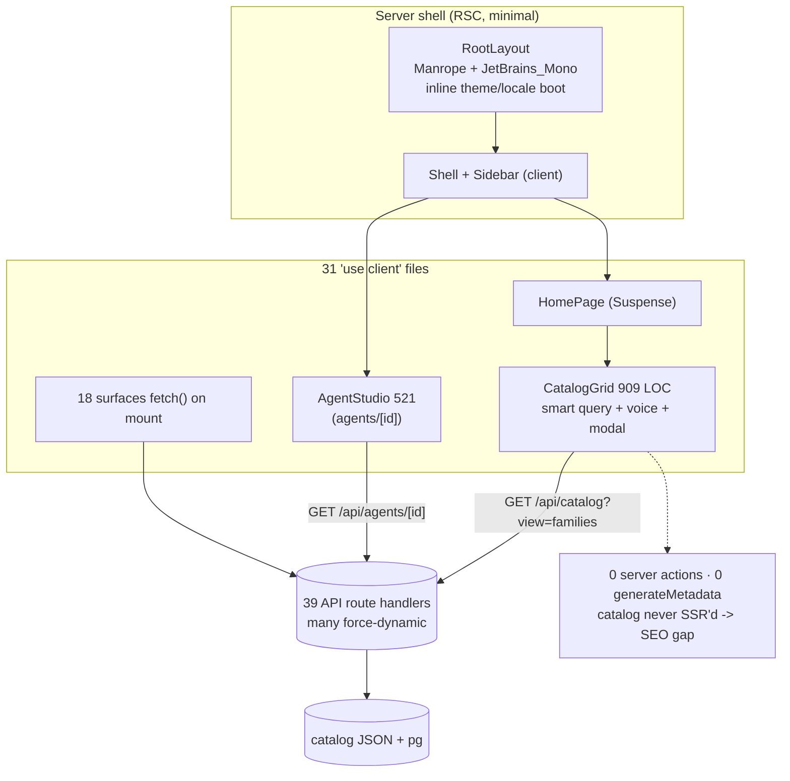


**Diagram — Four frontend delivery channels**

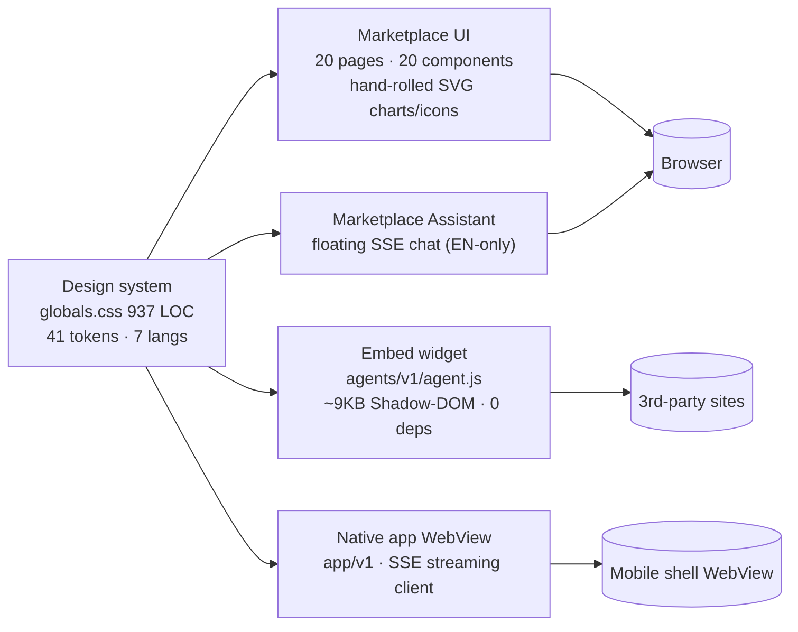


## §5 + §7 — Backend & API

### Overview

The backend is a **Next.js 15 App Router API layer** — 39 route handlers (38 under `apps/web/src/app/api` plus one versioned public asset route `/agents/v1/agent.js`), ~2,592 LOC of route code, **0 server actions**, and a functional (non-OOP) style. Business logic is correctly pushed down into `apps/web/src/lib/*` and the `@miai/*` workspace packages; route handlers stay thin and delegate. The standout architectural strength is **uniformity**: nearly every protected route follows the identical idiom

```
requireAuth(req) → isAuthContext(auth) guard → requireRole/requireOperator(auth) gate
```

sourced from `lib/request-auth.ts` + `lib/security.ts`. The standout weakness is the **absence of any request-schema validation** and **near-total absence of tests/CI** around this security-critical surface.

### Complete API route inventory (39)

| # | Path | Method(s) | Purpose | Auth / Role |
|---|------|-----------|---------|-------------|
| 1 | `/api/health` | GET | Liveness + store ping | Public |
| 2 | `/api/catalog` | GET | Marketplace catalog list/search/filter (552 pkgs) | Public, `force-dynamic` |
| 3 | `/api/agents/[id]` | GET | Agent package detail + rental + connectors | Auth (any); ws-scoped |
| 4 | `/api/chat` | POST | Studio agent turn (JSON, non-stream) | Auth + role ≥ **agent** |
| 5 | `/api/embed/chat` | POST, OPTIONS | Public website-widget chat via embed key | **No session auth**; embed key + rateLimit 30/min + CORS |
| 6 | `/api/app/chat` | POST, OPTIONS | In-app channel chat — **SSE stream** default / JSON opt-in | Embed key + rateLimit 30/min + CORS |
| 7 | `/api/ask/chat` | POST | Pre-sales marketplace assistant | **Unauthenticated**; rateLimit 40/min |
| 8 | `/api/ask/leads` | GET | Captured pre-sales leads | Auth + **operator** |
| 9 | `/api/configure` | POST | Configure rented agent (model/knowledge/bindings) | Auth + role ≥ **agent** |
| 10 | `/api/rent` | POST | Rent agent into workspace | Auth + role ≥ **admin** |
| 11 | `/api/rentals` | GET | List workspace rentals | Auth (any) |
| 12 | `/api/wallet` | GET, POST | Token balance / top-up | GET ≥ **readonly**, POST ≥ **admin** |
| 13 | `/api/connectors` | GET, POST | List connectors / attach binding | GET listing, POST ≥ **agent** |
| 14 | `/api/connectors/credentials` | POST | Store connector API-key credential | Auth + role ≥ **admin** |
| 15 | `/api/oauth/[connector]/start` | GET | Begin OAuth (PKCE + HMAC-signed state) | Auth + role ≥ **agent** |
| 16 | `/api/oauth/[connector]/disconnect` | POST | Revoke connector | Auth + role ≥ **admin** |
| 17 | `/api/oauth/callback` | GET | OAuth redirect handler (code→token) | Public; **state HMAC-verified** |
| 18 | `/api/oauth/status` | GET | Connector connection status | Auth (any) |
| 19 | `/api/knowledge` | GET | List knowledge sources | Auth (any) |
| 20 | `/api/knowledge/[id]` | DELETE | Remove knowledge item | Auth + role ≥ **agent** |
| 21 | `/api/knowledge/paste` | POST | Add pasted-text knowledge | Auth + role ≥ **agent** |
| 22 | `/api/knowledge/upload` | POST | Upload file knowledge | Auth + role ≥ **agent** |
| 23 | `/api/knowledge/crawl` | POST | Crawl URL into knowledge (**SSRF-guarded**) | Auth + role ≥ **agent** |
| 24 | `/api/custom-requests` | GET, POST | Bespoke-agent requests | GET **operator**, POST ≥ **agent** |
| 25 | `/api/custom-requests/[id]` | PATCH | Update request status | Auth + **operator** |
| 26 | `/api/workspace/members` | GET, POST | List / invite members | GET ≥ **readonly**, POST ≥ **admin** |
| 27 | `/api/workspace/members/[userId]` | PATCH, DELETE | Change role / remove member | Auth + role ≥ **admin** |
| 28 | `/api/audit` | GET | Audit log (cross-ws needs operator) | ≥ **readonly** (+operator) |
| 29 | `/api/history/turns` | GET | Chat-turn history (cross-ws needs operator) | ≥ **readonly** (+operator) |
| 30 | `/api/history/trace/[correlationId]` | GET | Traceability by correlation id | Auth + role ≥ **readonly** |
| 31 | `/api/insights` | GET | Analytics / insights | Auth (any) |
| 32 | `/api/ops` | GET | Ops summary | Auth (any) |
| 33 | `/api/admin` | GET | Operator admin dashboard data | Auth + **operator** |
| 34 | `/api/dsar/export` | GET | DSAR / GDPR data export | Auth + role ≥ **admin** |
| 35 | `/api/slack/channels` | GET, POST | List Slack channels / set handoff channel | Auth (any) |
| 36 | `/api/mcp` | GET | MCP sink health/inspect | `MCP_SINK_TOKEN` in prod |
| 37 | `/api/mcp/tools/call` | POST | MCP tool-bridge sink | `MCP_SINK_TOKEN` in prod |
| 38 | `/api/webhook/sink` | POST, GET | Connector webhook proof sink | `WEBHOOK_SINK_SECRET` / `x-miai-signature` in prod |
| 39 | `/agents/v1/agent.js` | GET | Embeddable widget JS (**versioned, public**) | Public, `cache-control: max-age=60` |

### Middleware & auth (`middleware.ts`, `lib/auth.ts`)

`middleware.ts` matches `/api/:path*` but is a thin gate: **only when `MIAI_AUTH_MODE=oidc`** does it enforce presence of a `Bearer ` prefix (not validity) and exempt a public-path allowlist. Full JWT verification is deferred to handlers via `resolveAuth()`. In **oidc** mode, `jose.jwtVerify` validates against a remote JWKS with issuer/audience and requires a `workspace_id` claim — and critically, `workspaceId` is taken from the token, so body params cannot override tenant. In **mock** mode (the default), `workspaceId`/roles are read from `x-workspace-id`/`x-user-id`/`x-roles` headers or query, and an unauthenticated caller **defaults to `['owner','operator']`**. This is only safe because `instrumentation.ts → assertBootHardening()` **fails closed** in production, refusing to start on weak secrets or mock rails unless `ALLOW_MOCK_RAILS=1`.

### RBAC

A clean 4-tier workspace ladder — `readonly < agent < admin < owner` (`WORKSPACE_RANK`) — plus a platform-operator overlay (`operator`/`platform_admin`/`miai_admin`) with alias normalization. `requireRole` enforces minimum rank; `requireOperator` gates cross-tenant/admin surfaces (with a demo carve-out: a `mock`-mode `owner` may open operator views). 7 routes require ≥admin/owner.

### Validation, rate limiting, caching, streaming

- **Validation:** none structurally. 0 schema libraries; all bodies are `as {...}` casts with manual null checks. **This is the primary API-quality deficiency.**
- **Rate limiting:** in-process token bucket (`lib/security.ts`) on exactly 3 public chat routes (embed/app 30/min, ask 40/min). Not applied to authenticated routes; per-replica only.
- **Caching:** effectively none — routes are `force-dynamic`; the 552-package catalog is recomputed per request. No `revalidate`/`unstable_cache`/ISR. Only the widget script sets `max-age=60`.
- **Streaming/SSE:** only `/api/app/chat` streams (SSE `event:meta|delta|status|paused|done`, `x-accel-buffering:no`). The other three chat endpoints are one-shot JSON.

### Webhooks, connectors, versioning, jobs

- **Inbound sinks** (`/api/webhook/sink`, `/api/mcp*`) are Wave-4 "proof" endpoints: open in dev, secret-gated (`x-miai-signature` / `Bearer MCP_SINK_TOKEN`, `503` if unset) only when `NODE_ENV=production`. Persist to capped (50) in-memory arrays + best-effort JSON files.
- **Outbound** connector webhooks (`packages/connectors/src/live/execute.ts::postWebhook`) go through the SSRF guard, sign with `x-miai-signature`, and use `redirect:'manual'` (rejecting 3xx) — solid.
- **Versioning:** only the widget (`agents/v1`) and UI (`app/v1`) are versioned; the 38 JSON endpoints under `/api` are unversioned with no compatibility contract.
- **Background jobs / cron:** **none.** No cron, scheduler, or queue; all persistence is request-driven with `globalThis` caches and a pg→file→memory store fallback. No `.github` CI.

### Assessment

The **security perimeter of the connector/OAuth subsystem is genuinely well-built** (HMAC state, PKCE, MAC-encrypted tokens, DNS-resolving SSRF guard, timing-safe compares, fail-closed boot). The **API application layer is comparatively immature**: no input validation, no versioning, ephemeral single-replica state, uneven error handling (10/38 routes use try/catch), and **zero API tests / no CI**. Robustness rests heavily on one boot-time env check; a single misconfiguration (`ALLOW_MOCK_RAILS=1` in prod) collapses authentication entirely.


**Diagram — Request auth & RBAC pipeline**

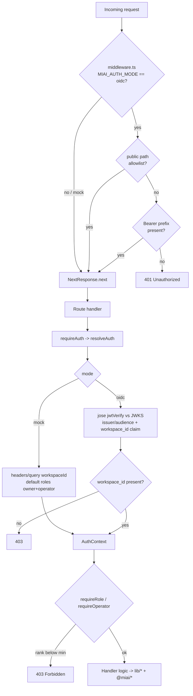


**Diagram — API surface by auth tier**

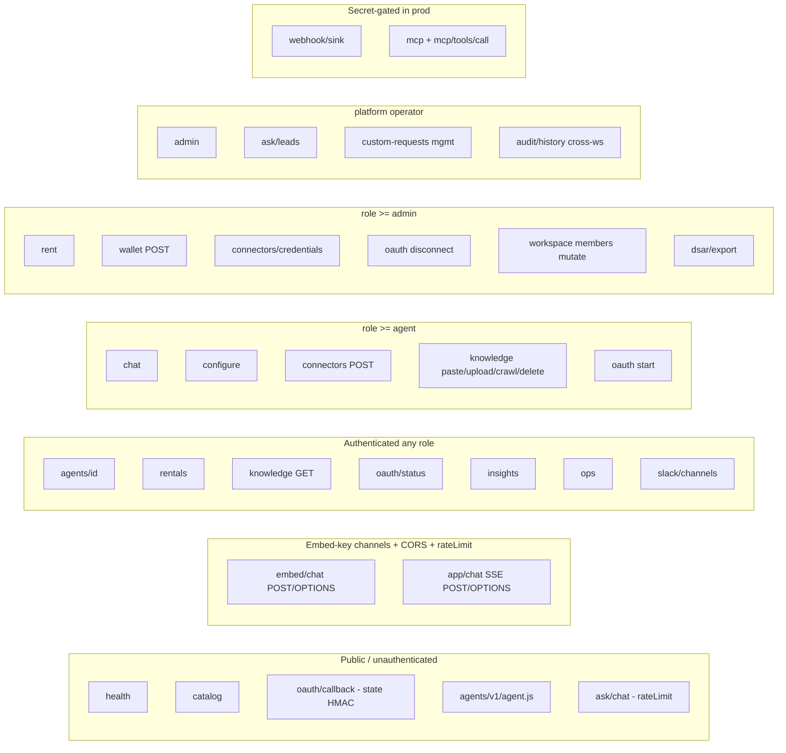


## 6. AI Platform

### 6.1 What was built

The AI platform is a **single-provider, functional-style agent runtime** that turns a JSON *agent package* into a live, tool-using assistant. The crown jewel is `packages/runtime/src/index.ts` (2,413 LOC), which contains the `runTurn` orchestrator, four model adapters, streaming helpers, and — most of the file — a hand-written deterministic model. Everything is TypeScript, functional (only ~12 classes repo-wide), and wired to LLM providers with raw `fetch` against an OpenAI-compatible surface. There is **no LLM framework** (no Vercel AI SDK, LangChain, or LlamaIndex) and no vector database.

The system is genuinely more sophisticated than a typical wrapper, but its sophistication is unusual: the heavy engineering sits in (a) a ~1,075-LOC regex intent-and-guardrail engine that stands in for the model in sandbox and in *all* evals, and (b) nine bespoke per-vertical workflow state machines. General-purpose agentic depth (a real multi-round tool loop, retrieval, provider routing) is comparatively thin.

### 6.2 Model layer and routing

| Element | Evidence | Assessment |
|---|---|---|
| Adapters | `MockModelAdapter`, `OpenAIModelAdapter`, `AnthropicModelAdapter`, `GatewayModelAdapter` | 4 adapters, one OpenAI-compatible code path; Anthropic uses its OpenAI-compat endpoint |
| Routing | `createModelAdapter()` on `MIAI_MODEL_MODE` env; alias maps translate `gemini-flash`/`gpt-4o`/`claude-sonnet` to concrete models | Works, but provider is a global env switch, not per-agent |
| Streaming | True SSE passthrough (`openAiCompatibleStream`); mock paces word chunks; `/api/app/chat` emits `delta`/`status` SSE | Real, functional streaming |
| Fallback / params | Manifest declares `model.fallback`, `temperature`, `max_output_tokens` | **Dead config** — adapters ignore all three (hardcode temp 0.4 / max_tokens 500), no provider fallback chain; a fetch error returns a static apology string |

The `MockModelAdapter` is the platform's most distinctive asset and its biggest tell. Its single `complete()` method is a cascade of ~421 regex branches implementing intent classification (which tool to call), retrieval (`knowledgeHit` lexical scoring), and safety refusals (injection, card/OTP, cross-tenant privacy, financial advice, clinical/emergency handoff, sanctions/AML, GDPR erasure). It is impressive, deterministic, and zero-cost — but it is a rules engine, not intelligence, and the guardrail behavior it encodes **does not execute for live models**.

### 6.3 Orchestration and tool execution

The **generic path runs at most one tool round per turn**: `modelAnswer` → if a `toolCall` is returned, execute a single connector → a follow-up `modelAnswer` with tools disabled. There is no loop that lets the model chain tool calls. Multi-step orchestration exists only in the **10 workflow modules** (4,750 LOC), of which 9 are dispatched by `agentId` regex (`isExecutiveAssistant`, `isItHelpdesk`, booking, sales-qualifier, restaurant, onboarding, dental, hotel, marketplace-assistant). These implement a proper **goal → plan → confirm → execute → verify** loop, **confirm-before-write** (a proposed plan is persisted inline as `<!--miai-workflow:{json}-->` and requires a "yes"), step-level failure handling ("don't continue writes after failure"), and **handoff-to-human** on unresolvable conflicts, localized across 8 languages. This is well-designed — but it covers ~9 of 100 families; the other ~91 inherit the shallow single-round path.

The **connector layer is the strongest engineering in the platform**: 15 live implementations behind a uniform `executeConnector` (Slack, Shopify, HubSpot, Google/M365 Calendar, Email, Teams, Zendesk, Calendly, Xero, QuickBooks, WhatsApp, Stripe, WooCommerce, webhook, MCP), with a sealed OAuth token store, SSRF guards, and ~80 sandbox stub patterns. Sandbox always stubs; live gracefully degrades to a stub when a connector is not yet OAuth-connected.

### 6.4 Agent packages, knowledge, MCP

The **agent-package schema (`miai.agent-package/v1`)** is portable and well-factored: `manifest` (tier, category, channels, languages, market, compliance, model, handoff, prepaid SKUs) + `system_prompt` + `knowledge` + typed `tools` (JSON-schema `parameters`, `side_effects: read-only|write|financial`, `auth_scope`) + `guardrails` + `evals`, with per-tenant `{{placeholder}}` materialization and preset tool-bindings. 551 packages, 2,111 tool definitions (avg 3.8/agent).

**Knowledge/RAG is stuff-the-context, not retrieval.** A grep for embeddings/vector/cosine/pgvector returns **zero hits**. Sources ingested via paste/file/crawl/upload are stored in a JSON file + in-memory map and flat-concatenated into the system prompt under an 80k budget, then sliced to 40k. The only "retrieval" is `knowledgeHit`, a lexical keyword score used by the mock; live models receive the entire blob. This will silently degrade as tenants upload more documents.

**MCP** is bidirectional but minimal: an inbound `/api/mcp` sink (records and echoes `{name, arguments}`, capped 50, bearer-gated in prod) and an outbound MCP client in `executeLive`. Neither implements JSON-RPC `tools/list` or an SSE MCP transport — it is a proof bridge, not a full MCP server.

### 6.5 Evaluation, metering, memory

**Eval framework (breadth impressive, rigor weak).** `eval-suite.mjs` runs 8,513 evals (avg 15.5/agent, min 12, max 23) with zero token cost: static checks (bindings present, prompt/knowledge length, eval-tool existence, knowledge↔eval drift) plus multi-turn runtime cases scored on `tool`/`tool_any`/`tool_none`/`says_any`/`says_none`. There is a `certify-golive.mjs` checklist and a CI-style critical threshold. **However**: (1) all runtime scoring is against the MockModel, not a real LLM; (2) assertions are very loose (digit-normalized substrings + 60% token overlap; a PTO eval accepts `"21"`, `"on file"`, `"help"`, `"team"`); and (3) `heal-eval-failures.mjs` makes failing *non-safety* evals pass by **injecting the expected phrases into the agent's knowledge** (`## Eval grounding`) and softening expects. Safety IDs (card/OTP/cross-party/emergency/injection) are correctly excluded. Net: the pass-rate headline is partly self-fulfilling and does not measure live-model quality.

**Token metering** is a `chars/4 × model-multiplier` estimate, not a real count, with idempotent debits and pause-on-zero. The real `HttpWalletAdapter` targets a MyInstantAI wallet API that does not yet exist; the operative wallet is in-memory. **Conversation memory** replays full per-workspace/agent history each turn (no summarization), with workflow state persisted inline in the assistant message — simple and functional.

### 6.6 Scorecard rationale

| Score | Value | Rationale |
|---|---|---|
| ai_complexity | 72 | 4 adapters, streaming, 10 workflow state machines, 551-pack schema, 15 live connectors — real breadth, but concentrated in a regex mock + per-vertical hardcoding, not a general agentic core |
| ai_maturity | 55 | End-to-end and demoable, but no vector RAG, single-round generic path, live guardrails prompt-only, wallet backend aspirational, dead model config |
| orchestration | 60 | Excellent plan/confirm/verify + handoff in 9 hero agents; ~91% of families lack bespoke orchestration and cap at one tool call/turn |
| evaluation_rigor | 47 | Large, well-structured harness undermined by loose matching, mock-only runtime scoring, and self-healing that writes answers into knowledge |
| agent_engineering | 74 | Strong, portable package format (typed tools, side-effect taxonomy, auth scopes, templating, preset bindings) — the most credible piece of the platform |

**Bottom line for the board:** this is a thoughtfully architected agent *platform shell* with an excellent package format and connector layer, whose demonstrated intelligence and safety today are largely produced by a deterministic mock and nine hand-built workflows. To become a real AI platform it needs: a genuine multi-round tool loop on live models, runtime guardrail enforcement (not prompt-only), embeddings-based retrieval, per-agent model routing with fallback, real token metering, and an eval suite scored against live models without answer-injection.


**Diagram — Agent turn / tool-execution lifecycle (runTurn)**

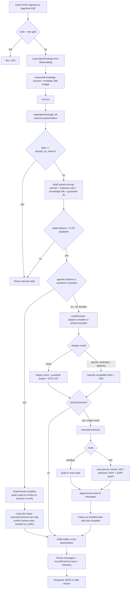


**Diagram — Zero-token eval / certify / heal loop**

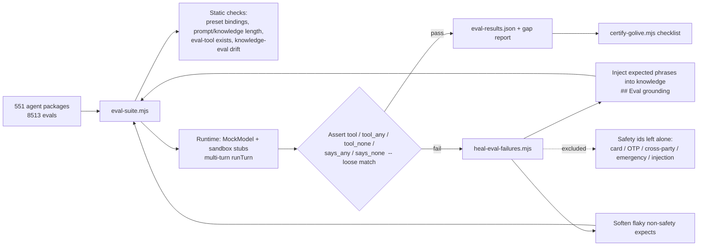


## 8. Data Architecture

### 8.1 Summary

MyInstantAI's marketplace is a **file/JSON-first system, not an RDBMS-backed application**. There are two distinct data planes:

1. **A read-only content catalog** (`data/catalog/`) — the product's core asset. 551 self-contained `*.agent.json` "agent packages" (100 families × 5 international markets = 500, plus 51 South-Africa base packs), fronted by a pre-built `index.json` (500 lightweight rows) and `families.json` (100 rows). This plane is git-tracked, generated by an offline pipeline, and served statically. It is coherent and appropriate for a read-heavy catalog.

2. **A runtime state plane** — eleven `globalThis`-singleton stores (rentals, audit, OAuth tokens, knowledge sources, turn transcripts, workspace members, wallet, etc.). These are in-memory Maps that snapshot to JSON files, with an **optional, partial** Postgres path. This plane is prototype-grade and is the platform's principal data-durability risk.

A real relational database is **present but optional and shallow**: `pg ^8.22.0` is the only DB driver declared (`apps/web/package.json`), dynamically imported (`await import("pg")`) in exactly three files — `store.ts`, `traceability.ts`, `health/route.ts`. **No** Prisma/Drizzle/TypeORM/Knex, **no** Redis, Mongo, Supabase, MySQL, or SQLite anywhere in source or dependencies (grep-verified). Postgres is engaged only when `DATABASE_URL`/`MIAI_DATABASE_URL` is set; otherwise the system runs entirely off local JSON files, and if `/data` is not writable, off process memory.

### 8.2 Agent-package schema & entity relationships

Each package conforms to `format: "miai.agent-package/v1"` (`packages/agent-protocol/src/index.ts`). Top-level shape: `{ format, manifest, system_prompt, knowledge, tools[], guardrails, evals[] }`. The `manifest` carries id, name, version, category (5-value enum), tier (standard/pro/enterprise), channels, languages, market, compliance, model config, handoff, usage_profile, and prepaid SKUs. Tools declare `name/description/parameters/side_effects(read-only|write|financial)/auth_scope`.

Relationships are **denormalized and string-referenced**, not foreign-keyed:
- `families.json` maps each family to its market variants via a `markets: { us, eu, africa, asia, oceania, za }` dictionary of **agent-id strings** — resolved at read time by filename (`getAgentPackage`), with a silent `null` on miss. No referential integrity.
- At rental, a catalog agent is instantiated into a `WorkspaceAgent` (`store.ts`) carrying `bindings: ToolBinding[]`. A `ToolBinding` (`packages/connectors/src/types.ts`) links `tool → connector(+config)`. A connector, once OAuth-authorized, has one `StoredToken` per `(workspaceId, connectorId)` sealed with AES-256-GCM.

### 8.3 Persistence inventory (measured)

| Store (singleton) | File | Postgres path | Durable on Railway? | Encrypted at rest |
|---|---|---|---|---|
| Rentals + Audit (`__miaiStore`) | `rentals.json` | Yes — `miai_rentals`, `miai_audit` | Only if `DATABASE_URL` set | No |
| Turn transcripts (`__miaiTurns`) | `turn-transcripts.json` | Yes — `miai_turns` | Only if `DATABASE_URL` set | No |
| OAuth tokens (`__miaiOauthTokens`) | `oauth-tokens.json` | **No** | **No** — file only | **Yes (AES-256-GCM)** |
| Knowledge sources (`__miaiKnowledge`) | `knowledge-sources.json` | **No** | **No** — file only | No |
| Workspace members (`__miaiWorkspaceMembers`) | `workspace-members.json` | **No** | **No** — file only | No |
| Ask leads (`__miaiAskLeads`) | `ask-leads.json` | **No** | **No** — file only | No |
| Custom requests (`__miaiCustomRequests`) | file | **No** | **No** — file only | No |
| Wallet (`__miaiWallet`) | none | **No** | **No — memory only** | n/a |
| Rate-limit / ask / channel sessions | none | No | Memory only | n/a |

Only **2 of the 7 file-backed stores** ever reach Postgres. The most sensitive material — **connector OAuth tokens** and **tenant-uploaded knowledge/PII** — is file-only even when Postgres is configured.

### 8.4 Durability posture (the critical gap)

The `Dockerfile` points all stores at `/data` (`RENTAL_STORE_PATH=/data/rentals.json`, `OAUTH_TOKEN_STORE_PATH`, `KNOWLEDGE_STORE_PATH`) and `mkdir -p /data`. **`railway.toml` declares no persistent volume** (grep: "NO VOLUME DECLARED"). On Railway's container filesystem `/data` is **ephemeral**, so absent `DATABASE_URL`, **every redeploy or restart wipes all rentals, audit, OAuth tokens, knowledge, members and leads.** Even *with* Postgres, tokens/knowledge/members/leads still vanish (no Postgres path). The wallet is a pure in-memory `MockWalletAdapter` — balances reset on every process restart. Durability therefore hinges on an unset env var and covers only a minority of the data.

### 8.5 Data-integrity & concurrency risks

- **No schema validation library** (no zod/ajv/joi — grep-confirmed). `loadAgentPackage()` does minimal duck-typing (format string + `manifest.id` + `system_prompt` + `tools` is-array). Malformed packages pass silently on any field it doesn't check.
- **Type/JSON schema drift.** The `AgentManifest` TS interface is a strict *subset* of the on-disk manifest, which additionally carries `voice, prompt, knowledge, tools, guardrails, evals` **duplicated inside `manifest`** and again at top level. Nothing enforces they agree; `index.json` caches stale `tools`/`evals` counts (e.g., base `accounting-practice` ships 15 evals while its `africa-` variant index row shows 16).
- **Full-table-rewrite persistence.** `persistToPostgres()` does `DELETE FROM miai_rentals` (all rows) then re-INSERTs the entire in-memory snapshot on **every** mutation, same for `miai_audit`. This is O(n) per write and **last-writer-wins across the whole table** — two container replicas would clobber each other's rentals.
- **Single-writer assumption.** All state is per-process `globalThis` Maps hydrated once. With >1 replica (or serverless fan-out) each process has its own Map and its own JSON file; file writes are whole-file read-modify-write with **no locking or atomic rename**, so concurrent writers can corrupt or lose data. `security.ts` itself notes the rate-limiter is "per Container App replica; replace with Redis… when multi-region scale lands."
- **No migrations / seeds framework** (no migrations dir). Schema is created inline via `CREATE TABLE IF NOT EXISTS` on every hydrate/persist — idempotent but unversioned; any column change requires manual ALTERs.

### 8.6 Catalog data model — strengths & weaknesses

**Strengths:** clean offline generation pipeline (`scripts/import-catalog.mjs` bundles a separate source-of-truth repo `miai-agents-audit/agents/` into denormalized packages + `index.json`); tidy two-level family/market taxonomy driven by `market-packs.json`; filename = agent id (content-addressable-ish); a lightweight 228 KB index as the query surface with 32 KB full packages loaded on demand; `data/reports/eval-results.json` gives a measured quality signal (500 agents, `passRate`, static/runtime pass-fail).

**Weaknesses:** the 51 ZA base packs are **excluded from `index.json`** (international-only) yet referenced by `families.json markets.za` — an orphan/inconsistency risk, and ZA coverage is partial (51/100 families). The 5 near-duplicate market variants per family mean the ~304 K-LOC JSON catalog is largely repetition; a family prompt change must fan out ×5 (via `deepen-*.mjs`), inviting drift. There is no checksum/version pin across the split-repo boundary, so `index.json` counts can silently diverge from the packages they summarize.

### 8.7 Verdict

The **catalog** plane is a genuine, well-structured asset — defensible for a read-heavy marketplace. The **runtime persistence** plane is demo/prototype-grade: correct for a single-process happy path, but not durable, not concurrency-safe, and not consistently backed by the database it half-integrates. For production, the priority order is: (1) declare a persistent volume *or* route **all** stores through Postgres; (2) put OAuth tokens and knowledge into the DB; (3) replace full-table-rewrite with row-level upserts and a connection pool; (4) add schema validation and versioned migrations.


**Diagram — Agent-package & runtime entity-relationship model**

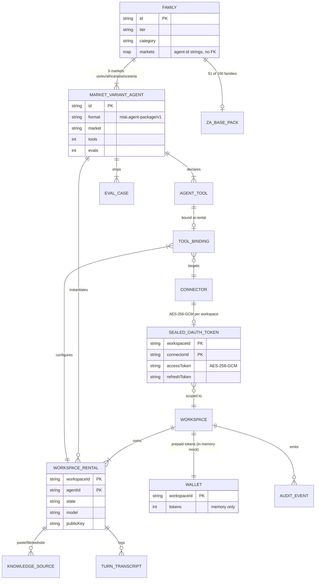


**Diagram — Persistence topology & durability tiers**

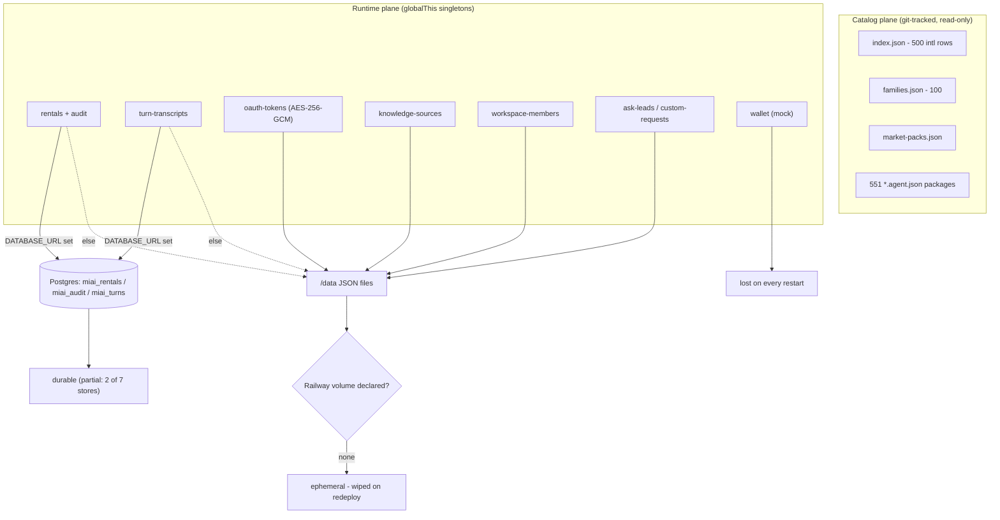


## §9 Integrations

### 9.1 Summary

The platform ships a **single, well-factored first-party connector layer** in `packages/connectors/src` (no third-party integration SDK/iPaaS dependency) that exposes **16 connectors** spanning calendar, CRM, commerce, accounting, ticketing, messaging and payments, plus a generic **Webhook** and **MCP** bridge for open-ended extension. Every connector has a **real live-execution handler** in `live/execute.ts` (1,286 LOC) — none are metadata-only stubs — and eleven of them are wired to a **properly-built OAuth2 subsystem** (PKCE, HMAC-signed self-contained state, AES-256-GCM sealed token store, DSAR-safe metadata, tokens kept out of the LLM context). On top of connectors, the runtime integrates **3 LLM providers** (OpenAI, Anthropic, and an OpenAI-compatible "MIAI gateway") behind a shared adapter, and the app targets **two clouds** (Railway via `railway.toml`/`Dockerfile`; Azure via `infra/azure/main.bicep` — Container Apps + Postgres + Key Vault + Azure Files + App Insights).

The design quality is high for the codebase size; the gaps are **operational hardening**, not architecture: a **file-based token store** (not a secret manager/DB), **dev-fallback signing secrets**, a webhook "signature" that is a shared secret rather than an HMAC-over-body, **zero automated tests** for the entire connector/OAuth layer (the sole unit test is `packages/wallet-adapter/test/wallet.test.mjs`), and **default preset bindings that exercise only 5 of 16 connectors** out of the box.

> Correction to prior baseline: **`next-auth` is not used** anywhere (0 references). Auth is a **bespoke OIDC/JWT layer built on `jose`** with `mock`/`oidc` modes (`MIAI_AUTH_MODE`), role-gated at the route level (`requireAuth`/`requireRole`).

### 9.2 Connector inventory (measured — `CONNECTORS` array + `live/execute.ts`)

| Connector | Purpose | Auth | Phase | Live handler (execute.ts) | OAuth provider entry |
|---|---|---|---|---|---|
| **mcp** | Call tools on an HTTP MCP bridge (`POST {endpoint}/tools/call`) | `mcp` (bearer) | 1 | `executeLive` case `mcp` | — |
| **webhook** | POST events to any backend URL | `webhook_secret` | 1 | `postWebhook` (SSRF-guarded) | — |
| **google_calendar** | Availability (freeBusy) + create events/reminders | `oauth` (PKCE) | 1 | `googleCalendar` | ✔ |
| **m365_calendar** | Availability + events via Graph `getSchedule`/`/me/events` | `oauth` (PKCE) | 1 | `m365Calendar` | ✔ |
| **shopify** | Order lookup (`/admin/api/2024-10/orders`) | `oauth` (no PKCE) | 1 | `shopifyOrder` | ✔ (`requiresShop`) |
| **hubspot** | Create tickets / contacts (dynamic pipeline stage) | `oauth` (no PKCE) | 1 | `hubspotWrite` | ✔ |
| **slack** | Channel notify / human handoff (`chat.postMessage`) | `oauth` | 1 | `slackHandoff` | ✔ |
| **email** | Send via **Gmail API** or **Graph sendMail** | `oauth` (PKCE) | 1 | `sendEmail` | ✔ (dual google/microsoft) |
| **whatsapp** | Cloud API text send (`graph.facebook.com/v19.0`) | `api_key` | 1 | `whatsappSend` | — |
| **woocommerce** | Order status (Basic auth consumer key/secret) | `api_key` | 2 | `wooOrder` | — |
| **teams** | Channel message handoff via Graph | `oauth` (PKCE) | 2 | `teamsHandoff` | ✔ |
| **xero** | Invoice read + tenant discovery (`/connections`) | `oauth` (PKCE, basic) | 2 | `xeroRead` | ✔ |
| **quickbooks** | Invoice query (sandbox/prod switch) | `oauth` (basic) | 2 | `quickbooksRead` | ✔ (`realmId`) |
| **stripe** | Payment-link creation (product→price→link) | `api_key` | 2 | `stripePaymentLink` | — |
| **calendly** | User/scheduling-URL read | `oauth` (PKCE) | 2 | `calendlyBook` | ✔ |
| **zendesk** | Create ticket (`/api/v2/tickets`) | `oauth` | 2 | `zendeskTicket` | ✔ (`requiresSubdomain`) |

**Totals:** 16 connectors — 11 OAuth · 3 api_key (whatsapp, woocommerce, stripe) · 1 webhook_secret · 1 mcp. Phase 1 = 9, Phase 2 = 7. **11 declarative OAuth provider entries** in `OAUTH_PROVIDERS` (email covers both Google and Microsoft via `resolveProvider` override → effectively 12 authorization surfaces). PKCE is enabled on 6 providers (google, email, m365, teams, xero, calendly); Shopify/HubSpot/Slack/QuickBooks/Zendesk rely on the HMAC-signed `state` for CSRF instead.

### 9.3 External platforms

| Platform | Role | Where | Auth |
|---|---|---|---|
| **OpenAI** | LLM adapter (`gpt-4o`/`4o-mini`) | `runtime/src/index.ts` `OpenAIModelAdapter` | `OPENAI_API_KEY` |
| **Anthropic** | LLM adapter via OpenAI-compat `/v1/chat/completions` | `AnthropicModelAdapter` (Haiku/Sonnet/Opus map) | `ANTHROPIC_API_KEY` |
| **MIAI Gateway** | OpenAI-compatible model gateway (passthrough) | `GatewayModelAdapter` | `MIAI_MODEL_GATEWAY_KEY` |
| **MIAI Wallet** | Token metering / debit rail | `packages/wallet-adapter` | `MIAI_WALLET_API_KEY` |
| **MIAI OIDC (jose)** | Request auth (not next-auth) | `MIAI_OIDC_ISSUER/AUDIENCE/JWKS_URL` | JWT/JWKS |
| **Railway** | Primary deploy target | `railway.toml`, `Dockerfile` | platform |
| **Azure** | Alt landing zone (Container Apps, Postgres, Key Vault, Files, Log Analytics) | `infra/azure/main.bicep` | Key Vault + UAMI |
| **App Insights** | Telemetry (`trackDependency/Event/Exception`) | `@/lib/telemetry` | connection string |
| **Postgres** | Persistence (`pg`) | `apps/web` | `DATABASE_URL` |

### 9.4 OAuth + sealed-token design (strength)

- **Self-contained signed state** (`flow.ts::createState/consumeState`): `base64url(json).base64url(HMAC-SHA256)`, 15-minute expiry, `timingSafeEqual` verification — survives Railway multi-instance/cold starts without server-side session storage. PKCE verifier is carried inside the signed state.
- **Sealed tokens at rest** (`tokens.ts::seal/open`): **AES-256-GCM** (`v2.` envelope, key = SHA-256 of secret), with backward-compatible `v1.` HMAC and plaintext acceptance for migration.
- **Tokens never enter LLM context**: the callback rewrites bindings to a **pointer** (`oauth: "connected"`) only; `listTokenMeta` strips access/refresh material for DSAR exports; credentials route returns masked `••••` values.
- **SSRF egress guard** (`ssrf.ts`): scheme allow-list, credential-in-URL rejection, blocked hostnames (localhost/metadata), DNS resolution with private/loopback/link-local/CGNAT/ULA range blocking, and `redirect: "manual"` on webhook POSTs.
- **Role-gating**: OAuth start requires `agent` role; credential save requires `admin`.

### 9.5 Weaknesses / risks

1. **File-based token store, not a secret manager.** `data/oauth-tokens.json` behind an in-memory `Map`; `hydrate()` early-returns when `mem().size > 0`, so a horizontally-scaled second instance will not observe tokens written by the first without a restart — **multi-instance desync / stale-read risk**. Azure Key Vault exists in Bicep but the token store does not use it.
2. **Dev-fallback signing secrets.** `stateSecret()` and `secret()` fall back to `"dev-only-change-me"`. If `OAUTH_TOKEN_SECRET`/`OAUTH_STATE_SECRET` are unset in production, all tokens are sealed and all state is signed with a **publicly-known key**. (Azure Bicep auto-generates; a Railway/self-host deploy can silently miss this.)
3. **Webhook "signature" is a shared secret, not an HMAC.** `postWebhook` sends `x-miai-signature: <secret>` (the raw secret, not `HMAC(secret, body)`); the sink compares with `!==` (not constant-time). Not replay-resistant and mislabeled as a signature.
4. **No automated tests for the integration layer.** Only `wallet-adapter/test/wallet.test.mjs` exists; OAuth flow, token sealing, SSRF, and all 16 live handlers are covered only by **manual** ops scripts (`proof-mcp`, `proof-webhook`, `live-connector-proof`, `live-llm-smoke`) with **no `.github` CI** to gate them.
5. **Breadth ≠ activation.** Default preset bindings reference only **5 of 16** connectors (webhook ×19, hubspot ×7, slack ×5, shopify ×3, google_calendar ×1); the other 11 (email, m365, teams, xero, quickbooks, stripe, calendly, zendesk, whatsapp, woocommerce, mcp) require manual per-workspace wiring.
6. **No provider retry/backoff/rate-limiting.** Handlers do a single `fetch`; a provider 429/5xx surfaces as a one-shot failure (graceful "hand to a human" fallback, but no resilience). `getValidAccessToken` silently swallows refresh failures and serves the stale token.
7. **Monolithic execution surface.** `executeLive` is one 1,286-line file: a large `switch` plus a ~500-line `stubFor` if-ladder that routes by **substring matching on tool names** — brittle as the 552-pack catalog grows.

### 9.6 Extensibility

Adding an **OAuth connector** is clean and declarative: append to the `ConnectorId` union + `CONNECTORS` array, add one `OAuthProvider` object (`authorizeUrl`/`tokenUrl` functions, `authStyle: body|basic`, `pkce`, optional `requiresShop`/`requiresSubdomain`), and one handler + `switch` arm. The shared `openAiCompatible{Complete,Stream}` helpers make adding an LLM provider trivial. There is, however, **no plugin/handler-module registry** — connectors are hard-coded switch arms rather than discoverable handler modules — so extension still edits core files.


**Diagram — Integration map: platform to connector to agent tools**

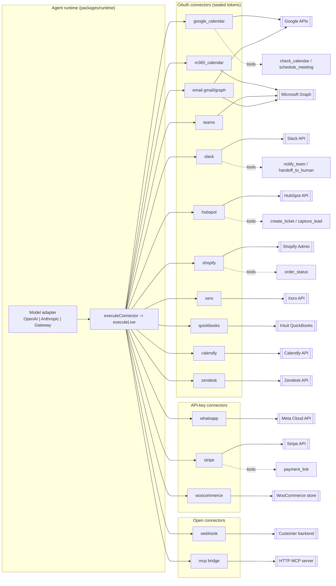


**Diagram — OAuth authorize + sealed-token flow**

```mermaid
sequenceDiagram
  participant UI as Actions UI
  participant Start as /api/oauth/[connector]/start
  participant Prov as OAUTH_PROVIDERS
  participant IdP as Provider IdP
  participant CB as /api/oauth/callback
  participant Store as tokens.ts (AES-256-GCM)

  UI->>Start: GET (requireRole agent)
  Start->>Prov: buildAuthorizeUrl (PKCE + scopes)
  Start->>Start: createState = b64(json).HMAC (15m exp)
  Start-->>UI: redirect to IdP authorize URL
  UI->>IdP: user consents
  IdP-->>CB: code + state
  CB->>CB: consumeState (timingSafeEqual, exp check)
  CB->>IdP: exchangeCode (PKCE verifier from state)
  IdP-->>CB: access + refresh token
  CB->>Store: saveToken -> seal(v2 AES-GCM) to disk
  CB->>CB: bindings set pointer oauth=connected (no secret)
  CB-->>UI: redirect ?tab=actions&oauth=connected
  Note over Store: getValidAccessToken refreshes<br/>within 60s of expiry; failure -> stale token
```


## §10 Security

### 10.1 Summary judgment

For a pre-revenue marketplace assembled at high velocity, the security engineering here is **materially above the norm for its stage**. Authorization is the strongest pillar: a coherent rank-based RBAC model is enforced consistently across the API surface, cross-tenant isolation is demonstrable in code, and OAuth secrets are encrypted at rest and deliberately kept out of LLM context, audit logs, and data-subject exports. A recent, substantive hardening commit (`b35d451`) added a real SSRF guard, fail-closed boot checks, and production gating of demo rails.

The countervailing reality is that the platform's safe posture is **conditional on configuration, not on architecture**. The default runtime is a "mock" mode in which authentication is header-spoofable, and the only thing standing between that and a production breach is a single boot-time environment check (and its `ALLOW_MOCK_RAILS=1` escape hatch). That, plus a permissive CSP, non-distributed rate limiting, two unguarded server-egress paths, and the complete absence of CI/security automation, is what separates this from a production-hardened system. None of these are architecturally hard to close; several are one commit each.

### 10.2 What was measured

| Area | Evidence | Assessment |
|---|---|---|
| AuthN | `apps/web/src/lib/auth.ts` — OIDC via `jose` `jwtVerify` against remote JWKS (issuer+audience checked, `workspace_id` claim required); mock mode trusts request headers | Solid OIDC path; risky mock default |
| AuthZ (RBAC) | `apps/web/src/lib/security.ts` `requireRole`/`requireOperator`, rank map readonly<agent<admin<owner + platform operator; used in **22/39** routes, `requireAuth` in **30/39** | Strong, consistent |
| Multi-tenancy | `/api/audit`, `/api/dsar/export` filter by `auth.workspaceId`; cross-workspace only via `requireOperator` + `all=1` | Isolation enforced |
| Secrets at rest | `packages/connectors/src/oauth/tokens.ts` AES-256-GCM `v2.` envelope, legacy `v1.` HMAC migration; state signed HMAC+exp+nonce+PKCE-S256 (`flow.ts`) | Strong |
| Secret hygiene | 0 committed secrets (grep `sk-`/`AKIA`/`xoxb-`/PEM/`ghp_`); `.env` gitignored; dev-default `dev-only-change-me` only as fallback, blocked at boot | Good |
| Boot hardening | `instrumentation.ts` → `assertBootHardening()` throws in prod on weak secrets / mock rails | Fail-closed |
| SSRF | `ssrf.ts` blocks loopback/RFC1918/link-local/metadata/CGNAT/IPv6-ULA; used by crawl + webhook (`redirect:"manual"`) | Good, with gaps (10.4) |
| Transport / headers | `next.config.ts`: CSP, HSTS, `X-Content-Type-Options`, `X-Frame-Options: SAMEORIGIN`, `Referrer-Policy`, `Permissions-Policy` (6) | Complete set; CSP weakened |
| CORS | `embed-cors.ts` — bare `*` denied in prod unless `ALLOW_EMBED_ORIGIN_STAR=1`; wildcard-subdomain matching | Reasonable |
| Rate limiting | in-process token bucket, 3 chat routes only, 30–40/min | Present but non-distributed |
| Webhook signature | `x-miai-signature` shared secret, required in prod (503 if unset), 401 on mismatch | Adequate; non-constant-time compare |
| XSS | Embed widget (`agents/v1/agent.js`) uses `textContent` for dynamic content; one static-only `dangerouslySetInnerHTML` in `layout.tsx` | Low risk |
| Injection (SQL) | No raw SQL string-building observed; `pg` used parametrically / file-store fallback | Low risk |
| Prompt injection | Per-package `guardrails` (scope/grounding/cross-tenant-refusal) baked into system prompt + `scrubLeakedPlaceholders`; probe suite in `guardrails.ts` | Good, prompt-level |

### 10.3 OWASP Top 10 (2021) coverage

| # | Category | Coverage | Notes |
|---|---|---|---|
| A01 Broken Access Control | **Good** | Rank-based RBAC on 22 routes, workspace-scoped queries, verified cross-tenant isolation. Weak point: mock-mode header trust. |
| A02 Cryptographic Failures | **Good** | AES-256-GCM tokens, HSTS, `upgrade-insecure-requests`, signed state. Two shared-secret compares non-constant-time. |
| A03 Injection | **Partial** | XSS-safe widget, no SQL string-building; CSP allows `unsafe-inline`/`unsafe-eval`. |
| A04 Insecure Design | **Partial** | Fail-closed boot + defense-in-depth, but safe posture hinges on one env flag; mock default is insecure-by-default. |
| A05 Security Misconfiguration | **Partial** | Strong header baseline; `ALLOW_MOCK_RAILS` / `ALLOW_EMBED_ORIGIN_STAR` are foot-guns; no CI to catch drift. |
| A06 Vulnerable Components | **Adequate (unverified)** | Current majors (`next ^15.2.8` — past the CVE-2025-29927 middleware-bypass line; `jose ^6`, `react ^19`); only 26 deps, but no automated audit/CI. |
| A07 Identification & AuthN Failures | **Partial** | Real OIDC verification; mock mode is spoofable by design. |
| A08 Software & Data Integrity | **Adequate** | Signed OAuth state; `redirect:"manual"` on webhook. No SRI/CI provenance. |
| A09 Logging & Monitoring | **Partial** | Correlation IDs + workspace-scoped audit + App Insights hooks; no transcript PII redaction, no tamper-evidence. |
| A10 SSRF | **Partial** | Dedicated guard on crawl+webhook; **MCP endpoint and Woo `store_url` egress unguarded**; DNS-rebinding residual. |

### 10.4 OWASP LLM Top 10 coverage

| # | Category | Coverage | Notes |
|---|---|---|---|
| LLM01 Prompt Injection | **Good** | Every catalogue package ships explicit guardrails (scope limits, grounding/honesty, cross-tenant refusal) baked into the system prompt; adversarial probe suite exists. Enforcement is prompt-level + a *claimed* host policy layer not independently verified in code. |
| LLM02 Insecure Output Handling | **Good** | Assistant text rendered via `textContent`; placeholder leakage scrubbed (`scrubLeakedPlaceholders`). |
| LLM03 Training-Data Poisoning | **N/A** | No training; uses hosted models. |
| LLM04 Model DoS | **Partial** | Per-key chat rate limiting + token-wallet debit/pause; non-distributed limiter. |
| LLM05 Supply Chain | **Partial** | Small dep surface; no SBOM/CI audit; model providers external. |
| LLM06 Sensitive Info Disclosure | **Good** | Connector secrets never enter model context (pointer-only bindings); DSAR/audit exclude token material. |
| LLM07 Insecure Plugin/Tool Design | **Partial** | Tool egress mostly to fixed provider hosts; **MCP/Woo tool URLs are unvalidated egress**; tools require admin-configured bindings. |
| LLM08 Excessive Agency | **Partial** | Guardrails forbid claiming un-executed actions; handoff-only side effects; but agent tool-calls run with stored OAuth tokens — blast radius = connector scope. |
| LLM09 Overreliance | **Adequate** | Grounding rules + "check with a human" fallbacks in packages. |
| LLM10 Model Theft | **N/A** | No self-hosted weights. |

### 10.5 Priority remediation

1. **Make insecure auth impossible to ship, not merely discouraged.** Treat mock mode as a build-time dev-only capability; at minimum, log-and-alert whenever `ALLOW_MOCK_RAILS=1` is set with `NODE_ENV=production`, and require a second distinct flag. (High)
2. **Route all user/admin-configurable egress through `assertSafeOutboundUrl`** — specifically the MCP `endpoint` and WooCommerce `store_url` in `live/execute.ts` — and pin the validated IP on fetch to close DNS-rebinding. (Medium)
3. **Tighten CSP**: move to nonce/hash-based `script-src`, drop `unsafe-eval`/`unsafe-inline`. (Medium)
4. **Distributed rate limiting** (Redis/APIM) and extend throttling to OAuth-start and knowledge-crawl. (Medium)
5. **Add CI**: dependency audit, secret scanning, and SAST gates; use `timingSafeEqual` for the sink/MCP secret compares; redact PII in transcript persistence. (Low-Medium)


**Diagram — Authentication & Authorization Flow**

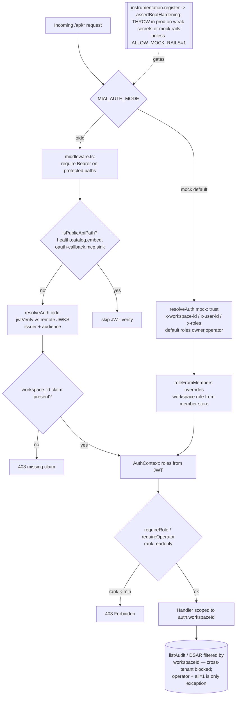


**Diagram — Public Embed Chat & Outbound Egress Trust Boundary**

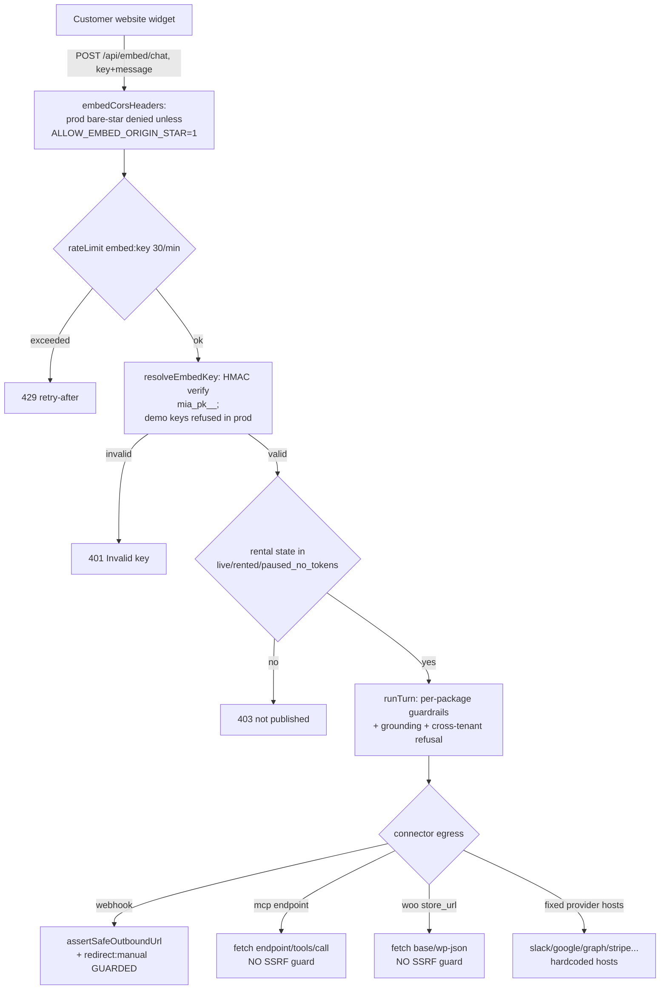


## §11 Compliance Assessment

### Summary

MyInstantAI Agent Marketplace treats compliance primarily as an **agent-layer, prompt-and-guardrail control set localized per market**, layered over a **modest but real platform security baseline**. This is an unusually honest and well-instrumented posture for a pre-GA product: the codebase measures its own compliance behaviour (an 8,513-case eval harness at 96.6% pass, including named compliance tests such as `ccpa-erasure-handoff` and `cross-tenant-refused`) and labels every trust claim `Live / Partial / Via provider / Planned` in `docs/TRUST_AND_COMPLIANCE.md` and `apps/web/src/lib/trust-content.ts`, explicitly prohibiting over-claiming ("Do not say: SOC 2 certified; GDPR-compliant platform; EU residency guaranteed today").

The gap is between **behavioural alignment** (strong, testable) and **certified assurance** (largely absent). There are no certifications, no CI/CD or security-scanning pipeline (`.github` missing), one unit-test file, no signed DPA/BAA, no ISMS/AIMS/risk register, no user-facing privacy notice or consent capture (0 of 20 pages are legal/privacy), and DSAR is export-only with **no automated erasure**. The result is a product that is credible for SMB/mid-market and defensible in partner meetings, but not yet procurement-ready for regulated enterprise (banking, telco, healthcare) without a funded audit program.

### Measured evidence

| Area | Evidence (file-traced) |
|---|---|
| Localized compliance tags | 551 `*.agent.json`; tags: gdpr 100, popia 151, ccpa 100, tcpa 100, pdpa 100, au_privacy_act 100, nz_privacy_act 100, regional_privacy 200, hipaa **5**, ferpa **1** |
| Guardrails (per-pack coverage) | escalation 551/551 · human handoff 387/551 · prompt-injection 326/551 · card/PCI 335/551 (PAN/CVV/PIN/OTP 225/551) · no-legal-advice 238/551 |
| DSAR | `apps/web/src/app/api/dsar/export/route.ts` — owner/admin JSON pack, token/secret redaction, OAuth secrets omitted; **erasure = human handoff only** |
| Encryption at rest | `packages/connectors/src/oauth/tokens.ts` — AES-256-GCM `v2.` envelopes; key = `sha256(OAUTH_TOKEN_SECRET)`; no KMS/Key Vault; JSON-file store |
| OAuth security | `packages/connectors/src/oauth/flow.ts` — PKCE `S256`, HMAC-signed self-contained state, `timingSafeEqual` |
| Web headers | `apps/web/next.config.ts` — 6 headers incl enforcing CSP (weakened by `unsafe-inline`/`unsafe-eval`), HSTS, X-Frame, nosniff, Referrer-Policy, Permissions-Policy |
| Access control | `apps/web/src/lib/security.ts` — RBAC (readonly/agent/admin/owner), operator gate, boot-hardening secret checks, in-process rate limit |
| Audit | `store.ts` `appendAudit` w/ correlationId, workspace-scoped; **file/in-memory, mutable, not immutable/WORM** |
| AI assurance | 8,513 evals, 96.6% pass, 291 fails (`docs/reports/eval-gap-2026-08-02.md`); guardrail probes `apps/web/src/lib/guardrails.ts` |
| Absent | privacy/terms/cookie pages (0), consent banner, ROPA, DPIA, breach-notification policy, CI, SAST/DAST/SCA, LICENSE/SECURITY.md, signed DPA/BAA |

### Per-standard readiness

| Standard | Score | Key present controls (traced) | Top missing controls |
|---|---:|---|---|
| **SOC 2** | 30 | RBAC + operator gate; audit events w/ correlation ids; AES-GCM at rest; boot-hardening secret checks; security headers/CSP; subprocessor list | No CI/change-mgmt, no SAST/DAST/SCA, no policies/control matrix, no continuous monitoring/SIEM (planned), mutable audit store, no independent audit — SOC 2 self-declared "planned/post-GA" |
| **ISO 27001** | 28 | Technical Annex-A controls: access control (A.8.2-8.5), crypto (A.8.24), logging (A.8.15), secure config (A.8.9); documented subprocessors | No ISMS, no risk register/SoA/risk treatment, no asset/supplier mgmt, no incident-mgmt procedure, no internal audit/mgmt review |
| **GDPR** | 42 | 100 EU packs (gdpr tag); DSAR access+portability export (Art.15/20); data-minimisation guardrails; erasure→human handoff; subprocessor list; security headers | No privacy notice/consent (Art.13/7), no automated erasure (Art.17), no ROPA (Art.30), no DPIA (Art.35), no signed DPA/SCCs, no breach-72h process (Art.33), EU residency not guaranteed |
| **POPIA** | 40 | 151 Africa/ZA packs (popia tag); minimisation + human handoff for HR/payroll/medical; DSAR export; ZA under Africa pack | No Information Officer registration/PAIA manual, no data-subject notice, no operator agreement, no cross-border transfer safeguards (s.72), residency not pinned |
| **HIPAA** | 18 | Health-agent HIPAA-caution guardrails; "never give medical advice"; medication/cross-client-refused evals; explicit "BAA required before PHI" | Only 5 packs tagged; no BAA; no §164.312 technical-safeguard mapping; no PHI segmentation/audit-integrity; no minimum-necessary enforcement |
| **PCI DSS** | 45 | Scope-avoidance posture — "card data never touches agents"; guardrails "no PAN/CVV/PIN/OTP" (225 packs); payments delegated to Stripe/wallet (via-provider) | No SAQ/AoC, no documented segmentation attestation, card-guardrail not in 100% of packs, no tokenization proof, reliance on unverified provider scope |
| **EU AI Act** | 35 | Human-in-the-loop/handoff (Art.14); guardrails + grounding; eval harness; model transparency in manifest; "no legal/financial advice" | No AI-system risk classification, no Annex IV technical docs, **no explicit end-user AI-disclosure string (Art.50)**, no fundamental-rights impact assessment |
| **NIST AI RMF** | 43 | Measure/Manage: 8,513-eval harness + honest gap report; injection/erasure/cross-tenant probes; human oversight; grounding controls | Govern function weak — no AI governance policy, no formal risk taxonomy, no third-party red-team, no incident-feedback loop |
| **ISO 42001 (AIMS)** | 27 | AI lifecycle artefacts: eval pipeline, guardrail policy, roadmap; documented AI safety pillar | No AIMS, no AI policy/objectives, no AI risk & impact assessment, no roles/competence, no operational planning/control docs |
| **OWASP ASVS** | 52 | V2 auth (OIDC/RBAC), V3 session (Bearer), V4 access (workspace isolation), V6 crypto (AES-GCM/PKCE/HMAC/timingSafeEqual), V14 config (headers/CSP), rate limiting | CSP `unsafe-inline`/`unsafe-eval` (V14), no SAST/DAST/SCA, 1 test file, file-based token store + sha256(secret) key, in-process rate limit (single replica), no ASVS mapping |
| **OWASP LLM Top 10** | 58 | LLM01 injection (probes+326 packs); LLM06 disclosure (redaction, no-secrets-in-prompt, cross-tenant refusal evals); LLM08 excessive agency (confirm-before-write + handoff); LLM09 overreliance (grounding); LLM04 (rate limits) | No dedicated injection classifier/3rd-party moderator, output moderation policy-layer only, red-team = 3 static probes, per-pack coverage uneven (injection 59%) |
| **Overall (compliance_maturity)** | **38** | Honest labelling; agent-layer localized controls; AI-native safety + eval culture; baseline platform crypto/RBAC/headers | Zero certifications, no consent/erasure/ROPA/DPIA, no CI/security-scanning/SDLC evidence, no DPA/BAA, mutable audit, residency not pinned |

### Verdict

Compliance is **a differentiated product feature, not yet an assured control environment.** The market-pack localization (US TCPA/CCPA + HIPAA-caution/FERPA, EU GDPR, Africa POPIA, Asia PDPA, Oceania AU/NZ) and the eval-driven, honestly-labelled trust posture are genuinely above seed-stage norms and reduce mis-representation risk. To move from "aligned" to "compliant/certified," the priority backlog is: (1) ship a privacy notice + consent + automated/managed erasure; (2) stand up CI with SAST/DAST/SCA/secret-scanning; (3) make the audit trail immutable and move keys to a KMS/Key Vault; (4) execute DPA/BAA + ROPA + DPIA + breach-SLA; (5) begin SOC 2 Type II / ISO 27001 evidence collection. None of these are blocked by the architecture — they are unstarted governance and assurance work.


**Diagram — Compliance readiness by standard (measured scores)**

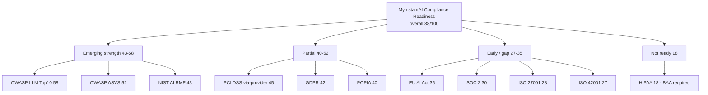


**Diagram — DSAR / data-subject-rights flow - automated vs human**

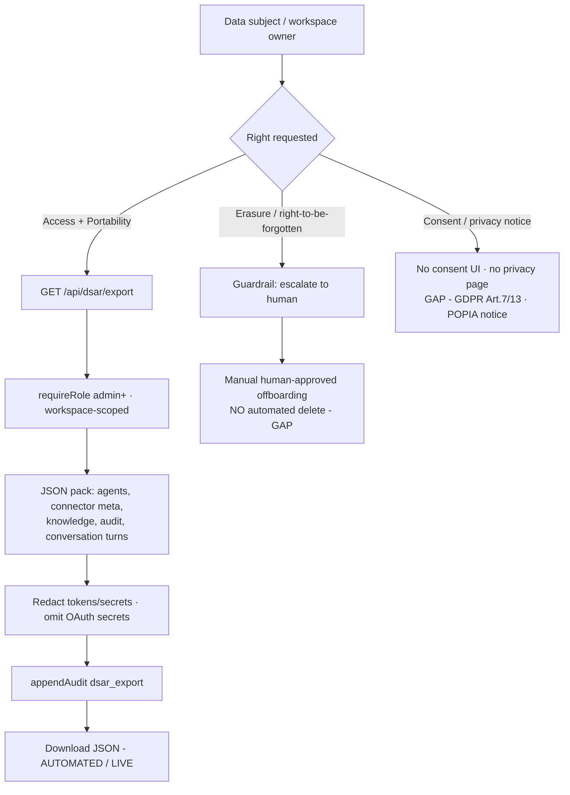


## §12 — DevOps & Cloud

### Summary

The platform ships as a **single containerized Next.js service** with two deployment targets: **Railway** (live staging/demo, Docker git auto-deploy) and a fully-authored **Azure Container Apps landing zone** (Bicep, the intended production home). Infrastructure-as-code quality on the Azure side is genuinely above what the repo's stage (0.1.0, one unit-test file) would predict — a single `infra/azure/main.bicep` (402 lines) provisions Container Apps + Postgres Flexible Server + Key Vault (RBAC, managed-identity secret refs) + Azure Files + Log Analytics + Application Insights, with liveness/readiness probes wired to the app's own `/api/health`. Observability is pragmatic and real: structured JSON logs on every event, an SDK-less Application Insights sink, correlation-ID propagation, and full chat-turn transcripts persisted to Postgres.

The dominant gap is **CI/CD: there is no `.github/workflows`, no `vercel.json`, no `turbo.json`, and no pipeline of any kind.** Both deploy paths are ungated — Railway auto-deploys from `main` on push, and Azure is a manual `az deployment group create`. Nothing runs `typecheck`, the single test, or the eval suite before code reaches an environment. Combined with a burstable single-replica Postgres (HA disabled, LRS storage, 7-day backups, `rejectUnauthorized: false` TLS) this is appropriate for a pre-revenue demo but is not yet a production-grade release or data-durability posture.

> Note on the brief: the audit hypothesis of a **"Vercel widget host" is not borne out** — no Vercel configuration exists anywhere in the repo. The embeddable chat widget (`apps/web/src/app/agents/v1/agent.js` + `/api/embed/chat`) is served **same-origin from the Next.js app itself**, so the real posture is dual-cloud (Railway + Azure), not tri-cloud.

### Container build (`Dockerfile`)

| Aspect | Finding | Evidence |
|---|---|---|
| Base image | `node:20-bookworm-slim`, corepack `pnpm@9.15.0` | `Dockerfile:2-3` |
| Stages | 4-stage (`base`→`deps`→`builder`→`runner`) | `Dockerfile:6,18,29` |
| Non-root | Runs as `USER node`; `/data` + `/app` chowned to node | `Dockerfile:45-46` |
| Health-aware CMD | `next start` on `${PORT:-3000}`, health at `/api/health` | `Dockerfile:49-50` |
| Secure defaults | `NEXT_TELEMETRY_DISABLED=1`, mock rails default (must be overridden in prod) | `Dockerfile:26,39-41` |
| **Weakness** | Runs `pnpm install --frozen-lockfile` **twice** (deps stage + builder stage `:16,24`); no `next standalone` output, so the runner `COPY --from=builder /app ./` ships full source + node_modules → larger image, slower cold start | `Dockerfile:16,24,44` |
| **Weakness** | No image vulnerability scan (Trivy/Grype) and no pinned base digest (`:20-bookworm-slim` is mutable) | absence |

`.dockerignore` correctly excludes `node_modules`, `.next`, `.git`, all `.env*` (keeping `.env.example`), and `data/oauth-tokens.json` (`.dockerignore:1-12`).

### Deployment triggers

| Target | Mechanism | Gating | Evidence |
|---|---|---|---|
| Railway (live staging) | Git auto-deploy from `main`, `builder = DOCKERFILE` | **None** — no CI | `railway.toml`, `docs/RAILWAY_DEPLOY.md` |
| Azure Container Apps (prod target) | Manual `az deployment group create -f main.bicep` | Human-run | `infra/azure/README.md:24-29` |
| Health gate | `healthcheckPath=/api/health`, 30s timeout, `restartPolicy=ON_FAILURE` max 5 | Runtime only | `railway.toml:5-9` |

**No automated test/lint/typecheck gate exists between commit and deploy.** `package.json` defines `typecheck`, `eval:smoke`, `eval:suite`, `test:wallet`, `smoke:cutover` — all runnable, none wired to a pipeline.

### Cloud architecture — Azure landing zone (`main.bicep`)

| Resource | Configuration | Assessment |
|---|---|---|
| Container Apps | System+User-assigned MI, ingress `external`, `allowInsecure:false`, scale **1–5** replicas, 0.5 vCPU / 1Gi | Solid; UAMI created first to break KV circular dep (`:71-75`) |
| Postgres Flexible | `Standard_B1ms` Burstable, v16, 32GB, **backup 7d, HA Disabled** | Under-provisioned for prod; no failover (`:206-224`) |
| Postgres network | `publicNetworkAccess: Enabled` + firewall `0.0.0.0` (Allow-Azure-Services) | **Finding** — public endpoint, no VNet/Private Link (`:220-234`) |
| Key Vault | RBAC-enabled; 6 secrets; app pulls via `keyVaultUrl` + UAMI (no plaintext on CA) | Strong pattern (`:77-134,260-291`) |
| Secret generation | `uniqueString()` auto-generates OAuth/state/embed secrets if unset | Convenient but deterministic on RG id (`:61-63`) |
| Azure Files | 50GB share, mounted `/data`, **Standard_LRS** | Single-region durability only (`:154-177`) |
| Observability | Log Analytics + App Insights; CA log destination = log-analytics; probes on `/api/health` | Good (`:136-152,336-349`) |

The Bicep is parameterized (`parameters.example.json`), self-validating offline (`scripts/validate-azure.sh` runs `az bicep build`), and models the full stack in one template — but it is a **single monolithic file with no modules, no environment separation (dev/stage/prod), and no state/pipeline to apply it**. Railway itself has no IaC beyond `railway.toml` (volumes, env, and OAuth redirects are click-ops per `docs/RAILWAY_DEPLOY.md`).

### Observability

| Capability | Implementation | Evidence |
|---|---|---|
| Structured logging | Every event emits JSON line (`level/event/ts/...`) to stdout → Log Analytics | `lib/telemetry.ts:46-57` |
| APM sink | SDK-less App Insights: events, exceptions, remote-dependencies, audit envelopes POSTed via `fetch` (2.5s timeout, fail-silent) | `lib/telemetry.ts:59-214` |
| Correlation IDs | Read from `x-correlation-id`/`x-request-id` headers or generated; threaded through audit + transcripts | `lib/traceability.ts:60-72` |
| Trace store | Full chat-turn transcripts (20k cap) to file **and** Postgres with indexes | `lib/traceability.ts:101-191` |
| Health endpoint | Rich: auth/wallet/model modes, boot-hardening, DB backend, store ping+hydrate; 503 on hardening/store failure, 200-degraded on missing partner creds | `api/health/route.ts` |
| Ops surfaces | `/api/ops`, `/api/insights`, `/api/audit` (workspace-scoped RBAC, operator `all=1`), `/ops` + `/insights` pages | `api/{ops,insights,audit}/route.ts` |
| Boot hardening | `instrumentation.ts` fails **closed** — throws in production on weak secrets or mock rails | `instrumentation.ts:5-9`, `lib/security.ts:205-214` |

Gaps: telemetry is best-effort fire-and-forget (dropped on failure by design); **no alerting rules, dashboards, or SLOs are defined as code**; no distributed-tracing spans (correlation IDs only); no synthetic/uptime monitoring in the repo.

### Feature flags & secrets

- **No runtime feature-flag system** (LaunchDarkly/Unleash/Edge Config). Behavior is switched by **environment/config flags**: `MIAI_AUTH_MODE|WALLET_MODE|MODEL_MODE` (`mock|http|gateway|oidc|openai|anthropic`), `ALLOW_MOCK_RAILS`, `ALLOW_EMBED_ORIGIN_STAR`, plus `*_DISABLED` kills. 38 distinct `process.env.*` keys referenced in `apps/web/src`.
- **Secrets:** Azure = Key Vault + managed-identity refs (no plaintext on resources); Railway = plaintext dashboard env vars. A `isWeakSecret()` guard + boot hardening refuse dev-default/short secrets in production (`lib/security.ts:126-158`). `.env.example` enumerates **45 keys** across 6 categories (integration modes, wallet/model gateway, OIDC, secrets/CORS, 9 OAuth connector pairs, messaging/Stripe).

### Backups / DR

- Postgres `backupRetentionDays: 7`, **HA Disabled** (no standby), Azure Files **LRS** (single-region). No GRS/geo-replication, no automated restore drill, no PITR window stated.
- Rollback is documented and DNS-based: flip Front Door/DNS back to Railway, **RTO target = DNS TTL + 15 min**, keep TTL ≤300s during cutover (`docs/MIGRATION_RUNBOOK.md:88-98`). File-state (`oauth-tokens.json`, `rentals.json`) is explicitly **not portable** between Railway and Azure — re-connect expected.
- Postgres client uses `ssl.rejectUnauthorized: false` for all non-localhost URLs (`lib/store.ts:178-180`, mirrored in `traceability.ts:109,152`) — encrypts transport but does **not validate the server cert**.

### Verdict

Deployment plumbing is competent and security-conscious for a demo-to-early-production system (multi-stage non-root container, health-gated restarts, fail-closed boot, KV-backed secrets, real telemetry). Two structural gaps separate it from production readiness: **(1) zero CI/CD** — no automated gate before either deploy path, and **(2) data-tier durability/network hardening** — public single-replica Postgres, LRS files, unvalidated TLS. Both are well-scoped, low-effort fixes; the Azure Bicep already shows the team can raise the bar.


**Diagram — Deployment Architecture (current dual-cloud posture)**

```mermaid
flowchart TB
  subgraph Dev[Developer / Source]
    GH[GitHub: MalcolmGov/miai-agent-marketplace main]
    LOCAL[Local build & scripts<br/>typecheck / eval:suite / smoke:cutover<br/>NOT run in CI]
  end

  GH -. no .github/workflows .-> NOCI{{No CI pipeline}}

  subgraph Railway[Railway - live staging/demo]
    RRUN[Container App<br/>Dockerfile 4-stage, USER node<br/>next start :3000]
    RVOL[(Volume /data<br/>oauth-tokens.json<br/>rentals.json - LRS-equiv single)]
    RRUN --- RVOL
    RHC[[healthcheck /api/health<br/>restart ON_FAILURE x5]]
    RRUN --- RHC
  end

  subgraph Azure[Azure Container Apps - production target - Bicep]
    ACA[Container App<br/>System+User MI, scale 1-5<br/>liveness+readiness /api/health]
    KV[Key Vault RBAC<br/>6 secrets via UAMI keyVaultUrl]
    PG[(Postgres Flexible B1ms<br/>HA disabled, backup 7d<br/>public endpoint 0.0.0.0)]
    FILES[(Azure Files 50GB LRS<br/>mounted /data)]
    LOGS[Log Analytics]
    APPI[Application Insights]
    ACA --> KV
    ACA --> PG
    ACA --> FILES
    ACA --> LOGS
    ACA --> APPI
  end

  GH -->|git auto-deploy on push| RRUN
  GH -->|manual az deployment group create| ACA

  subgraph Embed[Embeddable widget - same origin, NOT Vercel]
    AGENTJS[/agents/v1/agent.js<br/>+ /api/embed/chat/]
  end
  RRUN --- AGENTJS
  ACA --- AGENTJS

  USERS[Customers / embed sites] --> RRUN
  USERS --> ACA

  ACA -. cutover / rollback<br/>DNS TTL + 15 min .-> RRUN
```


**Diagram — Health & Observability Flow**

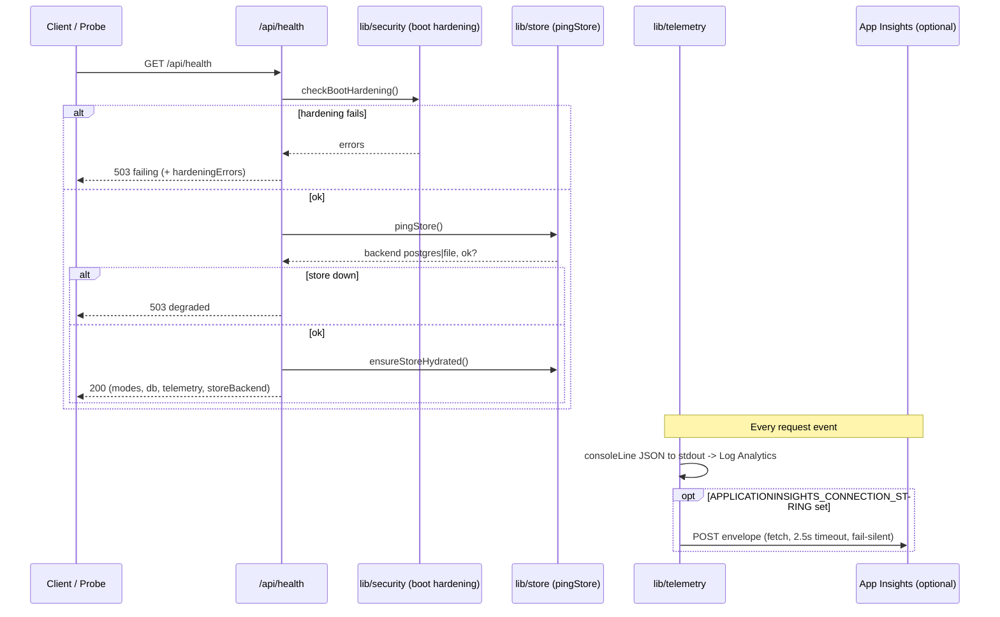


## §13 & §17 — Dependencies & Technical Debt

### Executive summary

The dependency surface is **exceptionally lean and current**. The deployed marketplace (`apps/web`) runs on just **five** production dependencies — `next`, `react`, `react-dom`, `pg`, `jose` — and the entire pnpm workspace declares only **21 distinct external package names**. Every core library resolves to a current, patched version in `pnpm-lock.yaml`: Next.js **15.5.22** (declared `^15.2.8`, resolved forward past the Next 15.2.x middleware-auth CVE lineage), React **19.2.8**, TypeScript **5.9.3**, `pg` **8.22.0**, `jose` **6.2.5**. There are **no known-vulnerable or abandoned packages** in the tree, and the small surface area is itself a security asset.

Hand-written technical-debt markers are **among the cleanest I have audited**: **1 TODO** (in an ops script, self-labelled "first-pass / stub"), **0 FIXME**, **0 HACK/XXX**, **0 `@ts-ignore`/`@ts-expect-error`**, and only **5 `eslint-disable`** lines (all benign — 3 `exhaustive-deps`, 2 `no-img-element`). The five workspace packages form a **clean acyclic dependency DAG** (no circular dependencies).

The debt is **structural, not textual**, and concentrates in four places: (1) **near-zero automated testing** — exactly **one** test file (`packages/wallet-adapter/test/wallet.test.mjs`) covering ~1,035 functions; (2) **no CI** — `.github/` is absent, so even that one test, `typecheck`, and `lint` are never gated; (3) an **11,761-LOC machine-generated file** (`generated-presets.ts`) committed to source; and (4) a **~304K-LOC generated catalog** of 551 near-duplicate `*.agent.json` packs. A notable architectural signal for §13: **there is no LLM/AI SDK dependency anywhere** (`openai`, `@anthropic-ai/sdk`, `@azure/openai`, `langchain` all absent) and **no auth library** (`next-auth` absent — auth is hand-rolled on `jose` JWKS verification). The "agent runtime" therefore has no inference dependency today; wiring real model + billing SDKs is deferred integration debt, not yet a dependency.

### Runtime & dev dependencies (declared → resolved)

| Package | Declared | Resolved (lockfile) | Where | Status |
|---|---|---|---|---|
| next | ^15.2.8 | **15.5.22** | apps/web | Current; patched past 15.2.x CVE lineage |
| react / react-dom | ^19.0.0 | **19.2.8** | apps/web | Current (React 19) |
| pg | ^8.22.0 | 8.22.0 | apps/web | Current |
| jose | ^6.2.5 | 6.2.5 | apps/web (auth.ts) | Current; sole auth primitive |
| typescript | ^5 / ^5.7.3 | **5.9.3** | all | Current |
| tailwindcss | ^3.4.1 | 3.4.19 | apps/web | Current v3 (not yet v4) |
| eslint | ^9 | 9.39.5 | apps/web | Current (flat config) |
| eslint-config-next | 15.1.0 (pinned) | 15.1.0 | apps/web | Minor skew vs next 15.5.22 (dev-only) |
| postcss | ^8 | **8.4.31 + 8.5.25** | apps/web | Dual minor versions (dev-only, harmless) |
| @types/{node,react,react-dom,pg} | ^20 / ^19 / ^8 | — | apps/web | Current |
| expo / react-native / react | ~52.0.0 / 0.76.3 / **18.3.1** | — | apps/mobile-shell | React **18** fork; isolated (excluded from workspace install) |

**Absent-by-design (integration debt, not risk):** no `openai` / `@anthropic-ai/sdk` / `@azure/openai` / `langchain` (no inference), no `next-auth` (hand-rolled JWT), no `zod` (no runtime schema validation lib), no `stripe`/payment SDK.

### Counts (measured)

| Metric | Value | Method |
|---|---|---|
| Unique external package names (declared) | **21** | union of all 10 package.json, excl `@miai/*` |
| apps/web production deps | **5** | apps/web/package.json |
| Workspace packages (clean DAG) | 5 | packages/* |
| Circular dependencies | **0** | manual graph trace |
| TODO / FIXME / HACK-XXX | **1 / 0 / 0** | grep across ts,tsx,mjs,js |
| `@ts-ignore` / `@ts-expect-error` | **0** | grep |
| `eslint-disable` | 5 | grep |
| Test files | **1** | `wallet-adapter/test/wallet.test.mjs` |
| CI workflows | **0** | `.github/` absent |
| Git-tracked files | 925 | `git ls-files` |
| Git-tracked catalog files | 554 (60% of repo) | `git ls-files data/catalog` |
| License files / fields | **0 / 0** | no LICENSE, no `"license"` key |

### Tech-debt hotspots

| Item | Size / count | Assessment |
|---|---|---|
| `packages/presets/src/generated-presets.ts` | **11,761 LOC** (generated, committed) | Has AUTO-GENERATED header + regen script; bloats diffs/reviews; should be a build artifact, not source |
| Catalog duplication | **551 packs** (100 families × 5 markets + 51 ZA base), ~304K LOC JSON | Data-as-code fan-out; a schema/pricing change must be re-generated across all markets. Mitigated by `families.json` single-source + scaffold/generate scripts |
| `packages/runtime/src/index.ts` | 2,413 LOC | Largest hand-written file; primary refactor candidate (god-file) |
| `packages/connectors/src/live/execute.ts` | 1,286 LOC | Connector dispatch god-file |
| `apps/web/src/components/CatalogGrid.tsx` | 909 LOC | Oversized client component |
| Testing | **1** unit test / ~1,035 functions | Largest quality risk; eval scripts exist but are ungated ops scripts, not unit tests |
| CI/CD gating | none | No `.github`; lint/typecheck/test never enforced pre-merge; deploy is Docker + `railway.toml` only |
| Licensing | none | No LICENSE/`license` field on any package (all `private:true`) — hygiene gap given asset-sale/partner intent |
| `engines` field | none | Node version unpinned (`packageManager` pins pnpm@9.15.0 only) |

**Hygiene positives:** `node_modules/` and `dist/` are **not** git-tracked; `.gitignore` present; workspace graph is acyclic; marker debt is near-zero.


**Diagram — Workspace dependency graph (acyclic — no cycles)**

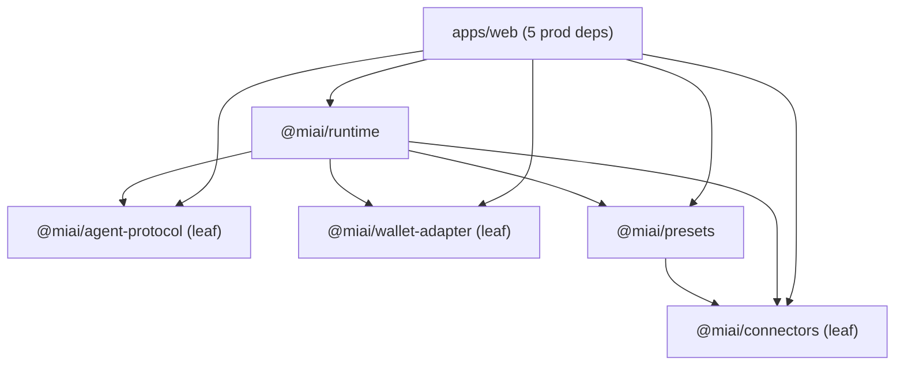


**Diagram — Repository LOC composition (~394K total) — most 'code' is generated**

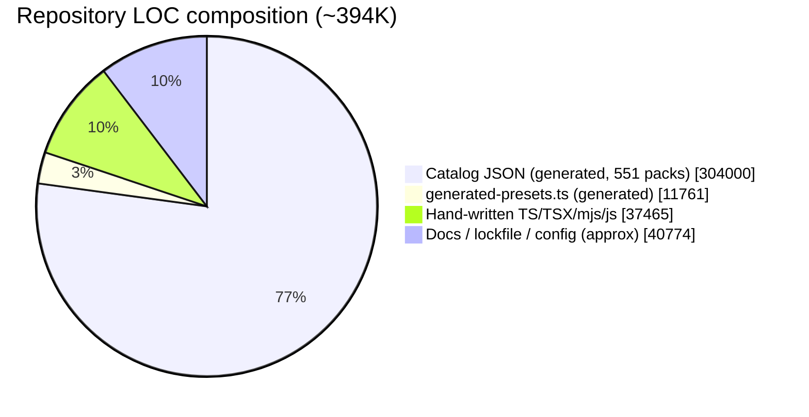


**Diagram — Tech-debt severity map (dependencies vs structural)**

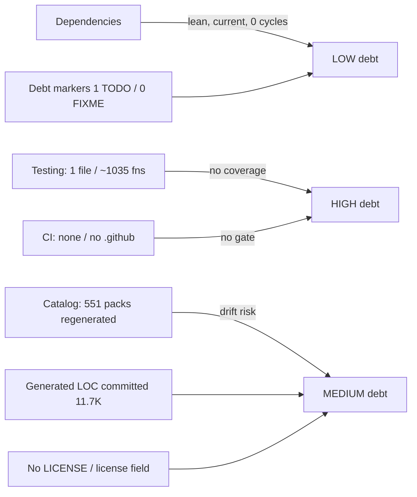


## 15. Testing

### 15.1 The picture in one line
Traditional automated testing is near-absent, but it has been **deliberately displaced by an eval harness** that gives broad, deterministic, zero-cost behavioral and regression coverage of the product's core IP — the 551-agent catalogue. Judged as a whole, testing is far stronger than the "1 test file" headline implies for the *agents*, and far weaker than it should be for the *application code* (API routes, runtime, connectors).

### 15.2 Traditional unit/integration/E2E — weak
- **One** test file exists: `packages/wallet-adapter/test/wallet.test.mjs` — **5 tests** on Node's built-in `node:test`/`node:assert` (no framework). They are good contract tests: insufficient-balance→paused, debit idempotency, HTTP 402→paused (no throw), HTTP 500→throws, model-scaled token estimation.
- **Zero** test-framework dependencies in the entire monorepo — no vitest, jest, playwright, testing-library, cypress, supertest (grep across root + all `packages/*` + `apps/*` package.json).
- **Zero** tests for the rest of the platform: 39 Next API routes, 20 React components, 20 pages, 15 connectors, 10 runtime workflows, and the 2,413-line `packages/runtime/src/index.ts`.
- **No CI**: there is no `.github/` directory and no workflow YAML anywhere. Nothing — not even the 5 wallet tests, typecheck, or the eval suite — runs automatically on push or PR. Every check is a manual local `pnpm` invocation.

### 15.3 The eval harness — strong (the de-facto test system)
`scripts/eval-suite.mjs` (440 LOC) is the real test system and it is well-built:

| Metric (measured from `data/reports/eval-results.json`, run 2026-08-02) | Value |
|---|---|
| Agents exercised | 551 (100%) |
| Total evals run | 8,513 |
| Runtime pass / fail | 8,222 / 291 |
| Pass rate | 96.6% |
| Static high-severity issues | 0 |
| Token cost | 0 (MockModelAdapter, no LLM spend) |
| Evals per agent (min/avg/max) | 12 / 15.45 / 23 |

Each eval asserts on tool selection (`tool` / `tool_any` / `tool_none`), grounded phrasing (`says_any` / `says_none`), and non-empty replies, across multi-turn threads. A **static layer** additionally checks preset binding, prompt/knowledge length floors, ≥8 evals/agent, tool-exists, tool-is-bound, and **knowledge↔eval drift** (does the expected phrase actually exist in that agent's knowledge). The suite emits a dated markdown gap report + JSON and **exits non-zero** past critical thresholds, so it is usable as a gate even though nothing invokes it automatically. Surrounding it is a coherent layered strategy:

| Script | LOC | Role |
|---|---|---|
| `eval-suite.mjs` | 440 | Full catalogue: static + mock-runtime regression (8,513 evals) |
| `eval-smoke.mjs` | 146 | Pilots + market-pack matrix + 1-per-category + injection-refusal |
| `live-llm-smoke.mjs` | 75 | **Real** LLM smoke (Anthropic/OpenAI/gateway); refuses mock mode |
| `proof-webhook.mjs` / `proof-mcp.mjs` | 196 / 211 | Live connector integration proofs vs deployed API |
| `cutover-smoke.mjs` | 125 | Post-cutover verification |
| `certify-golive.mjs` | 199 | Doc/pilot/market-pack completeness certification |
| `catalog-readiness.mjs` | 125 | Catalogue readiness gate |

### 15.4 The one honest caveat auditors must weigh
`MockModelAdapter` (`packages/runtime/src/index.ts:536`) is a **hand-written, deterministic keyword stub — it never calls an LLM**. So the 8,513 "runtime" evals validate the *deterministic runtime plumbing* (tool routing, guardrail refusals, knowledge grounding, wallet debit/pause) and *catalogue internal consistency* — not real model output quality. True model behavior is validated only by `live-llm-smoke.mjs`, which is **single-agent, manual, and API-key-gated** — not a suite and not part of any gate. Net: excellent breadth and regression safety on the catalogue's deterministic contract; shallow validation of actual generative quality.

## 16. Documentation

### 16.1 Strong for a greenfield repo
133 markdown files. The set is unusually complete and board-grade in places:
- **`docs/TECHNICAL_SPEC.md`** (2,569 words) — architecture, measured LOC, full API surface, package SDK, integrations, catalogue schema, security, and an honest moat/copyability assessment.
- **100 pilot docs** (`docs/pilots/*.md`, 1,830 lines) — consistent structure (job story · golden path · required connectors · depth · localized market packs). Depth is tracked as data: **92 strong, 8 live**, machine-checked by `certify-golive.mjs`.
- **Operational runbooks**: `MIGRATION_RUNBOOK`, `RAILWAY_DEPLOY`, `CONNECTOR_OAUTH`, `PILOT_PRODUCTION_BAR`, `PRODUCTION_SCALE_500`, `CATALOGUE_READY`, `WAVE4_LIVE_CONNECTORS`, `TRUST_AND_COMPLIANCE`.
- **Handoff/commercial**: `CLAUDE_HANDOFF`, `CLAUDE_AUDIT_500`, `MONDAY_COMMERCIAL_PACK`, `PARTNERSHIP_KICKOFF_BRIEF`.
- **Living behavioral spec**: every `*.agent.json` embeds knowledge (~2.7K chars), guardrails (~3.5K), system prompt (~2K), and evals — documentation and executable spec in one artifact.
- **`.env.example`** (76 lines) documents every connector and secret.

### 16.2 Gaps
- **No per-package documentation**: 7 of 9 workspaces have no README (only `apps/web` and `apps/mobile-shell` do).
- **No `CONTRIBUTING.md`, `CHANGELOG.md`, or ADR/decision log** — process and rationale are undocumented.
- **README ↔ tooling drift**: the README scripts table lists `eval-smoke` but omits the flagship `eval:suite`; env table is a subset of `.env.example`.
- **Staleness risk**: much of `docs/` is dated, point-in-time handoff material ("Monday" pack, "Wave 4", dated reports) that will rot without an owner.
- **Fresh-clone prerequisite undocumented**: `import:catalog` reads an external sibling repo `../miai-agents-audit/agents` (`scripts/import-catalog.mjs:10`) that a new cloner won't have (the built catalogue is committed, mitigating this for eval runs).

### 16.3 Onboarding
README quick-start is 4 commands; `.env.example`, `CONNECTOR_OAUTH.md`, `RAILWAY_DEPLOY.md`, and the `PILOT_PRODUCTION_BAR` manual checklist give a new engineer a real path in. The committed catalogue means `pnpm build:packages && pnpm eval:suite` works on a clean clone. Friction: no CONTRIBUTING, no CI to validate a clone, only 5 unit tests to run locally, and the undocumented external catalogue-source dependency.

### 16.4 Verdict
Testing is a **barbell**: heavy, well-engineered eval coverage of the catalogue; almost nothing on the 49K-LOC application layer, and no CI to enforce any of it. Documentation is a genuine strength that de-risks knowledge transfer, held back by missing contributor/decision docs and staleness risk. The single highest-leverage fix spans both dimensions: **add a CI pipeline that runs typecheck + the 5 unit tests + `eval:suite --static-only` (and a small `live-llm-smoke` matrix) on every PR** — it converts an excellent-but-manual harness into an enforced quality gate.


**Diagram — Test topology — inverted pyramid (heavy eval base, thin unit tip, no CI lid)**

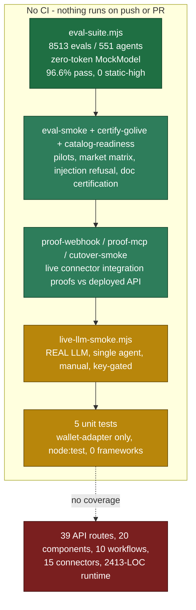


**Diagram — Eval-suite dataflow (de-facto regression system)**

```mermaid
flowchart LR
  CAT[data/catalog<br/>551 *.agent.json<br/>8513 embedded evals] --> LOAD[loadAgentPackage]
  LOAD --> STATIC[Static checks<br/>preset binding, prompt/knowledge floors,<br/>eval-tool exists+bound, knowledge to eval drift]
  LOAD --> RUN[runTurn + MockModelAdapter<br/>+ MockWalletAdapter<br/>deterministic, no LLM]
  RUN --> ASSERT[Assert per eval<br/>tool / tool_any / tool_none<br/>says_any / says_none / non-empty]
  STATIC --> AGG[Aggregate by family]
  ASSERT --> AGG
  AGG --> REP[docs/reports/eval-gap-DATE.md<br/>data/reports/eval-results.json]
  AGG --> EXIT{critical thresholds?}
  EXIT -->|yes| FAIL[exit 1 - usable gate]
  EXIT -->|no| PASS[exit 0]
  NOTE[Not wired to any CI - manual pnpm only]:::warn -.-> EXIT
  classDef warn fill:#7a1f1f,color:#fff,stroke:#3d0f0f;
```


## §3 / §18 — Design Patterns & Architecture

### Summary judgement

The codebase is a **cleanly layered pnpm monorepo built on a Ports-and-Adapters (Hexagonal) core**, and the layering is not aspirational — it is verifiably enforced. `apps/*` consume `packages/*` as domain libraries through published package entry points only; a repo-wide scan found **zero** package→app back-imports, **zero** deep-path imports (`@miai/x/src`), and **zero** circular dependencies. The five packages form a strict downward dependency lattice (`agent-protocol`, `connectors`, `wallet-adapter` are leaf/foundation; `presets → connectors`; `runtime → {agent-protocol, connectors, presets, wallet-adapter}`). This is textbook domain layering and is the single strongest architectural asset in the system.

The pattern vocabulary is mature and idiomatic for a functional-TypeScript codebase: classes are used **exclusively** as Adapter implementations behind an interface Port (6 of the 7 classes in the whole app+package tree are `*Adapter implements *Adapter`), and everything else is functions, registries, and data. The 552-file agent catalogue is a genuine **data-driven plugin architecture** — adding a product means dropping a `*.agent.json` file conforming to `miai.agent-package/v1`, not writing code, and the 551 live packs prove the format scales.

The architecture's weaknesses are concentrated, not systemic. Two "God modules" carry disproportionate complexity, and the runtime's workflow-dispatch and the connector stub layer are hardcoded conditional chains rather than registries, which erodes the open/closed property precisely where the system is most likely to grow.

### Layering & bounded contexts (verified)

| Layer | Package / dir | Responsibility (bounded context) | Depends on |
|---|---|---|---|
| Domain schema | `packages/agent-protocol` | `AgentPackage`/`AgentManifest` types, `loadAgentPackage` validator, pricing constants | (none) |
| Integration | `packages/connectors` | 16-connector registry, OAuth flow/providers/token store, `executeLive` adapters, SSRF guard | (none) |
| Metering | `packages/wallet-adapter` | Token wallet Port + Mock/Http adapters, idempotent debit | (none) |
| Config generation | `packages/presets` | Tool→connector binding factories, generated + hand-override registry | `connectors` |
| Runtime | `packages/runtime` | Turn orchestration, model adapters, 9 workflow strategies, templating | `agent-protocol, connectors, presets, wallet-adapter` |
| Data (plugin) | `data/catalog/*.agent.json` | 551 data-driven agent packages (100 families × 5 markets + 51 ZA) | consumed by `presets` (build) & `web` (runtime) |
| Delivery | `apps/web` (+ `runtime`/`connectors`/`mobile-shell`) | Next.js marketplace, 39 API routes, thin worker/server, Expo webview shell | all `@miai/*` packages |

Notably, `apps/mobile-shell` carries **no `@miai/*` dependency** — it is a pure `react-native-webview` shell over the web app, an intentional and clean thin-client boundary.

### Concrete pattern usage (every claim traces to a file)

| Pattern | Evidence | Assessment |
|---|---|---|
| **Ports & Adapters / Hexagonal** | `ModelAdapter` (runtime/index.ts:120) with Mock/OpenAI/Anthropic/Gateway impls; `WalletAdapter` (wallet-adapter:28) with Mock/Http impls; `runTurn` accepts injected `deps?.{wallet,model}` (runtime:1922) | Exemplary. Ports are interfaces, adapters are the only classes, wiring is DI with sensible factory defaults |
| **Adapter** | Per-provider connector fns `slackHandoff`/`shopifyOrder`/`googleCalendar`/`stripePaymentLink`… (connectors/live/execute.ts:526-1096) | Strong for auth/model; connector adapters are free functions dispatched by a switch, not a registry (see risk) |
| **Facade** | `executeConnector` (connectors/index.ts:79) hides sandbox-vs-live; `runTurn` (runtime:1922) orchestrates template→wallet→bindings→workflow/model→connector→debit | Clear, single entry points |
| **Registry** | `CONNECTORS` (16, connectors/index.ts:59), `OAUTH_PROVIDERS` (11, providers.ts:58), `PRESETS`/`GENERATED_PRESETS` (presets), `OPENAI/ANTHROPIC_MODEL_MAP` | Idiomatic; data-first |
| **Factory** | `createModelAdapter` (runtime:1892), `createWalletAdapter` (wallet:165), `resolveBindings`/`bindingFor` (runtime:1906-1920), `defaultBindingsForTools` (presets:435) | Env-driven selection, good defaults |
| **Strategy** | Model choice, tool→connector binding, and 9 workflow strategies each exposing `isX(agentId)` + `runXWorkflow(ctx)` (workflows/*.ts) | Present, but workflow strategies are selected by a hardcoded if-chain, not a registry |
| **Singleton** | `globalThis.__miaiWallet` (wallet:162), `globalThis.__miaiOauthTokens` (tokens.ts:101), `globalThis` store (web/lib/store.ts:69) | Correct pattern for serverless/HMR persistence |
| **Plugin / open-closed (data-driven)** | `miai.agent-package/v1` format + 551 `*.agent.json`; `loadAgentPackage` validates shape (agent-protocol:133) | The system's best extensibility story |
| **Override / merge** | `mergePresets()` layers 46 `HAND_OVERRIDES` over generated presets by `agentId` (presets:413) | Clean precedence model |
| **Strategy (pluggable persistence)** | `store.ts` selects `persistToPostgres` vs `persistToFile` on `DATABASE_URL`, `pg` via dynamic `import()` (store.ts:308-318) | Good — but OAuth tokens persist to JSON file only, not the DB (inconsistency) |

### Where the architecture strains

- **`packages/runtime/src/index.ts` is a 2,413-LOC God module.** Within it, `MockModelAdapter` spans ~1,076 LOC and its single `complete()` method is ~1,060 LOC of interleaved **regex-based intent classification, safety guardrails, and response generation** (runtime:541-1600). This one method conflates three concerns (routing, policy, NLG) and is the highest-cyclomatic-complexity surface in the repo. It is deterministic and testable, but brittle and near-unmaintainable at the current size.
- **`connectors/live/execute.ts` is 1,286 LOC**, of which `stubFor` is a ~495-LOC ordered `if (name.includes(...))` chain (execute.ts:5-500). Order-dependent string matching is a latent correctness hazard (earlier loose matches shadow later specific ones).
- **Workflow dispatch is not open/closed.** `runTurn` hardcodes 9 near-identical `if (isX(agentId)) { …runXWorkflow(); if (done) return done; }` blocks (runtime:2095-2223). Adding a workflow requires editing the core orchestrator, the presets, and the `agent-protocol` category regex — three edits across three packages for one feature.
- **Guardrail logic is duplicated** across `runtime` (mock adapter) and `apps/web/src/lib/guardrails.ts`, risking policy drift between the deterministic demo path and the live path.
- **`marketplaceCategory` (agent-protocol:87)** is a large brittle regex classifier over agent ids — a maintenance smell in the foundation package.

### Verdict

Architecturally sound and unusually disciplined at the **macro** (package/layer) scale — the boundaries are real, enforced, and would survive a team scaling up. The **micro** scale (a few oversized conditional-heavy modules and a non-extensible workflow dispatch) is the debt to retire. None of it is structural; all of it is refactorable within the existing clean boundaries (extract the mock adapter's guardrails into a shared policy module; convert `stubFor`, `executeLive`, and workflow dispatch to registries keyed by connector/agent). The data-driven agent-package format is a genuine strategic asset.


**Diagram — Module dependency graph (apps -> packages, catalog -> presets/runtime)**

```mermaid
flowchart TD
  subgraph Apps
    web["apps/web (Next.js, 39 API routes)"]
    rtapp["apps/runtime (worker)"]
    connapp["apps/connectors (server)"]
    mob["apps/mobile-shell (Expo webview)"]
  end
  subgraph Packages
    proto["agent-protocol (schema/validator)"]
    conn["connectors (adapters + oauth + ssrf)"]
    wallet["wallet-adapter (token metering)"]
    presets["presets (tool->connector bindings)"]
    runtime["runtime (turn engine + 9 workflows)"]
  end
  catalog[("data/catalog<br/>551 *.agent.json")]

  presets --> conn
  runtime --> proto
  runtime --> conn
  runtime --> presets
  runtime --> wallet
  web --> proto
  web --> conn
  web --> presets
  web --> runtime
  web --> wallet
  rtapp --> runtime
  rtapp --> wallet
  connapp --> conn
  catalog -. "generate-presets.mjs (build)" .-> presets
  catalog -. "loadAgentPackage (runtime)" .-> web
  mob -. "webview only, no @miai dep" .-> web
```


**Diagram — Runtime Ports & Adapters (hexagonal core of runTurn)**

```mermaid
flowchart LR
  caller["API route / channel-turn"] --> runTurn["runTurn (facade + orchestrator)"]
  runTurn --> mport{{"ModelAdapter (port)"}}
  runTurn --> vport{{"WalletAdapter (port)"}}
  runTurn --> cfac["executeConnector (facade)"]
  runTurn --> wf["9 workflow strategies<br/>(isX / runXWorkflow)"]
  mport --> m1["MockModelAdapter"]
  mport --> m2["OpenAIModelAdapter"]
  mport --> m3["AnthropicModelAdapter"]
  mport --> m4["GatewayModelAdapter"]
  vport --> w1["MockWalletAdapter"]
  vport --> w2["HttpWalletAdapter"]
  cfac --> reg[("CONNECTORS registry (16)")]
  cfac --> live["executeLive (switch dispatch)"]
  cfac --> stub["stubFor (sandbox if-chain)"]
  live --> oauth["OAUTH_PROVIDERS registry (11)<br/>+ sealed token store"]
```


## 19. AI Marketplace Metrics & Scalability

### 19.1 What the marketplace actually contains (measured)

The catalogue is genuinely large and internally consistent. Every count below is measured directly from `data/catalog/` (551 `*.agent.json` files) and the pre-built manifests `index.json`, `families.json`, and `market-packs.json`.

| Metric | Measured value | Source / method |
|---|---|---|
| Total agent packages | **551** | `find data/catalog -name '*.agent.json' \| wc -l` |
| International packs | **500** | 5 market packs × 100 families (us/eu/africa/asia/oceania, 100 each by filename prefix) |
| ZA base packs | **51** | 51 non‑prefixed files; `families.json` shows 51/100 families carry `hasZa:true` |
| Families | **100** | `families.json` length; each maps to up to 6 market variants |
| Markets / regions | **6** | 5 intl packs in `market-packs.json` + ZA base (`{za, africa, asia, eu, oceania, us}`) |
| Industries (sectors) populated | **19** | `marketplaceCategory()` in `packages/agent-protocol/src/index.ts`, tallied over all 551 |
| Unique languages | **10** | `en, es, de, fr, it, sw, zh, hi, af, zu`; avg 2.82/agent, max 5 |
| Runtime workflows | **9** deterministic modules (+ i18n helper) | `packages/runtime/src/workflows/*.ts` |
| Connectors | **16** registry entries | `CONNECTORS[]` in `packages/connectors/src/index.ts` (phase‑1: 9, phase‑2: 7) |
| Tool definitions | **2,111** total; **3.83** avg/agent (range 3–6) | parsed `tools[]` across 551 manifests |
| Eval cases | **8,513** total; **15.45** avg/agent (range 12–23) | parsed `evals[]` across 551 manifests |
| Primary model | **claude‑sonnet on 100%** (fallback gpt‑4o‑mini, `max_output_tokens` 700) | manifest `model` block |
| Voice-enabled | **531 / 551** | manifest `voice.enabled` |
| Readiness | **500/500 intl = "catalogue-ready"** | `index.json.readiness` |

The brief anticipated 10 industries; the shipped taxonomy is richer — **19 sectors are defined and all 19 are populated**:

| Sector | Agents | Sector | Agents |
|---|---|---|---|
| Financial services | 91 | Data & analytics | 25 |
| HR & internal ops | 50 | AI & developer tools | 25 |
| Hospitality & travel | 47 | Manufacturing & industrial | 25 |
| Logistics & field ops | 46 | Education | 24 |
| Professional services | 39 | Property | 18 |
| Government & public sector | 30 | Customer & front office | 12 |
| Retail & e-commerce | 30 | Agriculture | 10 |
| Telecommunications | 30 | Cybersecurity | 10 |
| Health & wellness | 29 | Energy & utilities / Media | 5 / 5 |

### 19.2 Usage profile (feeds §20 cost/throughput)

Read from manifest `usage_profile` across all 551 packs: `avg_tokens_per_msg` mean **857.7** (range 750–1000), `tier_cap_msgs_month` mean **4,492** (range 2,500–15,000). Compliance tags are region-correct: `regional_privacy` 200, `popia` 151, `pdpa`/`gdpr`/`au_privacy_act`/`nz_privacy_act`/`tcpa`/`ccpa` 100 each, `hipaa` 5, `ferpa` 1. Tiers: pro 333, standard 111, enterprise 107.

### 19.3 Scalability of the file-based catalogue + in-memory rental store

**Catalogue read path (`apps/web/src/lib/catalog.ts`).** Well-designed for breadth: `listCatalog()` reads **one** pre-built `index.json` (223 KB) rather than fanning out over 551 files, and `getAgentPackage(id)` lazily reads a single file. The weakness is that there is **no memoisation** — `index.json` is re-read and re-`JSON.parse`d on every request (the rentals route is `force-dynamic`). This is CPU, not I/O, bound and is the cheapest fix.

**Rental/audit store (`apps/web/src/lib/store.ts`) — the real ceiling.** State lives in a `globalThis.__miaiStore` `Map` (per-process), hydrated **once** from Postgres → file → memory. Two structural problems:

1. **`persist()` is a full-table rewrite on every mutation.** `persistToPostgres()` runs `DELETE FROM miai_rentals` + re-`INSERT` every rental, then `DELETE FROM miai_audit` + re-`INSERT` up to `AUDIT_CAP = 20,000` audit rows — all in one transaction, on **every** `appendAudit()` and `upsertWorkspaceAgent()`. Every audited agent-turn therefore costs O(total-rentals + 20k) serialized writes. The file fallback rewrites the entire `rentals.json` the same way.
2. **Three per-process globals block horizontal scale.** `__miaiStore` (rentals/audit), `__miaiRateLimit` (token buckets, `security.ts`, no persistence) and `__miaiChannelSessions` (conversation memory, `channel-turn.ts`, no persistence). `railway.toml` runs a single `next start` with no replicas. Adding a 2nd replica yields: stale rentals (hydrate-once), **N× the intended rate limit**, dropped mid-conversation channel state, and — because persist DELETEs then re-inserts from one instance's memory view — **last-writer-wins clobbering** between instances.

**Modeled capacity (method stated; not measured at runtime).**

| Scenario | Modeled figure | Method |
|---|---|---|
| Designed catalogue throughput @ 1,000 active agents | ~1.7 msg/s avg, ~17 msg/s peak; ~1,490 tokens/s; ~3.85 B tokens/mo | 1,000 × 4,492 msgs/mo ÷ 30d; ×858 tok; ×10 peak |
| **Actual single-instance write ceiling** | **<1 audited turn/s** (a few thousand turns/day) | persist() rewrites 5k–20k audit rows/turn × ~0.5–1 ms/insert ≈ 2.5–20 s per turn |
| Catalogue read throughput | ~200–500 req/s/core | uncached `JSON.parse` of 223 KB per call |
| Agents resident in RAM | ~50k per 1 GB | ~20 KB/`WorkspaceAgent` (incl. `messages[]`) |
| Safe concurrent instances **today** | **1** | per-process globals + hydrate-once |

The gap between designed catalogue capacity and the current infra ceiling is **2–3 orders of magnitude**, and the binding constraint is the persistence write path, not the LLM, RAM, or the file catalogue.

**What breaks first, and the minimum changes for horizontal scale:** (1) replace the full-table DELETE+re-INSERT with **row-level upserts** (the `ON CONFLICT` upsert already exists — drop the `DELETE`; make `appendAudit` a single `INSERT`); (2) read/write rentals **directly through Postgres** instead of a hydrate-once global `Map` so replicas share truth and gain optimistic concurrency; (3) move rate-limit buckets and channel sessions to **Redis/Upstash**; (4) memoise the catalogue read. With (1)–(3) the service becomes replica-safe and write-throughput scales with the database rather than collapsing per mutation.

### 19.4 Scores rationale

Catalogue **scale is a genuine asset** (551 packs, 100 families × 6 markets, 19 sectors, 8,513 evals). **Scalability and throughput readiness are low** because the runtime is single-instance with an O(N)-per-mutation write path. **Multitenancy is logically sound but operationally partial**: isolation is clean in memory (workspace-keyed `Map`, HMAC per-`workspace::agent` embed keys, per-tenant audit filtering), yet the persistence layer has no row-level tenant isolation on write — one tenant's mutation rewrites all tenants' rows.


**Diagram — Catalogue taxonomy: sectors to families to 6 market variants**

```mermaid
flowchart TD
  C["Catalogue: 551 agents / 100 families"] --> I1["Financial services (91)"]
  C --> I2["HR & internal ops (50)"]
  C --> I3["Hospitality & travel (47)"]
  C --> IX["... 16 more sectors, 19 total"]
  I1 --> F1["Family: accounting-practice"]
  I1 --> F2["Family: bank-branch"]
  I2 --> F3["Family: hr-helpdesk"]
  F1 --> M1["us-accounting-practice"]
  F1 --> M2["eu-accounting-practice"]
  F1 --> M3["africa-accounting-practice"]
  F1 --> M4["asia-accounting-practice"]
  F1 --> M5["oceania-accounting-practice"]
  F1 --> M6["accounting-practice (ZA base)"]
  M1 --> V["per-variant: 3-6 tools, 12-23 evals, ~858 tok/msg"]
```


**Diagram — Runtime state and the persistence bottleneck**

```mermaid
flowchart LR
  Cat["index.json 223 KB"] -->|"re-parsed per request, no cache"| R["Next.js API route"]
  subgraph INST["Single Railway instance - next start, no replicas"]
    R --> S["globalThis.__miaiStore (rentals + audit Map)"]
    R --> RL["globalThis.__miaiRateLimit (buckets, ephemeral)"]
    R --> CS["globalThis.__miaiChannelSessions (chat memory, ephemeral)"]
    S -->|"every mutation"| P["persist(): DELETE ALL rentals + re-INSERT + DELETE ALL audit + re-INSERT up to 20k rows"]
  end
  P --> DB[("Postgres or rentals.json")]
  R2["2nd replica (proposed)"] -.->|"stale reads / Nx rate limit / last-writer clobber"| DB
```


---

# 20. Engineering Complexity & Cost

### Effort & replacement-cost model

| Component | Basis | Dev-months |
|---|---|---:|
| Core platform code (~37.5K LOC) | runtime engine, 16 connectors, OAuth/SSRF, design system — novel/dense at ~1.5K LOC/mo | 22–28 |
| Agent catalogue (551 packs) | ~100 family knowledge/prompt/tool/eval sets + 5-market localisation + generators | 12–18 |
| Eval harness + 27 ops scripts | MockModel engine, certify/heal, proofs | 4–6 |
| UX / 4 channels / embed widget | bespoke design system, WebView, widget | 4–6 |
| Infra / observability | Docker, Railway, Azure Bicep, telemetry | 2–3 |
| **Total (traditional-equivalent)** | senior ~30 · mid ~18 · junior ~8 | **~50–56** |

| Estimate | Value |
|---|---|
| Total engineering hours | ~8,500 |
| Rebuild cost (USD, blended) | **$0.75M–$0.95M** |
| Rebuild cost (ZAR) | R14M–R17.5M |
| Standalone asset value (incl. catalogue IP) | $1.0M–$2.5M |
| Enterprise white-label licence | $0.2M–$1M / yr |
| Actual calendar time | ~1 quarter (AI-accelerated) |

*Method: blended senior loaded rate ~$15K/dev-month × ~52 dev-months. Asset value adds catalogue IP, integration IP and time-to-market premium above pure rebuild. Licence range reflects the platform's own observed white-label commercial structure.*

**Comparable commercial platforms:** Salesforce Agentforce · Microsoft Copilot Studio · Sierra · Cognigy · Voiceflow · Relevance AI · Stack AI · Vertex AI Agent Builder.

---

# 14. Performance (summary)

Designed-lean at the edges, bottlenecked at the write path.

| Vector | Finding | Impact |
|---|---|---|
| Write throughput | `persist()` DELETE-ALL + re-INSERT per turn | **<1 audited write/sec** |
| Catalogue reads | 223KB index re-parsed per request, no cache | CPU on hot path |
| Frontend | client-fetch on 18 surfaces, no SSR/split | slow first paint |
| Images | 0 `next/image`, 2 raw `` | no optimisation |
| DB connections | new `pg.Client` per op, no pooling | connection churn |

*Quick wins: cache the parsed catalogue in-process, per-row upserts, a pg pool, SSR the catalogue, code-split the large studio components.*

---

# 22. Final CTO Report

### Strengths & competitive advantages
- Portable **agent-package format** — a real, differentiated IP primitive (data-driven agents, no code to add products).
- **16 live integrations** with production-grade OAuth2/PKCE, sealed token vault and SSRF egress guard.
- **551-agent, 19-industry, 6-market** catalogue with 8,513 evals — a genuine content moat and go-to-market head start.
- Clean, acyclic, lean architecture (5 deps on the web app) and unusually honest documentation/trust posture.

### Weaknesses & technical risks
- **Not horizontally scalable today**: single in-memory writer, O(N) persistence, ephemeral volume → data loss on redeploy.
- **No CI, ~zero tests** on 49K LOC of security-critical code; auth defaults to header-trust mock mode.
- **AI depth is shallow beyond ~9 hero agents**; live-LLM safety rests on prompt adherence with no output classifier.
- **Pre-enterprise compliance**: no certifications, mutable audit trail, unscaffolded AI-Act/GDPR operational controls.

### Assessments

| Dimension | Verdict |
|---|---|
| Scalability | **Blocked** — externalise 3 globals + per-row writes before multi-tenant load (~4–8 weeks). |
| Security | **Strong core, config-fragile** — kill mock-default in prod, close 2 SSRF gaps, harden CSP. |
| Compliance | **Pre-enterprise** — fund SOC 2 Type I + GDPR/POPIA operationalisation to unlock regulated deals. |
| Enterprise readiness | **6–9 months out** — durability + CI + certs are the gating trio. |
| AI maturity | **Broad, deepening** — wire real model config/fallback + retrieval; extend multi-step beyond hero agents. |

### Recommended next investments (priority order)

| # | Investment | Unlocks |
|---:|---|---|
| 1 | CI/CD + test harness (typecheck, unit, eval gate, SCA/secret-scan) | Merge safety; SOC 2 CC8 evidence |
| 2 | Durable multi-writer persistence (Postgres per-row + Redis for sessions/rate-limit; persistent volume) | Horizontal scale; no data loss |
| 3 | Real-LLM safety layer (output classifier, live-model eval, wire `model.fallback`/config) | Trustworthy AI at scale |
| 4 | Compliance program (SOC 2, GDPR/POPIA erasure+consent, immutable audit, DPA/BAA) | Regulated enterprise procurement |
| 5 | Input validation + API contract (zod, OpenAPI, versioning) & retrieval/RAG (embeddings) | Robustness; knowledge quality |

---

### One-page summary — for investors / procurement / M&A

**What it is.** An enterprise AI-agent marketplace: rent, configure and deploy ready-made agents to web, embed, WhatsApp and native app. 551 agent packages across 19 industries and 6 markets, 16 live integrations, delivered by a small AI-accelerated team.

**Engineering asset.** ~49K LOC of clean, lean, well-architected code (layering 87/100, 1 TODO across the tree) plus a 304K-line generated catalogue. Rebuild cost ~**$0.75–0.95M** (~R14–17.5M); ~50–56 dev-months of traditional-equivalent effort; standalone asset value ~**$1.0–2.5M** including catalogue and integration IP.

**Differentiators.** A portable agent-package IP primitive, a production-grade OAuth/SSRF integration engine, an 8,513-case eval harness, and a broad multi-market catalogue — a real time-to-market moat.

**What to fix before scale.** No CI + ~zero tests; single-writer in-memory persistence (data loss on redeploy, <1 write/sec); mock-default auth; pre-enterprise compliance; shallow AI depth beyond hero agents. All four are well-understood, fundable workstreams — not architectural dead-ends.

**Scores:** Eng. 61/100 · Rating B– · Architecture 7.5/10 · Security 63 · AI 55 · Scalability 33 · Enterprise-ready 45 · Docs 80.

**Investment thesis:** a strong, differentiated IP core and catalogue with a clearly-bounded, fundable path to hardened production. Fund the four gating workstreams (CI/testing, durable persistence, real-LLM safety, compliance) and this becomes a defensible enterprise platform.

---

*Static analysis, no runtime execution. Scores are analyst judgments calibrated to measured evidence; estimates are labelled with methodology. Confidential.*
